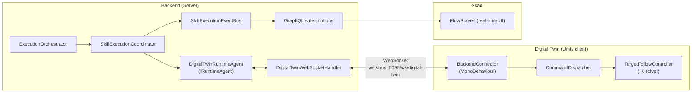
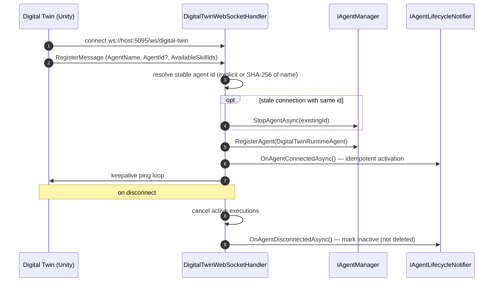
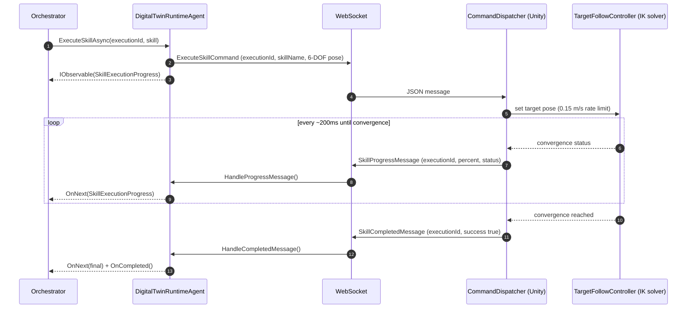

# Digital Twin Agent

> Connects a Unity Digital Twin to the Freydis Backend as an `IRuntimeAgent` via WebSocket.

## Architecture



## Connection Lifecycle

1. Digital Twin connects to `ws://<backend>:5095/ws/digital-twin`
2. Twin sends `RegisterMessage` with agent name, optional stable agent ID, and skill IDs
3. Backend resolves a stable agent ID (explicit or deterministic from name via SHA-256)
4. If an agent with the same ID exists in-memory (stale connection), it is replaced
5. Backend creates `DigitalTwinRuntimeAgent` and registers it with `IAgentManager`
6. Backend activates the agent in the domain model via `IAgentLifecycleNotifier.OnAgentConnectedAsync` (idempotent —
   handles both new and reconnecting agents)
7. Backend starts the keepalive ping loop; agent appears in Skadi's agent list
8. On disconnect: active executions are cancelled and `IAgentLifecycleNotifier.OnAgentDisconnectedAsync` marks the agent
   `Inactive` in the domain (not deleted — workflows can still reference it)



See [Agent Lifecycle](../../../Application/docs/agent-lifecycle.md) for the full lifecycle documentation.

## Message Protocol

All messages use the `DigitalTwinEnvelope` JSON shape: `{ "type": "<MessageType>", "payload": { ... } }`. The `type`
discriminator must match a constant in `DigitalTwinMessages.MessageTypes`; `RegisterMessage.AgentId` uses
`LenientNullableGuidConverter` to tolerate the empty strings Unity's `JsonUtility` emits.

### Backend to Twin

| Message                 | Purpose                                                                      |
|-------------------------|------------------------------------------------------------------------------|
| `ExecuteSkillCommand`   | Execute a skill (executionId, skillName, 6-DOF parameters, optional IK mode) |
| `CancelSkillCommand`    | Cancel a running execution                                                   |
| `Ping`                  | Keepalive                                                                    |
| `EstimateDurationQuery` | Request duration estimate for a target pose                                  |

### Twin to Backend

| Message                    | Purpose                                                                      |
|----------------------------|------------------------------------------------------------------------------|
| `Register`                 | Agent registration (name, optional agent id, skill IDs)                      |
| `SkillProgress`            | Progress update (executionId, 0-1 percent, status message)                   |
| `SkillCompleted`           | Execution finished (executionId, success, error message)                     |
| `Pong`                     | Keepalive reply                                                              |
| `HealthStatus`             | Resource usage (CPU, memory, FPS, uptime)                                    |
| `EstimateDurationResponse` | Duration estimate reply (`EstimatedDurationSeconds`, optional `MinDuration`) |

## Skill Execution Flow



## Adaptive (Hold-Position) Execution

For hold-position skills, `ExecuteSkillAdaptivelyAsync` keeps the Twin at its target until the orchestrator's finish
signal fires. The hold is bounded below by `HoldMinDurationSeconds` — the effective target is
`Math.Max(initialTargetDuration, HoldMinDurationSeconds)` — and is unbounded above. Movement skills are not adaptive:
the call returns `Observable.Throw<SkillExecutionProgress>(new NotSupportedException(...))` through the Rx stream.

## Duration Estimation

The Twin computes deterministic estimates based on:

- `posTime = distance / 0.15 m/s`
- `rotTime = angle / 75 deg/s`
- `estimated = max(posTime, rotTime) + convergenceOverhead`

Falls back to the configured nominal (`NominalDurationSeconds`, default 5s) if the Twin doesn't respond within
`EstimateTimeoutSeconds` (default 2s).

## Configuration (appsettings.json)

```json
{
  "Agents": {
    "DigitalTwin": {
      "NominalDurationSeconds": 5.0,
      "PingIntervalSeconds": 10.0,
      "PongTimeoutSeconds": 30.0,
      "EstimateTimeoutSeconds": 2.0,
      "MaxConcurrentExecutions": 1,
      "ReceiveBufferSize": 4096,
      "HoldMinDurationSeconds": 1.0
    }
  }
}
```

| Key                       | Default | Purpose                                                           |
|---------------------------|---------|-------------------------------------------------------------------|
| `NominalDurationSeconds`  | 5.0     | Fallback duration when the Twin does not answer an estimate query |
| `PingIntervalSeconds`     | 10.0    | Interval between keepalive pings                                  |
| `PongTimeoutSeconds`      | 30.0    | Stale-connection cutoff since the last received message           |
| `EstimateTimeoutSeconds`  | 2.0     | Wait for a duration-estimate reply before falling back to nominal |
| `MaxConcurrentExecutions` | 1       | Concurrent executions before the agent reports itself unavailable |
| `ReceiveBufferSize`       | 4096    | WebSocket receive buffer in bytes                                 |
| `HoldMinDurationSeconds`  | 1.0     | Minimum adaptive hold duration the orchestrator will schedule     |

## Key Files

| File                                             | Purpose                                                                             |
|--------------------------------------------------|-------------------------------------------------------------------------------------|
| `Protocol/DigitalTwinMessages.cs`                | `DigitalTwinEnvelope`, `MessageTypes`, message DTOs, `LenientNullableGuidConverter` |
| `DigitalTwinRuntimeAgent.cs`                     | `IRuntimeAgent` bridging WebSocket to Rx.NET                                        |
| `Services/DigitalTwinWebSocketHandler.cs`        | WebSocket endpoint, connection lifecycle                                            |
| `Services/DigitalTwinAgentFactory.cs`            | `IDigitalTwinAgentFactory` (returns a faulted task; agents connect dynamically)     |
| `Configuration/DigitalTwinAgentConfiguration.cs` | Configuration POCO                                                                  |

## Troubleshooting

- **Twin not appearing in agent list**: Check the WebSocket connection to `/ws/digital-twin` and verify the
  `RegisterMessage` includes valid skill definition IDs from `skills-config.json`.
- **Execution timeout**: The Twin's `CommandDispatcher` has a configurable timeout. Check whether the target pose is
  reachable within joint limits.
- **Reconnection**: The Unity `BackendConnector` should auto-reconnect with backoff. On reconnect, the same stable agent
  ID is reused (deterministic from name or explicitly provided), so the domain record is reactivated.
- **Duration estimate fallback**: If you see nominal durations instead of computed ones, the Twin may not be responding
  to `EstimateDurationQuery` within `EstimateTimeoutSeconds`.
