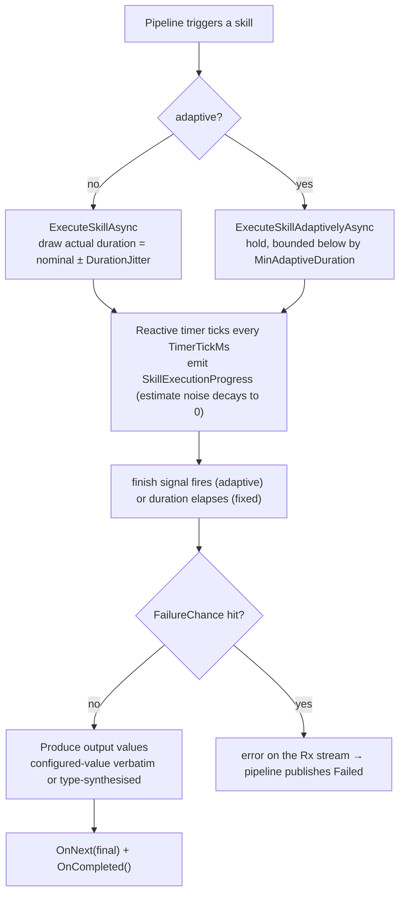

# Dummy Agent

> In-process simulated `IRuntimeAgent` that executes skills by waiting out a (jittered) duration — for development,
> testing, and headless benchmarks without any real hardware.

## Overview

`DummyRuntimeAgent` is a software-only agent: it implements the full `IRuntimeAgent` contract but performs no physical
action. Instead it simulates execution by emitting progress over a configurable duration, fabricating plausible health
metrics and skill outputs. It is the default agent in `Development` and the workhorse for tests and convergence
benchmarks, where deterministic, hardware-free runs matter.

Unlike the KUKA agent, the Dummy agent **supports adaptive execution**, so it can stand in for a hold-position skill.

## Key Concepts

- **Fixed-duration execution** — `ExecuteSkillAsync` waits out the skill's nominal duration (with jitter) and emits a
  `Finish`, producing simulated output values along the way.
- **Adaptive execution** — `ExecuteSkillAdaptivelyAsync` runs until the pipeline's finish signal fires, bounded below by
  the skill's `MinAdaptiveDuration` and unbounded above.
- **Pacing configuration** — `DummyRuntimeAgentPacingConfig` shapes timing and perturbation (jitter, estimate noise,
  timer tick, optional RNG seed). Defaults reproduce the agent's historical hardcoded behaviour.
- **Output configuration** — `DummyRuntimeAgentOutputConfig` shapes how output values are produced (configured values
  versus type-synthesised, boolean pass rate). Defaults reproduce historical behaviour.

For term definitions, see the [Glossary](../../../docs/glossary.md).

## How It Works



### Simulated outputs

When a skill completes, each output property gets a value:

- With `DummyRuntimeAgentOutputConfig.UseConfiguredValues` set, a non-null configured value is emitted verbatim — making
  the output deterministic and router-evaluable. A null configured value still falls through to type-synthesis.
- Otherwise the value is synthesised from the property type. Booleans pass at `BooleanTruePassRate` (default 0.85),
  numbers and booleans draw from the agent RNG (seedable via `DummyRuntimeAgentPacingConfig.RandomSeed`), and strings
  are
  a wall-clock timestamp (not seed-reproducible).

### Simulated health

`GetHealthStatusAsync` reports `IsHealthy = true`, an `IsAvailable` flag derived from concurrent-execution count, and
randomised CPU/memory metrics, so the agent appears live in GraphQL queries.

## Components

| Component                               | Role                                                                                                        |
|-----------------------------------------|-------------------------------------------------------------------------------------------------------------|
| `DummyRuntimeAgent`                     | The `IRuntimeAgent` implementation (a `partial` class split across the fixed and adaptive execution paths). |
| `DummyAgentFactory`                     | `IDummyAgentFactory`; builds agents from JSON via `CreateFromJsonFileAsync`.                                |
| `DummyAgentConfiguration`               | Root config: shared `SkillDefinition`s, `PositionTag`s, `SceneObject`s, and the agent list.                 |
| `DummyAgentConfig` / `DummySkillConfig` | Per-agent and per-skill performance settings.                                                               |
| `DummyRuntimeAgentPacingConfig`         | Record (constructor-injected) tuning timing and perturbation. `Default` reproduces historical behaviour.    |
| `DummyRuntimeAgentOutputConfig`         | Record (constructor-injected) tuning output-value generation. `Default` reproduces historical behaviour.    |

## Configuration

The factory loads a JSON file (`dummy-agents-config.json`) with shared definitions and a list of agents:

```json
{
  "SkillDefinitions": [
    { "Id": "<guid>", "Name": "Pick", "Description": "Pick up a part", "Properties": [] }
  ],
  "Agents": [
    {
      "Id": "<guid>",
      "Name": "Dummy-1",
      "Description": "Simulated arm",
      "MaxConcurrentExecutions": 5,
      "CpuUsage": { "Min": 0, "Max": 15 },
      "Skills": [
        {
          "SkillDefinitionId": "<guid>",
          "CanExecuteAdaptively": false,
          "NominalDuration": 3.0,
          "MinAdaptiveDuration": 1.0,
          "FailureChance": 0.0
        }
      ]
    }
  ]
}
```

| Field (per skill)      | Meaning                                                          |
|------------------------|------------------------------------------------------------------|
| `SkillDefinitionId`    | References a shared `SkillDefinition` (or define a skill inline) |
| `CanExecuteAdaptively` | Whether this agent runs the skill adaptively                     |
| `NominalDuration`      | Fixed-mode duration in seconds (before jitter)                   |
| `MinAdaptiveDuration`  | Lower bound for adaptive mode (seconds)                          |
| `FailureChance`        | Probability `[0, 1]` of simulating a failure                     |

`DummyRuntimeAgentPacingConfig` and `DummyRuntimeAgentOutputConfig` are supplied to the agent's constructor (for example
by a benchmark host), not through this JSON file. Log levels are set in `appsettings.json` under `Logging:LogLevel`.

See [Agent Configuration Reference](../../../GraphQLServer/README-Configuration.md) for file locations and environment
wiring.

## Related Documentation

- [Agents Module](../../docs/README.md) — Agent types, factories, managers, shared infrastructure
- [KUKA iiwa 14 Agent](../Kuka/README.md) — The OPC UA hardware agent
- [Digital Twin Agent](../DigitalTwin/README.md) — The WebSocket simulation agent
- [Agent Lifecycle](../../../Application/docs/agent-lifecycle.md) — Startup, activation, skill sync
- [Glossary](../../../docs/glossary.md) — Term definitions
