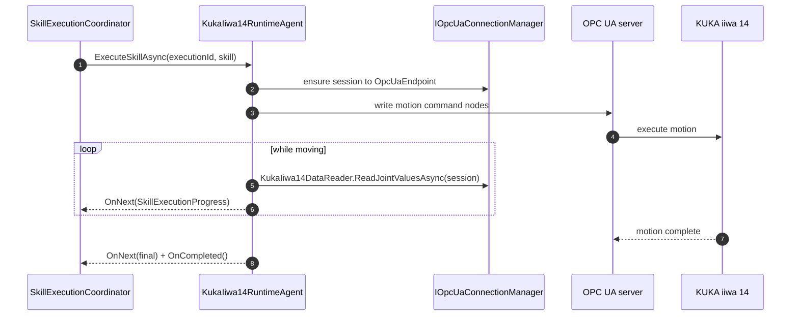
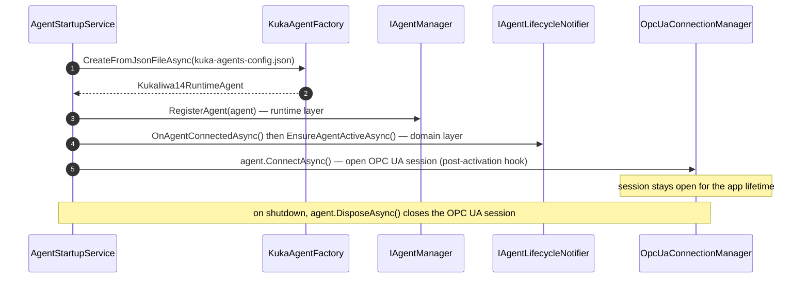

# KUKA iiwa 14 Agent

> `IRuntimeAgent` that drives a physical KUKA iiwa 14 over OPC UA — sending motion commands and reading live joint
> state.

## Overview

`KukaIiwa14RuntimeAgent` connects the execution pipeline to a real KUKA iiwa 14 lightweight robot through an OPC UA
session. When the pipeline triggers a skill, the agent issues the corresponding OPC UA commands, streams progress while
the motion runs, reads back joint values for monitoring, and emits completion. It owns the OPC UA connection lifecycle
(`IAsyncDisposable` / `IDisposable`).

This agent **does not support adaptive execution** — calls to `ExecuteSkillAdaptivelyAsync` return a
`NotSupportedException` through the Rx stream.

## Key Concepts

- **OPC UA transport** — All robot communication goes through an `IOpcUaConnectionManager` session to the agent's
  configured `OpcUaEndpoint` (e.g. `opc.tcp://localhost:4840/kuka/iiwa14`).
- **Fixed-duration only** — Skills run for their nominal duration; there is no adaptive/hold mode.
- **Live joint state** — `KukaIiwa14DataReader` reads joint values from the session for health and monitoring.
- **Security profile** — `OpcUaSecurityConfig` selects anonymous-vs-authenticated and plain-vs-encrypted channels;
  defaults are development-friendly and must be tightened for production.

For term definitions, see the [Glossary](../../../docs/glossary.md).

## How It Works



If `ExecuteSkillAdaptivelyAsync` is called, the agent returns `Observable.Throw<SkillExecutionProgress>` with a
`NotSupportedException` — the error is delivered through the Rx stream, not thrown synchronously (LSP compliance).

## Lifecycle

The KUKA agent is a **startup-loaded** agent: `AgentStartupService` builds it eagerly from `kuka-agents-config.json`,
registers it, activates it in the domain, then opens its OPC UA session via the post-activation hook
(`KukaIiwa14RuntimeAgent.ConnectAsync` → `OpcUaConnectionManager.ConnectAsync`). The outbound session stays open for the
application lifetime and is closed when the agent is disposed at shutdown.



### KUKA versus Digital Twin

The two hardware-backed agents have opposite lifecycle shapes — the KUKA agent is loaded at startup and reaches *out* to
the robot over OPC UA, while the Digital Twin agent is created on demand when a Unity client reaches *in* over a
WebSocket:

| Aspect               | KUKA iiwa 14                                                                                                                                                             | Digital Twin                                                                                                                  |
|----------------------|--------------------------------------------------------------------------------------------------------------------------------------------------------------------------|-------------------------------------------------------------------------------------------------------------------------------|
| Creation             | Eager, at startup from config (factory)                                                                                                                                  | Lazy, at runtime when the Twin opens a WebSocket                                                                              |
| Transport            | OPC UA session the backend opens **outbound** to the robot                                                                                                               | WebSocket the Unity client opens **inbound** to the backend                                                                   |
| Identity             | Configured or generated GUID at load                                                                                                                                     | Stable SHA-256 of the agent name (reconnect-safe)                                                                             |
| Runtime registration | Persists for the application lifetime                                                                                                                                    | Added on connect, removed on disconnect                                                                                       |
| Disconnect handling  | A dropped OPC UA session does not change domain state (no heartbeat detection yet — the `Lost` state is reserved); skills simply cannot run until the session reconnects | WebSocket close unregisters the agent and sets domain `State = Inactive` (preserved for references); reconnect reactivates it |
| Teardown trigger     | Backend shutdown disposes the agent and closes the session                                                                                                               | The Twin closing the socket                                                                                                   |

For the shared startup, activation, and skill-sync flow,
see [Agent Lifecycle](../../../Application/docs/agent-lifecycle.md).

## Components

| Component                  | Role                                                                                 |
|----------------------------|--------------------------------------------------------------------------------------|
| `KukaIiwa14RuntimeAgent`   | The `IRuntimeAgent` implementation; owns the OPC UA session and skill execution.     |
| `KukaAgentFactory`         | `IKukaAgentFactory`; builds agents from JSON via `CreateFromJsonFileAsync`.          |
| `KukaIiwa14DataReader`     | Reads joint values (and other live data) from the OPC UA session.                    |
| `OpcUaConnectionManager`   | Maintains the OPC UA session to the configured endpoint (`IOpcUaConnectionManager`). |
| `OpcUaCertificateManager`  | Handles OPC UA security certificates.                                                |
| `SkillPropertyExtractor`   | Extracts skill parameters (e.g. target pose) into the values written over OPC UA.    |
| `AgentExecutionStatistics` | Tracks execution counts for health reporting.                                        |

## Configuration

The factory loads a JSON file (`kuka-agents-config.json`) with one entry per robot:

```json
{
  "Agents": [
    {
      "Id": "<guid>",
      "Name": "Kuka-1",
      "OpcUaEndpoint": "opc.tcp://localhost:4840/kuka/iiwa14",
      "MaxConcurrentExecutions": 1,
      "ConnectionTimeout": 5000,
      "Security": {
        "UseAnonymousAuthentication": true,
        "UseEncryption": false,
        "AutoAcceptUntrustedCertificates": true,
        "ValidateServerCertificate": false
      },
      "Skills": [
        { "SkillDefinitionId": "<guid>", "CanExecuteAdaptively": false, "NominalDuration": 4.0 }
      ]
    }
  ]
}
```

| Field                     | Default    | Meaning                                                        |
|---------------------------|------------|----------------------------------------------------------------|
| `OpcUaEndpoint`           | —          | OPC UA URL of the robot (required)                             |
| `MaxConcurrentExecutions` | 1          | KUKA robots execute one skill at a time                        |
| `ConnectionTimeout`       | 5000       | Session connect timeout in milliseconds                        |
| `Security`                | anon/plain | `OpcUaSecurityConfig` — auth, encryption, certificate handling |

The `Security` defaults (anonymous, unencrypted, auto-accept certificates) suit localhost development. **For production,
enable `UseEncryption`, set `ValidateServerCertificate = true`, disable `AutoAcceptUntrustedCertificates`, and supply
credentials or a client certificate.** Log levels are set in `appsettings.json` under `Logging:LogLevel`.

See [Agent Configuration Reference](../../../GraphQLServer/README-Configuration.md) for file locations and environment
wiring.

## Related Documentation

- [Agents Module](../../docs/README.md) — Agent types, factories, managers, shared infrastructure
- [Dummy Agent](../Dummy/README.md) — The in-process simulated agent
- [Digital Twin Agent](../DigitalTwin/README.md) — The WebSocket simulation agent
- [Agent Lifecycle](../../../Application/docs/agent-lifecycle.md) — Startup, activation, skill sync
- [Security & Configuration](../../../docs/security.md) — Credentials and host hardening
- [Glossary](../../../docs/glossary.md) — Term definitions
