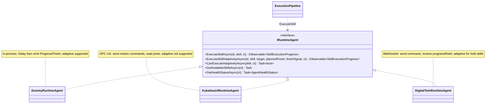
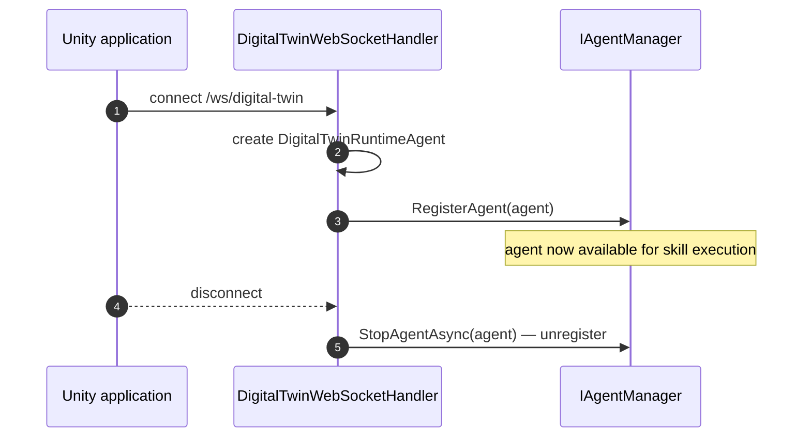

# Agents Module

> Runtime agent implementations that execute skills on real robots, simulations, and digital twins.

## Overview

An **agent** is anything that can execute a skill — a real robot, a simulated device, or a Unity digital twin. The
Agents module provides the concrete implementations that connect the execution pipeline to physical (or virtual)
hardware. When the pipeline decides it's time to run "Pick Up Part," the Agents module is what actually makes the robot
move.

Each agent type has its own communication protocol (OPC UA for KUKA, WebSocket for Digital Twins, in-process for Dummy),
but they all implement the same `IRuntimeAgent` interface. This lets the execution pipeline treat all agents
identically.

## Key Concepts

- **IRuntimeAgent** — The common interface all agents implement. Provides `ExecuteSkillAsync()` (fixed duration) and
  `ExecuteSkillAdaptivelyAsync()` (variable duration).
- **Agent Factory** — Creates agent instances from configuration. Each agent type has its own factory.
- **UnifiedAgentManager** — The single `IAgentManager` implementation, registered as a singleton, that manages all
  agents across all types. Every collaborator (the startup service, the Digital Twin WebSocket handler, the
  runtime-agent
  provider) depends on the `IAgentManager` interface, so all agent types register with this one instance. Supports both
  factory-based loading (startup) and dynamic registration (WebSocket connections).
- **Skill Execution** — Agents return an `IObservable<SkillExecutionProgress>` stream. The pipeline subscribes to it,
  receives progress updates, and detects completion.

## How It Works

### Agent Types

| Agent                       | Hardware           | Protocol   | Connects                                    | Deep-dive                                             |
|-----------------------------|--------------------|------------|---------------------------------------------|-------------------------------------------------------|
| **DummyRuntimeAgent**       | None (simulated)   | In-process | At startup from `dummy-agents-config.json`  | [Dummy Agent](../Agents/Dummy/README.md)              |
| **KukaIiwa14RuntimeAgent**  | KUKA iiwa 14 robot | OPC UA     | At startup from `kuka-agents-config.json`   | [KUKA iiwa 14 Agent](../Agents/Kuka/README.md)        |
| **DigitalTwinRuntimeAgent** | Unity simulation   | WebSocket  | Dynamically when the Twin opens a WebSocket | [Digital Twin Agent](../Agents/DigitalTwin/README.md) |

Each agent type has its own deep-dive doc (linked above) covering its execution behaviour, components, and
configuration. This module README covers what they share.

### Execution Flow

All agents emit progress as an `IObservable<SkillExecutionProgress>` stream:

1. **Progress events** — Status updates during execution (e.g., "Moving to position...", "Holding position: 3.2s")
2. **Completion** — The observable completes (OnCompleted) when the skill finishes

### Adaptive Execution

Some skills have no fixed duration — they run until an external signal says to stop (e.g., "hold position until the
other robot finishes"). This is **adaptive execution**:

- `ExecuteSkillAdaptivelyAsync()` starts the skill with a **minimum** duration bound and an event-driven finish signal.
  There is no maximum: the agent paces toward the scheduler's planned finish times but completes only when the finish
  signal fires.
- The agent emits progress continuously, reporting its current `MinAchievableDuration` (unbounded above).
- The pipeline signals when to finish (via a finish prerequisite event), and the agent emits completion.

Not all agents support adaptive execution. `DummyRuntimeAgent` supports it; `KukaIiwa14RuntimeAgent` does not; the
Digital Twin supports it for hold-position skills and rejects movement skills. An unsupported call returns
`Observable.Throw<SkillExecutionProgress>(new NotSupportedException(...))` — the error is delivered through the Rx
stream, not as a synchronous exception (LSP compliance).

### Digital Twin Dynamic Connection

Digital Twin agents are special: they don't exist at startup. Instead:

See [Digital Twin Protocol](../Agents/DigitalTwin/README.md) for the full message protocol.

## Components

### Agent Implementations

| Component                 | Purpose                                                                                                  |
|---------------------------|----------------------------------------------------------------------------------------------------------|
| `DummyRuntimeAgent`       | In-process simulation; supports adaptive execution. See [Dummy Agent](../Agents/Dummy/README.md).        |
| `KukaIiwa14RuntimeAgent`  | Drives a KUKA iiwa 14 over OPC UA; no adaptive mode. See [KUKA iiwa 14 Agent](../Agents/Kuka/README.md). |
| `DigitalTwinRuntimeAgent` | Bridges a Unity Digital Twin over WebSocket. See [Digital Twin Agent](../Agents/DigitalTwin/README.md).  |

### Factories

| Component                 | Purpose                                                                                  |
|---------------------------|------------------------------------------------------------------------------------------|
| `DummyAgentFactory`       | Creates DummyRuntimeAgent instances from JSON configuration.                             |
| `KukaAgentFactory`        | Creates KukaIiwa14RuntimeAgent instances from KUKA-specific configuration.               |
| `DigitalTwinAgentFactory` | Returns `Task.FromException` — Digital Twin agents connect dynamically, not via factory. |

### Management Services

| Component                  | Purpose                                                                                                                            |
|----------------------------|------------------------------------------------------------------------------------------------------------------------------------|
| `UnifiedAgentManager`      | Singleton managing all agent types in a `ConcurrentDictionary`; resolves by id or name.                                            |
| `RuntimeAgentProvider`     | Read-only adapter over `IAgentManager`; resolves a runtime agent by id and lists active agents (name lookup stays on the manager). |
| `ISkillDefinitionProvider` | Interface owned by the Agents module; implemented in `GraphQLServer` to supply skill definitions to the API.                       |
| `ISceneEntityProvider`     | Interface owned by the Agents module; implemented in `Application` to provide scene-level entity data.                             |

### OPC UA Services

OPC UA session and certificate management (`OpcUaConnectionManager`, `OpcUaCertificateManager`) is used only by the KUKA
agent. See the [KUKA iiwa 14 Agent](../Agents/Kuka/README.md) doc for detail.

## Configuration

Each agent type is independently enabled via `appsettings.{Environment}.json`:

| Environment   | Enabled Agents |
|---------------|----------------|
| `Development` | Dummy agents   |
| `Hybrid`      | Dummy + KUKA   |
| `Kuka`        | KUKA only      |
| `Production`  | Real agents    |

Digital Twin agents are enabled by default and connect dynamically — they're available alongside any combination of
other agent types.

See [Agent Configuration Reference](../../GraphQLServer/README-Configuration.md) for config file details.

## Related Documentation

- [Documentation Hub](../../docs/README.md) — Back to the index
- [Glossary](../../docs/glossary.md) — Term definitions
- [Agent Lifecycle](../../Application/docs/agent-lifecycle.md) — States, startup flow, reconnection, disconnection
- [Dummy Agent](../Agents/Dummy/README.md) — In-process simulated agent
- [KUKA iiwa 14 Agent](../Agents/Kuka/README.md) — OPC UA hardware agent
- [Digital Twin Protocol](../Agents/DigitalTwin/README.md) — WebSocket message format and connection lifecycle
- [Agent Configuration](../../GraphQLServer/README-Configuration.md) — Config files and environment setup
- [Application Layer](../../Application/docs/README.md) — Execution pipeline that invokes agents
- [Architecture Overview](../../docs/architecture.md) — How Agents fits in the system
