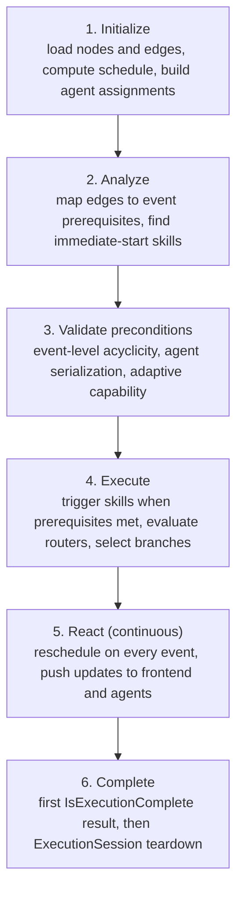
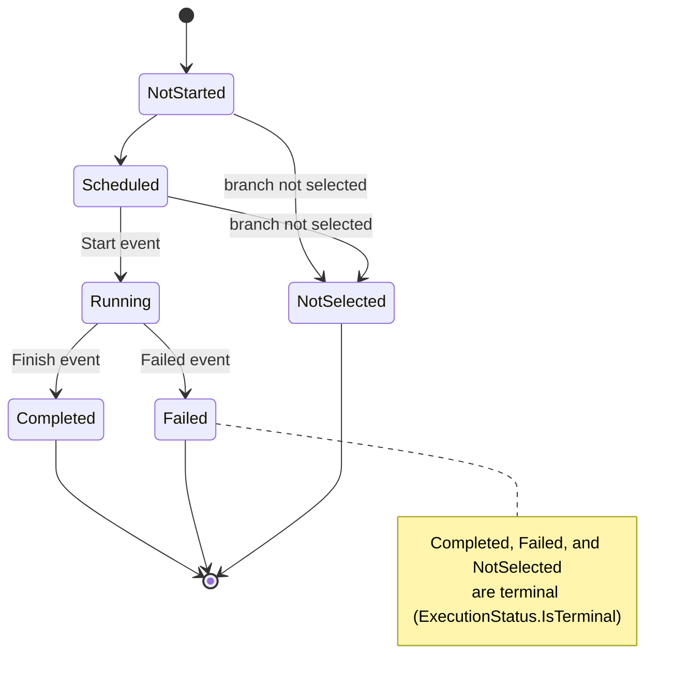
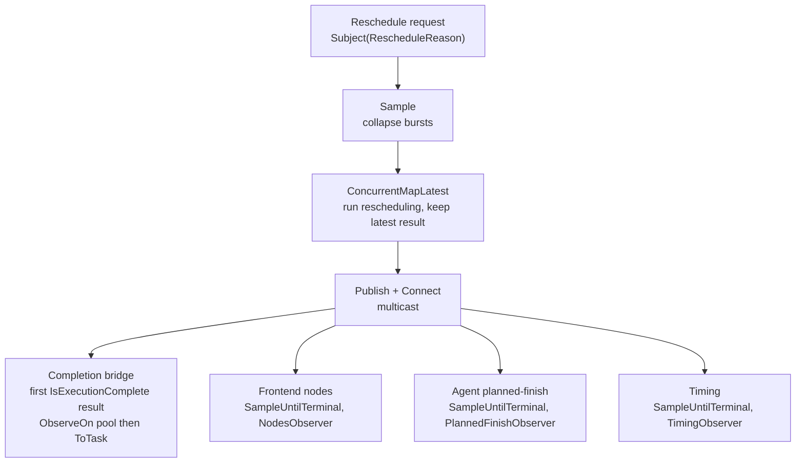
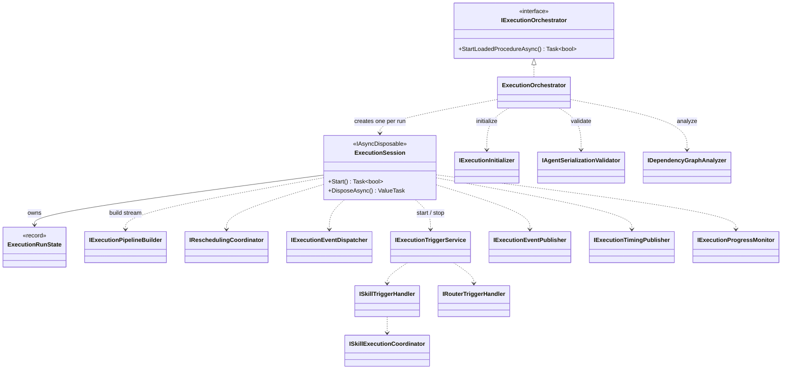

# Application Layer

> Business logic, execution pipeline, scheduling, and the reactive infrastructure that powers real-time updates.

## Overview

The Application layer is the heart of Freydis. It contains all the logic that turns static procedure definitions into
live, coordinated robot actions. When you click "Execute," this layer schedules the tasks, monitors events, triggers
skills on agents, handles branching decisions, and streams real-time updates to the frontend.

It's organized into service categories — each responsible for one aspect of the system. The most complex part is the
**execution pipeline**, which uses an event-driven model with Rx.NET reactive streams.

If you want to understand how execution works end-to-end, see
the [Execution Pipeline Guide](../../docs/execution-pipeline.md).

## Key Concepts

- **Execution Pipeline** — The sequence of steps from "start" to "all tasks complete."
  See [Execution Pipeline](../../docs/execution-pipeline.md).
- **Event-Driven Triggering** — Skills start when their prerequisites are met (not at fixed clock times). If Skill A
  finishes early, Skill B starts early too. A `Failed` or `NotSelected` event satisfies a prerequisite the same way a
  `Finish` does, so dependents are released rather than left hanging.
- **Rescheduling** — Every time a skill starts or finishes, the schedule is recalculated so the timeline stays accurate.
- **Single-Phase Completion** — The rescheduling coordinator stamps `IsExecutionComplete` onto the first result emitted
  once every skill reaches a terminal state. That single terminal value drives final-state delivery and run teardown;
  there is no second detection pass.
- **Per-Run Session** — A `ExecutionSession` owns each run's reactive state (the reschedule `Subject`, the subscription
  bag, the completion task) and an immutable `ExecutionRunState`. The orchestrator singleton holds no mutable per-run
  fields, so consecutive runs never share state.
- **Execution Preconditions** — Before a run starts, the orchestrator validates event-level acyclicity, agent
  serialization, and adaptive-agent capability. A failure aborts the start.
- **Change Trackers** — `BehaviorSubject`-backed state that pushes entity updates to GraphQL subscribers in real time.
- **Procedure-Scoped Operations** — All CRUD and observables are filtered to the currently loaded procedure.

For term definitions, see the [Glossary](../../docs/glossary.md).

## How It Works

### Service Categories

| Category              | Directory                     | What It Does                                                                                                |
|-----------------------|-------------------------------|-------------------------------------------------------------------------------------------------------------|
| **Execution**         | `Services/Execution/`         | Core execution pipeline — orchestration, triggering, coordination, monitoring, state management, validation |
| **Scheduling**        | `Services/Scheduling/`        | Timing calculation, node positioning, duration providers, branch filtering                                  |
| **EntityManagement**  | `Services/EntityManagement/`  | Procedure-scoped CRUD for nodes and edges with reactive notifications                                       |
| **AgentCoordination** | `Services/AgentCoordination/` | Agent registration, capability analysis, [lifecycle management](agent-lifecycle.md)                         |
| **Branching**         | `Services/Branching/`         | Router branch selection using variable-driven conditions                                                    |
| **Variables**         | `Services/Variables/`         | Variable resolution and state tracking                                                                      |
| **Properties**        | `Services/Properties/`        | Property binding and variable resolution for skill inputs/outputs                                           |
| **Expressions**       | `Services/Expressions/`       | Expression evaluation for router conditions                                                                 |
| **Common**            | `Services/Common/`            | Change tracking infrastructure, reactive extensions, platform and context utilities                         |
| **UI**                | `Services/UI/`                | Node height, width, and X/Y positioning calculations for visual layout                                      |

Each group has its own deep-dive under [Application Services](services/README.md) — what it does, how it connects to the
other groups, and its role in the pipeline.

### Execution Pipeline Flow



For the full walkthrough with diagrams and code, see [Execution Pipeline](../../docs/execution-pipeline.md).

### Skill Execution Status

Each skill node moves through a monotone status machine. Once a skill reaches a terminal status it never leaves it; the
run completes when every skill is terminal.



### Rescheduling Pipeline (Rx.NET)

The rescheduling pipeline is a multi-tier reactive stream. The pipeline builder produces a connectable
`Sample → ConcurrentMapLatest → Publish` source; `ExecutionSession` attaches the completion bridge and three sampled
per-channel observables before connecting it.



Each per-channel observable samples intermediate results at its own publish interval, then emits exactly one terminal
value when the completion result arrives. This lets different consumers get updates at appropriate rates without
overwhelming any single component.

## Components

### Execution Orchestration

The orchestrator is a singleton, but each run's reactive state lives on a freshly constructed `ExecutionSession` holding
an immutable `ExecutionRunState`. The session is the single teardown sink for every exit path.



### Execution Services

| Service                      | Purpose                                                                                                                                      |
|------------------------------|----------------------------------------------------------------------------------------------------------------------------------------------|
| `ExecutionOrchestrator`      | Top-level coordinator. Singleton for GraphQL continuity; creates one `ExecutionSession` per run and detaches the run on a background task.   |
| `ExecutionSession`           | `IAsyncDisposable` owner of one run's reactive state (reschedule `Subject`, subscription bag, completion task) and the single teardown sink. |
| `ExecutionRunState`          | Immutable per-run snapshot of nodes, edges, schedule, start time, and procedure id.                                                          |
| `ExecutionTriggerService`    | Monitors events, triggers nodes when prerequisites are met. Manages router evaluations.                                                      |
| `ExecutionEventDispatcher`   | Routes event-bus events into state transitions and reschedule requests.                                                                      |
| `SkillExecutionCoordinator`  | Coordinates individual skill execution: resolves bindings, invokes agent, publishes events.                                                  |
| `ExecutionInitializer`       | Loads nodes/edges, assigns execution IDs, initializes variables, calculates initial schedule.                                                |
| `DependencyGraphAnalyzer`    | Converts edges into an event-based dependency graph (prerequisites per node).                                                                |
| `SkillExecutionStateManager` | Tracks which skills are running, finished, failed, or not selected.                                                                          |
| `ExecutionProgressMonitor`   | Reports completion statistics and overall success at the terminal value.                                                                     |
| `ReschedulingCoordinator`    | Performs rescheduling calculations, applying actual times to the execution graph.                                                            |
| `ExecutionEventPublisher`    | Publishes state changes to the frontend via change trackers.                                                                                 |
| `RouterBranchNavigator`      | Navigates node hierarchy within router branches (BFS traversal, ancestor lookup).                                                            |

### Scheduling Services

| Service                          | Purpose                                                                                     | Namespace                 |
|----------------------------------|---------------------------------------------------------------------------------------------|---------------------------|
| `TimingCalculationEngine`        | Orchestrates full scheduling: topological sort, duration calculation, LP, position mapping. | `Scheduling/Computation/` |
| `NodePositioningService`         | Applies calculated X/Y positions, widths, heights to nodes.                                 | `Scheduling/Pipeline/`    |
| `ExecutionAwareDurationProvider` | Replaces planned durations with actual elapsed times for running/completed skills.          | `Scheduling/Duration/`    |
| `RouterBranchFilterService`      | Filters scheduling input to include only selected branches.                                 | `Scheduling/Filtering/`   |

### Entity Management

| Service                            | Purpose                                                                                   |
|------------------------------------|-------------------------------------------------------------------------------------------|
| `NodeApplicationService`           | Procedure-scoped node CRUD. Auto-creates variables for outputs, branch nodes for routers. |
| `DependencyEdgeApplicationService` | Procedure-scoped edge CRUD with validation and reactive filtering.                        |

### Reactive Infrastructure

| Component                    | Purpose                                                                                                                                                                                                                                                                                                                                                              |
|------------------------------|----------------------------------------------------------------------------------------------------------------------------------------------------------------------------------------------------------------------------------------------------------------------------------------------------------------------------------------------------------------------|
| `ProcedureStateTracker`      | Singleton unified tracker (`Services/Common/Reactive/`): one `BehaviorSubject<ProcedureState>` holding procedure-scoped nodes, edges, and variables behind `INodeChangeTracker` / `IDependencyEdgeChangeTracker` / `IProcedureVariableChangeTracker`. Filters public `UpdateEntities` writes by the loaded procedure id; drops and logs any cross-procedure payload. |
| `ObservableExtensions`       | Static Rx operators (`Services/Execution/Support/`), including `ConcurrentMapLatest<TSource, TResult>` — concurrent inner observables that emit only the latest result.                                                                                                                                                                                              |
| `ExecutionTimingPublisher`   | Streams execution timing snapshots (elapsed, progress, estimated total) behind `IExecutionTimingPublisher`.                                                                                                                                                                                                                                                          |
| `ExecutionAdvisoryPublisher` | Streams `ExecutionAdvisory` notices (e.g. adaptive-skill overrun) behind `IExecutionAdvisoryPublisher` to GraphQL subscribers.                                                                                                                                                                                                                                       |

### Execution Validation

The validation subsystem (`Services/Execution/Validation/`) enforces the procedure-scope and agent-serialization
invariants. The hard gate runs at start; the reactive tracker powers design-time soft warnings. See
[Agent Serialization](../../docs/agent-serialization/README.md) for the proofs behind it.

| Component                     | Purpose                                                                                                                                                                                             |
|-------------------------------|-----------------------------------------------------------------------------------------------------------------------------------------------------------------------------------------------------|
| `AgentSerializationValidator` | Verifies every physical agent's assigned skills are connected by a Finish-to-Start chain, preventing concurrent dispatch to one robot. Throws `AgentSerializationException` at start when violated. |
| `ProcedureValidationTracker`  | Reactive, `BehaviorSubject`-backed tracker that re-runs validators on every node/edge change (throttled, `DistinctUntilChanged`) to drive soft-warning UX.                                          |
| `ProcedureValidationResult`   | Aggregated validator output (list of `AgentSerializationViolation`) streamed by the tracker.                                                                                                        |
| `AgentNameResolver`           | Narrow facade over `IAgentManager` resolving agent display names for violation records.                                                                                                             |
| `ValidationResultComparer`    | `IEqualityComparer<ProcedureValidationResult>` giving the tracker structural `DistinctUntilChanged` semantics.                                                                                      |

### Observability and Monitoring

The monitoring subsystem (`Services/Execution/Monitoring/`) observes a running execution without ever feeding back into
the control plane — information flows control → observability, never the reverse.

| Component                             | Purpose                                                                                                                                      |
|---------------------------------------|----------------------------------------------------------------------------------------------------------------------------------------------|
| `AdaptiveSkillDurationOverrunMonitor` | `IHostedService` that watches executing adaptive skills against their scheduled finish and raises advisories on overrun. Observability-only. |
| `ExecutionAdvisoryPublisher`          | Surfaces `ExecutionAdvisory` notices (with `ExecutionAdvisorySeverity`) to subscribers.                                                      |
| `ExecutionProgressMonitor`            | Reports completion statistics and whether the run succeeded.                                                                                 |

### Branching and Routing

| Component                 | Purpose                                                                                                                                           |
|---------------------------|---------------------------------------------------------------------------------------------------------------------------------------------------|
| `BranchSelector`          | Evaluates branches with short-circuit priority logic (highest priority first, first match wins). May throw, so routers are validated at creation. |
| `RouterEvaluationService` | Wraps `BranchSelector` for execution-time use. Stores selections in memory only.                                                                  |

## Key Architectural Patterns

| Pattern                             | Where                                        | Why                                                                                                                                 |
|-------------------------------------|----------------------------------------------|-------------------------------------------------------------------------------------------------------------------------------------|
| **Singleton with Per-Run Session**  | `ExecutionOrchestrator` / `ExecutionSession` | GraphQL subscriptions need stable references; each run gets isolated reactive state in a fresh session                              |
| **Event-Driven Triggering**         | `ExecutionTriggerService`                    | Robots don't always take the predicted time; events handle timing variations naturally                                              |
| **Multi-Tier Rx Sampling**          | Reschedule pipeline                          | Different consumers need different update rates                                                                                     |
| **Single-Phase Completion**         | `ExecutionSession`                           | The first `IsExecutionComplete`-stamped result is the authoritative final snapshot; one terminal value drives delivery and teardown |
| **Single Teardown Sink**            | `ExecutionSession.DisposeAsync`              | One idempotent disposal path for success, cancellation, and synchronous start failure                                               |
| **Start-Time Validation Gate**      | `ValidateExecutionPreconditionsAsync`        | Acyclicity, agent serialization, and adaptive capability are checked before any skill fires                                         |
| **Observability-Only Monitoring**   | `AdaptiveSkillDurationOverrunMonitor`        | Overruns surface as advisories and never alter the control plane                                                                    |
| **Procedure-Scoped Isolation**      | Entity management                            | All observables and CRUD filtered to the active procedure                                                                           |
| **Trust-Boundary Filtering**        | `ProcedureStateTracker.UpdateEntities`       | Defend the same-graph invariant at the reactive write boundary; drop foreign-procedure entities and log structured warnings         |
| **BehaviorSubject Emission**        | Change trackers                              | New subscribers immediately receive current state                                                                                   |
| **Fire-and-Forget with Safety Net** | Router triggering                            | Async work from Rx callbacks with `.ContinueWith(OnlyOnFaulted)` defense-in-depth                                                   |

## Testing

The execution pipeline is extensively tested. Tests are organized by subsystem under
`Application.Tests/Services/Execution/`:

```
Coordination/       Skill execution coordinator tests
Dependencies/       Dependency graph analyzer tests
Events/             Event bus and publisher tests
Initialization/     Execution initializer tests
Integration/        Full pipeline integration tests
Monitoring/         Progress monitor and advisory tests
Pipeline/           Orchestrator and session tests
Rescheduling/       Rescheduling coordinator tests
Routing/            Router evaluation tests
Triggering/         Trigger service and branch navigator tests
Validation/         Agent-serialization validator and tracker tests
```

## Related Documentation

- [Documentation Hub](../../docs/README.md) — Back to the index
- [Agent Serialization](../../docs/agent-serialization/README.md) — Validation, procedure-scope invariant, and the Lean
  proofs that back them
- [Execution Orchestrator](execution-orchestrator.md) — Singleton lifecycle coordinator for procedure execution
- [Execution Trigger Service](execution-trigger-service.md) — Reactive prerequisite monitoring and node triggering
- [CRUD Scheduling Orchestrator](crud-scheduling.md) — Design-time CRUD with parallel scheduling and notifications
- [Execution Pipeline](../../docs/execution-pipeline.md) — Detailed execution flow walkthrough
- [Agent Lifecycle](agent-lifecycle.md) — Agent states, startup flow, reconnection
- [Domain Layer](../../Domain/docs/README.md) — Core entities and value objects
- [Infrastructure Layer](../../Infrastructure/docs/README.md) — PostgreSQL persistence
- [Scheduling Library](../../Scheduling/docs/README.md) — OR-Tools solver and execution graph APIs
- [GraphQL Server](../../GraphQLServer/docs/README.md) — API layer
- [Architecture Overview](../../docs/architecture.md) — Full system overview
