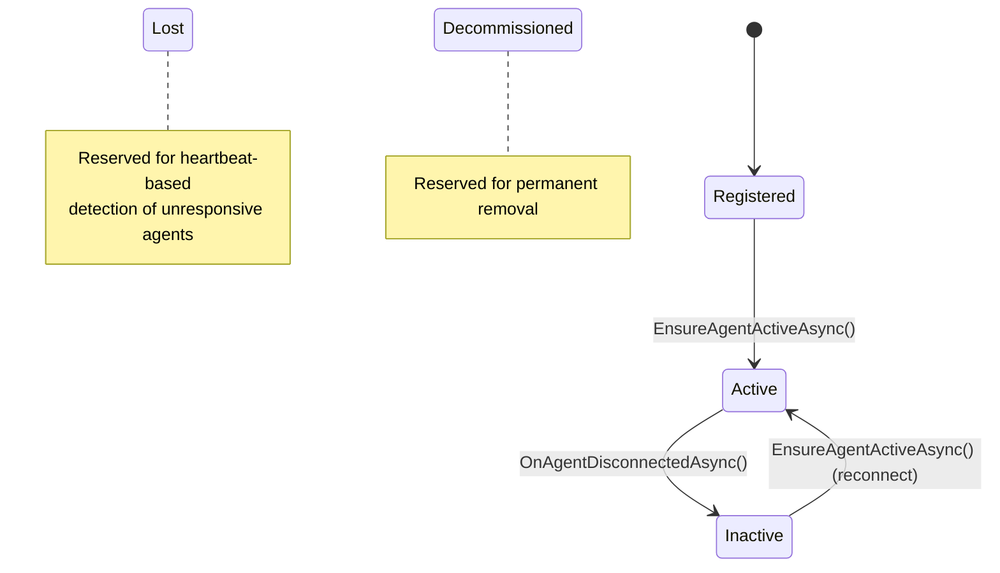
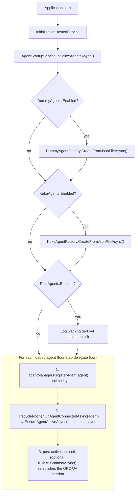
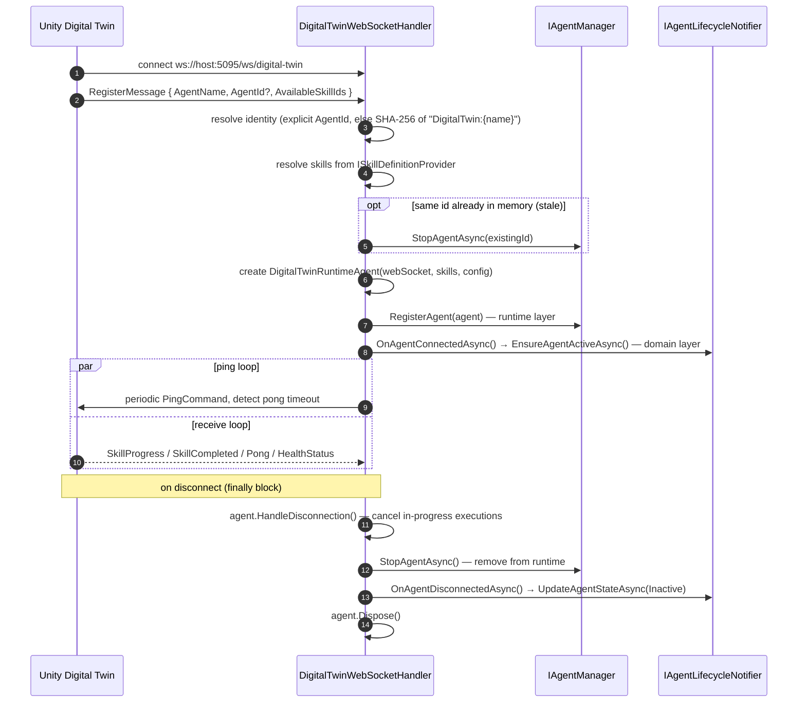
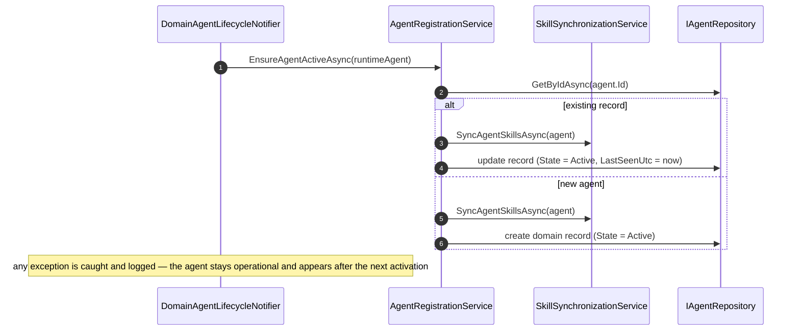
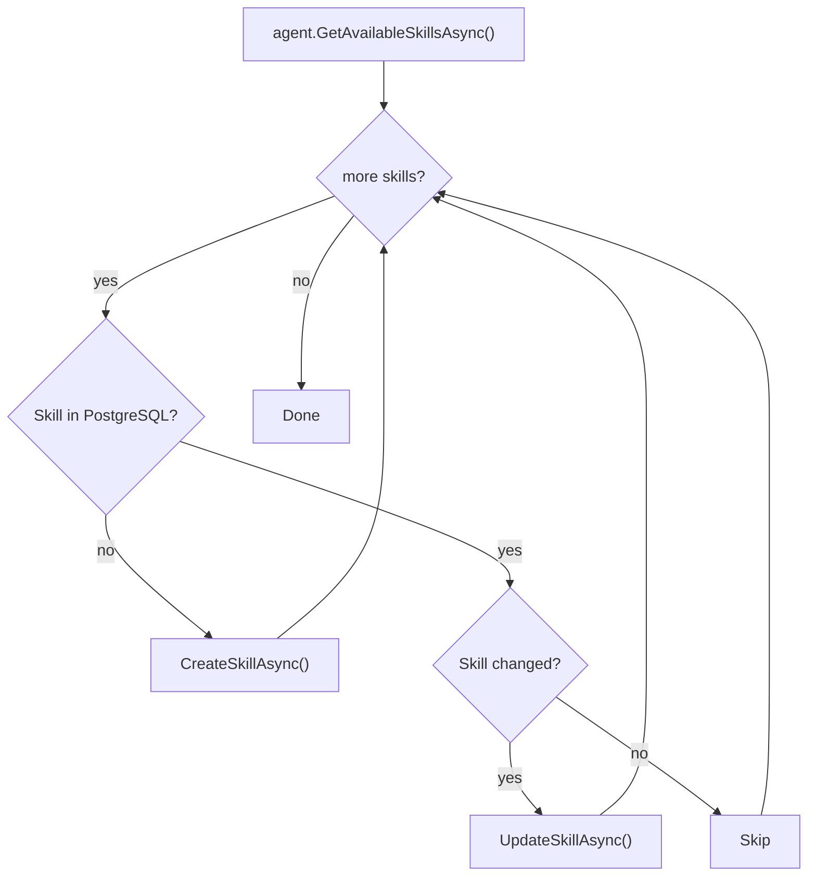
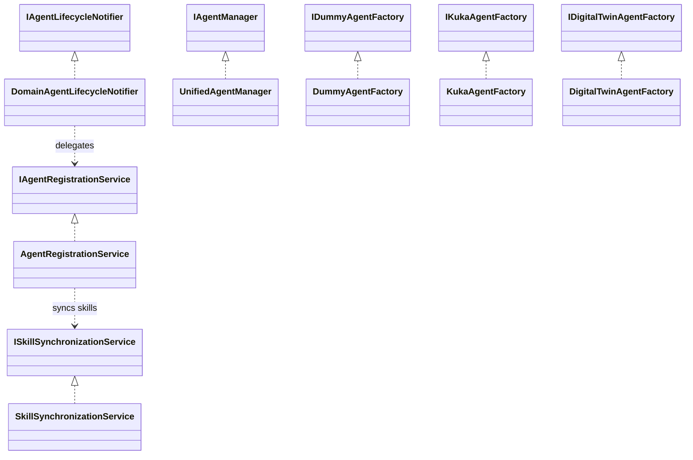

# Agent Lifecycle

> How agents are created, activated, reconnected, and disconnected in the Freydis backend.

## Two-Layer Architecture

Every agent exists simultaneously in two layers:

| Layer       | Storage                   | Purpose                                     | Manager                    |
|-------------|---------------------------|---------------------------------------------|----------------------------|
| **Runtime** | `ConcurrentDictionary`    | Skill execution, WebSocket I/O, health      | `UnifiedAgentManager`      |
| **Domain**  | PostgreSQL `agents` table | GraphQL queries, workflow references, state | `AgentRegistrationService` |

The `IAgentLifecycleNotifier` interface bridges the two: it is defined in the Agents layer but implemented in
the Application layer (`DomainAgentLifecycleNotifier`), following the Dependency Inversion Principle.

---

## Agent States



| State            | Meaning                                                                                |
|------------------|----------------------------------------------------------------------------------------|
| `Registered`     | Agent record exists in PostgreSQL but has not been activated yet.                      |
| `Active`         | Agent is operational — present in both runtime and domain. Appears in GraphQL queries. |
| `Inactive`       | Agent disconnected but persists in domain. Workflows can still reference it.           |
| `Lost`           | Reserved for heartbeat-based detection of unresponsive agents.                         |
| `Decommissioned` | Reserved for agents permanently removed from service.                                  |

Key design decision: **agents are never deleted on disconnect**. They transition to `Inactive` so that
procedures, nodes, and edges that reference them remain valid.

---

## Startup Flow (Dummy, KUKA)

Agents configured in JSON files are loaded at application start by `AgentStartupService`. Each agent type is
independently enabled via its sub-configuration's `Enabled` flag, which governs which agents are *loaded* (every factory
is always registered in DI).



`InitializeFromConfigAsync` uses a delegate pattern so all agent types follow the same flow; a
`Func<IRuntimeAgent, CancellationToken, Task>` post-activation hook handles type-specific setup (e.g. OPC UA for KUKA).

---

## Dynamic Connection Flow (Digital Twin)

Digital Twin agents connect at runtime via WebSocket. `DigitalTwinWebSocketHandler` manages the complete connection
lifecycle.



### Stable Agent IDs

Digital Twin agents get deterministic IDs so reconnecting with the same name reuses the same domain record, preserving
workflow references across reconnections.

```csharp
// If no explicit AgentId in RegisterMessage:
var hash = SHA256.HashData(Encoding.UTF8.GetBytes($"DigitalTwin:{agentName}"));
return new Guid(hash.AsSpan(0, 16));
```

The Twin can alternatively send an explicit `AgentId` in the `RegisterMessage` for full control.

---

## Idempotent Activation and Graceful Degradation

The core of the lifecycle is `AgentRegistrationService.EnsureAgentActiveAsync()`, which handles both first-time
registration and reconnection in a single idempotent method. `DomainAgentLifecycleNotifier` wraps the call in a
catch-and-log so a domain failure never crashes the runtime layer.



This means:

- **First startup** — Agent does not exist; a new `Active` record is created.
- **Restart** — Agent exists as `Inactive`; it is reactivated to `Active` and skills are re-synced.
- **Reconnect (Digital Twin)** — Same as restart; the existing record is reactivated.
- **PostgreSQL outage** — Activation fails but is swallowed; the agent still executes skills and appears in queries
  after
  the next successful activation.

---

## Skill Synchronization

When an agent activates, `SkillSynchronizationService.SyncAgentSkillsAsync()` ensures every skill the agent reports also
exists as a `Skill` record in PostgreSQL, returning a `SkillSynchronizationResult` summarizing what changed.



Skills originate from `skills-config.json` (loaded by `ISkillDefinitionProvider`). The sync copies them into PostgreSQL
so they are available for GraphQL queries and procedure configuration.

---

## Service Registration (DI)

`AddAgentSynchronizationServices` (`ApplicationServiceExtensions.cs`) registers the lifecycle trio. `AddAgentServices`
(`AgentServiceExtensions.cs`) registers the manager and **all three factories unconditionally** —
`AgentStartupService` needs them regardless of the `Enabled` flags. Only `DigitalTwinWebSocketHandler` and
`DigitalTwinAgentConfiguration` are gated behind `DigitalTwin.Enabled`.



Digital Twin agents bypass startup entirely — they connect dynamically via WebSocket through the mapped
`/ws/digital-twin` endpoint.

---

## Key Files

| File                                                                                         | Role                                          |
|----------------------------------------------------------------------------------------------|-----------------------------------------------|
| `Domain/Entities/Common/Agent.cs`                                                            | Agent domain entity (persisted in PostgreSQL) |
| `Domain/Entities/Common/AgentState.cs`                                                       | State enum                                    |
| `Agents/Services/Managers/UnifiedAgentManager.cs`                                            | In-memory runtime agent registry              |
| `Agents/Services/IAgentLifecycleNotifier.cs`                                                 | Lifecycle callback interface (DIP)            |
| `Agents/Services/Providers/RuntimeAgentProvider.cs`                                          | Resolves a runtime agent by id for execution  |
| `Application/Services/AgentCoordination/Registration/AgentRegistrationService.cs`            | Domain persistence and idempotent activation  |
| `Application/Services/AgentCoordination/Registration/DomainAgentLifecycleNotifier.cs`        | Bridge: runtime events → domain state         |
| `Application/Services/AgentCoordination/SkillSynchronization/SkillSynchronizationService.cs` | Skill definition sync to PostgreSQL           |
| `GraphQLServer/Services/Initialization/AgentStartupService.cs`                               | Startup agent loading                         |
| `Agents/Agents/DigitalTwin/Services/DigitalTwinWebSocketHandler.cs`                          | WebSocket connection lifecycle                |
| `GraphQLServer/Extensions/AgentServiceExtensions.cs`                                         | DI registration for agents                    |
| `GraphQLServer/Extensions/ApplicationServiceExtensions.cs`                                   | DI registration for lifecycle services        |

---

## Related Documentation

- [Agents Module](../../Agents/docs/README.md) — Agent types, factories, managers
- [Digital Twin Agent](../../Agents/Agents/DigitalTwin/README.md) — WebSocket protocol, message types, execution flow
- [Application Layer](README.md) — Execution pipeline, scheduling, entity management
- [GraphQL Operations](../../GraphQLServer/docs/graphql-operations.md) — Agent queries and subscriptions
