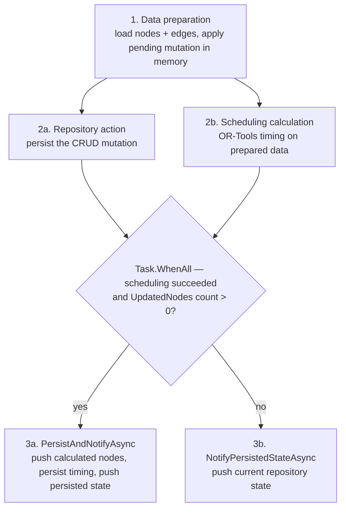
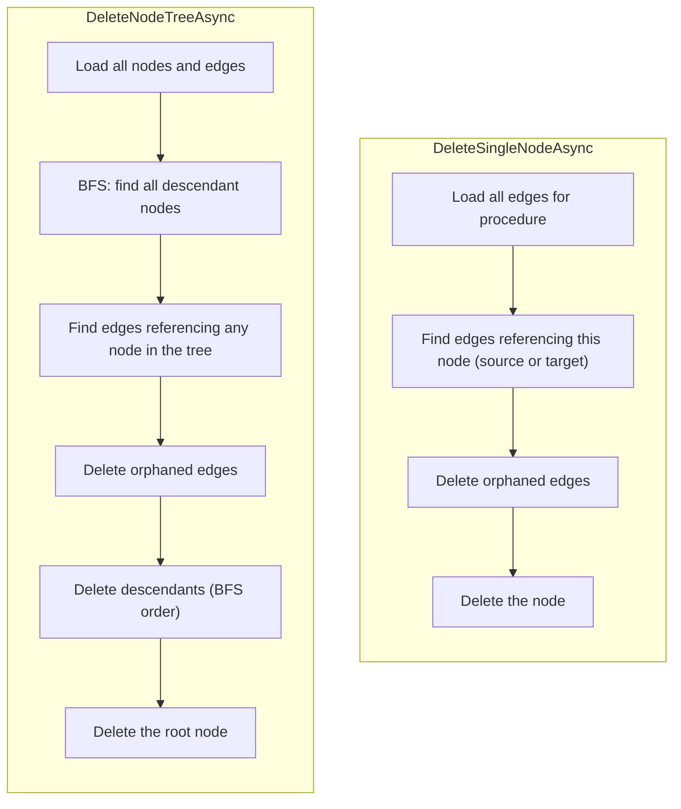
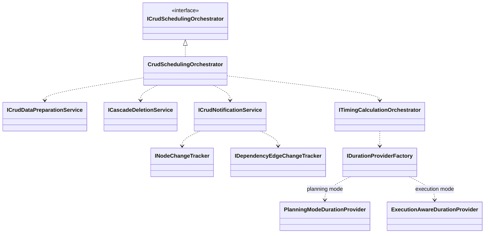

# CRUD Scheduling Orchestrator

> Coordinates every node/edge mutation with parallel scheduling recalculation and two-phase frontend notification —
> ensuring the visual timeline stays in sync with the data.

---

## Overview

When a user creates, updates, or deletes a node or edge in the procedure editor, three things must happen:

1. The change must be **persisted** to the database
2. The **schedule must be recalculated** (node positions, start/finish times)
3. The **frontend must be notified** with updated entity state

The `CrudSchedulingOrchestrator` coordinates all three in a single operation, running persistence and scheduling **in
parallel** for performance, then pushing notifications in two phases for responsiveness.

It delegates the three concerns to extracted single-responsibility services:

| Service                       | Responsibility                                                                             |
|-------------------------------|--------------------------------------------------------------------------------------------|
| `ICrudDataPreparationService` | Loads current entities and applies pending mutations for scheduling input                  |
| `ICascadeDeletionService`     | Handles cascade deletion of nodes and their referencing edges                              |
| `ICrudNotificationService`    | Two-phase notification: immediate with calculated results, then final with persisted state |

---

## Key Concepts

- **Optimistic Scheduling** — The scheduling calculation uses the *intended* state (current entities + pending mutation
  applied in memory) rather than waiting for persistence. This lets scheduling and persistence run in parallel.
- **Two-Phase Notification** — Phase 1: immediate push with calculated scheduling results (low latency). Phase 2: final
  push with authoritative persisted state from repositories (consistency).
- **Mode-Aware Duration** — `DurationProviderFactory` selects a planning-mode or execution-aware duration provider, so
  the same scheduling pipeline serves both design-time CRUD and live execution.
- **Procedure-Scoped Operations** — All operations are scoped to the currently loaded procedure via `IProcedureContext`.

For term definitions, see the [Glossary](../../docs/glossary.md).

---

## How It Works

### Core Orchestration Pattern

Every CRUD method funnels through `OrchestrateActionAsync`, which prepares data, runs the repository action and
scheduling calculation in parallel with `Task.WhenAll`, then notifies.



### Data Preparation Service

`CrudDataPreparationService` ensures scheduling always works with the correct future state. The create/update entry
points are generic over the entity type (`where T : class`):

| Method                             | What It Does                                                                     |
|------------------------------------|----------------------------------------------------------------------------------|
| `PrepareForCreateAsync<T>(entity)` | Loads all entities, **adds** the new entity to the in-memory list                |
| `PrepareForUpdateAsync<T>(entity)` | Loads all entities, **replaces** the matching entity in the list                 |
| `PrepareForDeleteAsync<T>(id)`     | Loads all entities, **removes** the entity with the given id                     |
| `PrepareForTreeDeleteAsync(id)`    | Loads all entities, **removes** the node and all its descendants (BFS traversal) |

This decouples scheduling from persistence timing — the scheduler always sees the intended result, even before the
database transaction commits.

### Cascade Deletion Service

`CascadeDeletionService` handles deleting nodes referenced by edges. Edges are always deleted **before** nodes to
maintain referential integrity.



### Two-Phase Notification

`CrudNotificationService` pushes through the `INodeChangeTracker` / `IDependencyEdgeChangeTracker` reactive surfaces.
Persistence attempts a bulk update when more than one node changed, falling back to per-node updates (a failed bulk
update also falls through); a single changed node goes straight to the per-node path.

```mermaid
sequenceDiagram
    autonumber
    participant Orch as CrudSchedulingOrchestrator
    participant Notify as CrudNotificationService
    participant NT as INodeChangeTracker
    participant ET as IDependencyEdgeChangeTracker
    participant Repo as IProcedureRepository

    Orch->>Notify: PersistAndNotifyAsync(calculatedNodes)
    Notify->>NT: UpdateEntities(calculatedNodes) — Phase 1, immediate
    Notify->>Repo: persist nodes (bulk if > 1, else per-node; bulk failure falls through)
    Notify->>Repo: GetNodes / GetEdges by procedure id
    Notify->>NT: UpdateEntities(persisted nodes) — Phase 2, authoritative
    Notify->>ET: UpdateEntities(persisted edges)
```

### Duration Provider Selection

The scheduling pipeline runs in two modes. `DurationProviderFactory.CreateDurationProvider` picks the provider, and
`TimingCalculationOrchestrator` consumes it:

- **Planning mode** returns the shared `PlanningModeDurationProvider` (design-time durations from the skill
  definitions).
- **Execution mode** returns a new `ExecutionAwareDurationProvider` that replaces planned durations with actual elapsed
  times; it requires both a procedure start time and live execution progress data.

---

## Components



| Component                        | Role                                                                                              |
|----------------------------------|---------------------------------------------------------------------------------------------------|
| `CrudSchedulingOrchestrator`     | Coordinates CRUD + parallel scheduling + notification (`ICrudSchedulingOrchestrator`)             |
| `CrudDataPreparationService`     | Loads entities and applies pending mutations for scheduling input (`ICrudDataPreparationService`) |
| `CascadeDeletionService`         | Handles single-node and tree deletion with edge cleanup (`ICascadeDeletionService`)               |
| `CrudNotificationService`        | Two-phase notification via change trackers with bulk persistence (`ICrudNotificationService`)     |
| `SchedulingRequest`              | Record carrying the procedure id, prepared nodes/edges, and timing flags passed to the scheduler  |
| `DurationProviderFactory`        | Selects the planning or execution-aware duration provider (`IDurationProviderFactory`)            |
| `ITimingCalculationOrchestrator` | Runs the scheduling pipeline (graph building, OR-Tools, positioning)                              |
| `ISchedulingResultLogger`        | Logs detailed timing results for diagnostics                                                      |
| `INodeChangeTracker`             | `BehaviorSubject`-backed stream for node updates to GraphQL subscribers                           |
| `IDependencyEdgeChangeTracker`   | `BehaviorSubject`-backed stream for edge updates to GraphQL subscribers                           |

---

## Key Design Decisions

| Decision                          | Rationale                                                                                           |
|-----------------------------------|-----------------------------------------------------------------------------------------------------|
| Parallel persistence + scheduling | Scheduling doesn't need the persistence result; running them concurrently reduces latency           |
| Optimistic scheduling input       | Applying mutations in memory avoids waiting for a DB round-trip before scheduling                   |
| Two-phase notification            | Phase 1 gives immediate visual feedback; Phase 2 ensures eventual consistency                       |
| Bulk update with fallback         | Optimizes the common case (many nodes updated) while degrading to per-node updates on failure       |
| Single-responsibility services    | Data preparation, cascade deletion, and notification are isolated behind interfaces for testability |
| Mode-aware duration provider      | One scheduling pipeline serves both design-time CRUD and execution-aware rescheduling               |

---

## Related Documentation

- [Execution Orchestrator](execution-orchestrator.md) — The runtime counterpart that orchestrates live execution
- [Execution Trigger Service](execution-trigger-service.md) — How prerequisites are monitored during execution
- [Execution Pipeline Guide](../../docs/execution-pipeline.md) — Full end-to-end execution walkthrough
- [Scheduling Module](../../Scheduling/docs/README.md) — OR-Tools solver and execution graph APIs
- [Application Layer](README.md) — Service categories and architectural patterns
- [Glossary](../../docs/glossary.md) — Term definitions
- [Documentation Hub](../../docs/README.md) — Back to the index
