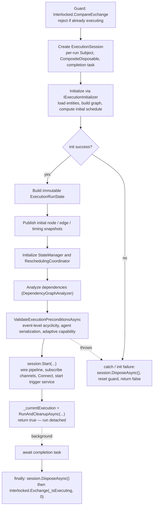
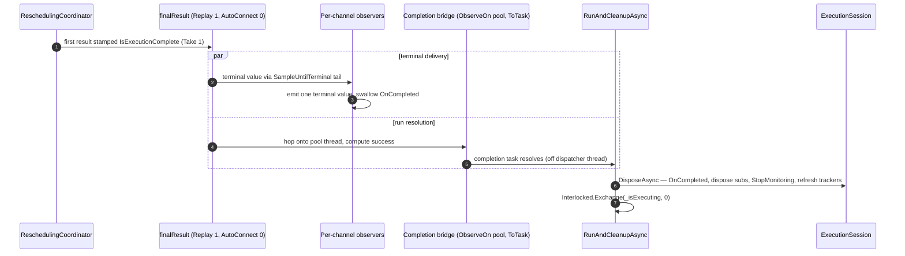
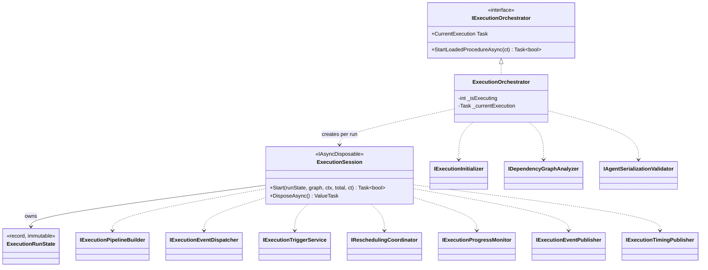

# Execution Orchestrator

> Singleton coordinator that drives a procedure from "Execute" to "Complete" — managing initialization, precondition
> validation, the Rx rescheduling pipeline, and single-phase completion, with each run isolated in its own session.

---

## Overview

The `ExecutionOrchestrator` is the top-level entry point for running a procedure. When the frontend calls the
`startExecution` GraphQL mutation, this service:

1. Guards against concurrent executions
2. Creates an `ExecutionSession` that owns all per-run reactive state
3. Initializes the run, validates execution preconditions, and analyzes dependencies
4. Starts the session and returns once execution has begun — the run proceeds on a detached background task
5. Tears the session down deterministically when the run reaches its terminal state

It is registered as a **Singleton** (required for GraphQL subscription continuity) but supports consecutive Execute →
Stop → Execute cycles because no per-run state lives on the singleton — every run gets a fresh session.

---

## Key Concepts

- **Singleton with Per-Run Session** — The orchestrator instance lives for the application lifetime, but every execution
  gets a fresh `ExecutionSession` holding its own Rx subject, subscription bag, and completion task. The session is the
  only owner of mutable per-run state.
- **Immutable Run State** — `ExecutionRunState` is an immutable record (nodes, edges, schedule, start time, procedure
  id) built once after initialization and threaded through the run, so one run can never read another run's data.
- **Detached Run** — `StartLoadedProcedureAsync` returns `true` once execution has *started*. Awaiting completion,
  fault logging, session disposal, and clearing the single-flight guard all happen on the detached `RunAndCleanupAsync`
  task, exposed through `CurrentExecution`.
- **Single-Phase Completion** — The rescheduling coordinator stamps `IsExecutionComplete` onto the first result produced
  once all skills are terminal. `Replay(1).AutoConnect(0)` multicasts that single value; the completion bridge resolves
  the run's success and the per-channel observables emit their one terminal value. There is no second detection pass and
  no feedback from subscribers into the source subject.
- **Completion Bridge as Re-entry Guard** — The terminal value is delivered onto a pool thread via
  `ObserveOn(TaskPoolScheduler.Default)` before `ToTask` resolves the run task. That hop moves the awaiting
  `DisposeAsync` (which disposes the live `Connect()` chain) off the dispatcher thread, so teardown never disposes the
  operator graph from inside its own terminal `OnNext`.
- **Interlocked Concurrency** — `_isExecuting` is an `int` guarded by `Interlocked.CompareExchange` for lock-free start
  rejection, cleared with `Interlocked.Exchange` only after teardown completes.
- **OnCompleted-only Termination** — Per-run teardown flows through `Subject<T>.OnCompleted` plus
  `CompositeDisposable.Dispose()`. Post-`OnCompleted` `OnNext` calls are silent no-ops, absorbing in-flight dispatcher
  callbacks during teardown. The publishers' `IObserver<T>` surfaces swallow `OnCompleted` so singleton channels stay
  hot across consecutive executions.

For term definitions, see the [Glossary](../../docs/glossary.md).

---

## How It Works

### Lifecycle Flow

Precondition validation runs between dependency analysis and start. A failed check (`AgentSerializationException`,
event-level cycle, or missing adaptive capability) throws; the outer `catch` disposes the session, resets the guard, and
returns `false`.

### Delegation Model

The orchestrator delegates all complex work to extracted services; the session wires them into the per-run pipeline.

| Concern                                                   | Delegated To                   | Why                                  |
|-----------------------------------------------------------|--------------------------------|--------------------------------------|
| Entity loading, graph building, initial schedule          | `IExecutionInitializer`        | Isolates setup from lifecycle        |
| Agent-serialization precondition gate                     | `IAgentSerializationValidator` | Isolates the start-time safety check |
| Event-based prerequisite graph                            | `IDependencyGraphAnalyzer`     | Isolates dependency expansion        |
| Event bus → state transitions → reschedule requests       | `IExecutionEventDispatcher`    | Isolates event logic from pipeline   |
| Rx pipeline wiring (Sample, ConcurrentMapLatest, Publish) | `IExecutionPipelineBuilder`    | Isolates reactive plumbing           |
| Prerequisite monitoring, skill/router triggering          | `IExecutionTriggerService`     | Isolates triggering logic            |
| Reschedule computation with actual times                  | `IReschedulingCoordinator`     | Isolates scheduling math             |
| State tracking (running, finished, failed, not selected)  | `ISkillExecutionStateManager`  | Isolates state machine               |
| Completion statistics and success                         | `IExecutionProgressMonitor`    | Isolates completion logic            |

### Single-Phase Completion

### Cleanup Order

Cleanup is owned by `ExecutionSession.DisposeAsync` and flows entirely through Rx semantics — no guard flags. Each step
runs under its own `try`/`catch` so an early throw cannot skip a later step:

1. `rescheduleRequests.OnCompleted()` — The source subject completes; `Sample → ConcurrentMapLatest → Publish`
   propagates completion; per-channel observables finish their tail and terminate. Publishers' `IObserver<T>` surfaces
   swallow the `OnCompleted` so singleton channels stay hot.
2. `subscriptions.Dispose()` — Tears down every subscription in the composite, including the `Connect()` handle.
   In-flight dispatcher callbacks landing on the now-completed subject become silent no-ops.
3. `_executionTriggerService.StopMonitoring()` — No new skills can start.
4. `await _eventPublisher.RefreshChangeTrackersFromRepositoryAsync()` — Reset change trackers to persisted state.

The orchestrator clears `_isExecuting` with `Interlocked.Exchange` only after `DisposeAsync` completes, so a
dispose-without-reset can never wedge the next run. `DisposeAsync` is idempotent.

---

## Components

| Component                      | Role                                                                          |
|--------------------------------|-------------------------------------------------------------------------------|
| `ExecutionOrchestrator`        | Top-level coordinator; singleton lifecycle owner; detaches the run            |
| `ExecutionSession`             | `IAsyncDisposable` owner of one run's reactive state and the teardown sink    |
| `ExecutionRunState`            | Immutable per-run snapshot (nodes, edges, schedule, start time, procedure id) |
| `IExecutionInitializer`        | Loads entities, builds execution graph, calculates initial schedule           |
| `IDependencyGraphAnalyzer`     | Expands edges into the event-based prerequisite graph                         |
| `IAgentSerializationValidator` | Verifies same-agent skills are Finish-to-Start separated before the run       |
| `IExecutionPipelineBuilder`    | Wires the connectable `Sample → ConcurrentMapLatest → Publish` source         |
| `IExecutionEventDispatcher`    | Handles event-bus events, performs state transitions, requests reschedules    |
| `IExecutionTriggerService`     | Monitors prerequisites, triggers skills and routers                           |
| `IReschedulingCoordinator`     | Computes reschedules with actual execution times                              |
| `ISkillExecutionStateManager`  | Tracks per-skill execution state                                              |
| `IExecutionProgressMonitor`    | Reports completion statistics and overall success                             |
| `IExecutionEventPublisher`     | Pushes entity changes to GraphQL subscribers via change trackers              |
| `IExecutionTimingPublisher`    | Streams execution timing snapshots (elapsed, progress, estimated total)       |

---

## Key Design Decisions

| Decision                                               | Rationale                                                                                    |
|--------------------------------------------------------|----------------------------------------------------------------------------------------------|
| Singleton registration                                 | GraphQL subscriptions require stable object references across requests                       |
| Per-run state in `ExecutionSession`                    | Consecutive executions need fresh, isolated reactive state                                   |
| Immutable `ExecutionRunState`                          | One run can never read another run's nodes, edges, or schedule                               |
| Detached run via `RunAndCleanupAsync`                  | The start request returns once execution begins, decoupled from run duration                 |
| `Interlocked` for `_isExecuting`                       | Lock-free concurrent start rejection                                                         |
| `IsExecutionComplete` stamped on `ReschedulingResult`  | Completion is snapshot-consistent with the emitted node set — no sidecar read                |
| `ObserveOn(TaskPoolScheduler.Default)` before `ToTask` | Re-entry guard: teardown never disposes the operator graph from inside its terminal `OnNext` |
| `SampleUntilTerminal` per channel                      | Rate-limits intermediate emissions; guarantees exactly one terminal value                    |
| `IObserver<T>` surfaces on publishers                  | Orchestrator pipes observables into publishers without knowing consumers                     |
| Observer `OnCompleted` swallowed by publishers         | Singleton channels stay hot across consecutive executions                                    |
| Single teardown sink (`DisposeAsync`)                  | One idempotent path for success, cancellation, and synchronous start failure                 |

---

## Failure Handling Limitations

The orchestrator detects completion by counting terminal nodes (`Completed + Failed + NotSelected == Total`). A failed
skill counts as terminal, so the execution still completes. A `Failed` or `NotSelected` event also *satisfies* a
dependent's prerequisite, so downstream nodes are released rather than left hanging — but they execute even though their
upstream produced no successful result. The orchestrator has no mechanism to propagate failure, retry, or cancel
dependent nodes. The execution ends, but a failed branch yields no successful outcome.

## Formal Verification

The dual-loop convergence (execution + rescheduling terminates) is formally verified
in [Sunstone](../../../Sunstone/README.md) (`DualLoopConvergence.lean`). The convergence proof correctly models `Failed`
as terminal — overall termination is guaranteed even under failure. The per-node liveness proof (`NoDeadlocks.lean`)
does
not model failure and is only valid on the success path. See
[Missing Failed Case](../../../Sunstone/docs/missing-failed-case.md).

## Related Documentation

- [Execution Trigger Service](execution-trigger-service.md) — How prerequisites are monitored and nodes triggered
- [CRUD Scheduling Orchestrator](crud-scheduling.md) — The design-time counterpart for CRUD + scheduling
- [Execution Pipeline Guide](../../docs/execution-pipeline.md) — Full end-to-end execution walkthrough
- [Agent Serialization](../../docs/agent-serialization/README.md) — The start-time validation gate and its proofs
- [Application Layer](README.md) — Service categories and architectural patterns
- [Glossary](../../docs/glossary.md) — Term definitions
- [Sunstone Proofs](../../../Sunstone/README.md) — Formal verification of scheduling and execution correctness
- [Documentation Hub](../../docs/README.md) — Back to the index
