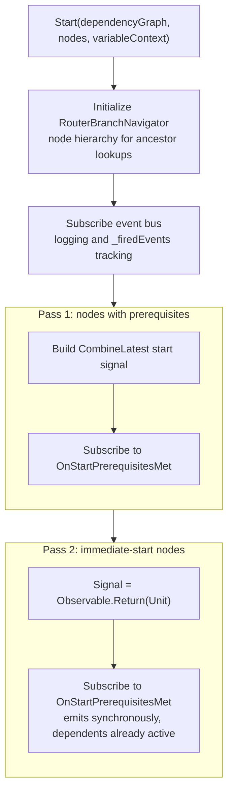
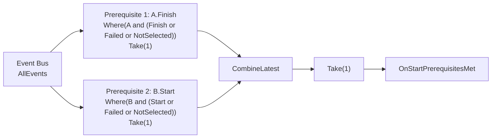
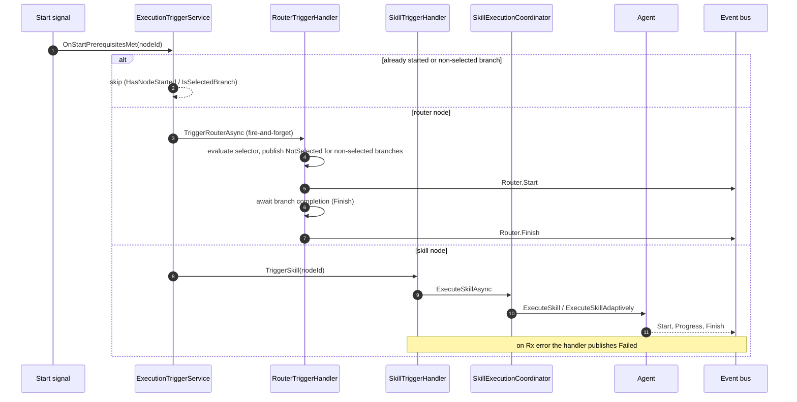
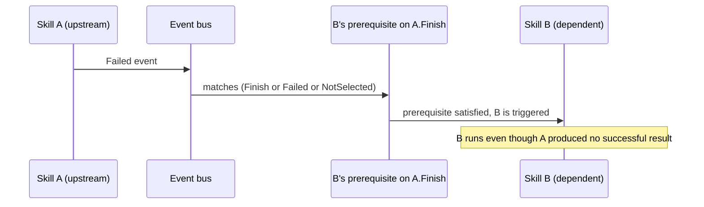

# Execution Trigger Service

> Monitors the event bus and triggers skills and routers the moment their prerequisites are satisfied — using reactive
> `CombineLatest` signals instead of imperative polling.

---

## Overview

The `ExecutionTriggerService` is the event-driven engine at the core of execution. Instead of checking prerequisites in
a loop, it builds **reactive start-signal subscriptions** for every node at startup. When all of a node's prerequisite
events have fired, the subscription emits and the node is triggered immediately.

It delegates the actual triggering to two specialized handlers:

- **`ISkillTriggerHandler`** — Triggers skill execution on the assigned agent (regular or adaptive)
- **`IRouterTriggerHandler`** — Evaluates router conditions, selects branches, publishes `NotSelected` events

The service is designed for **Singleton reuse**: `Start()` creates all state, `StopMonitoring()` tears it down, and the
next execution can call `Start()` again.

---

## Key Concepts

- **Reactive Prerequisite Signals** — Each node's prerequisites are converted to `IObservable<ExecutionEvent>` streams.
  `CombineLatest` + `Take(1)` emits exactly once when all prerequisites are satisfied.
- **Terminal Events Satisfy Prerequisites** — A prerequisite observable matches the required event type **or** a
  `Failed` **or** `NotSelected` event from the same skill. A failed or skipped upstream therefore *releases* its
  dependents rather than stalling them.
- **Two-Pass Subscription** — Non-immediate nodes subscribe first (they wait for bus events). Immediate-start nodes
  subscribe second (`Observable.Return(Unit)` emits synchronously). This prevents a race where an immediate node fires
  before dependent subscriptions are active.
- **Selected-Branch Filtering** — The synthetic `Router.Start` prerequisite that gates branch-internal nodes is injected
  into the dependency graph by `DependencyGraphAnalyzer`, not by this service. At trigger time the service enforces it
  by
  consulting `IRouterTriggerHandler.IsSelectedBranch`, skipping any node that is not in the router's selected branch.
- **Fire-and-Forget Router Triggering** — `TriggerRouterAsync` is launched from an Rx callback without `await`. It
  handles its own exceptions internally; a `.ContinueWith(OnlyOnFaulted)` safety net catches any escaping exception.
- **Total Router Selection** — `BranchSelector.SelectBranchAsync` can throw, and `IRouterTriggerHandler` swallows the
  exception, which means it never publishes `Router.Start` and the branch-internal nodes stay blocked. Routers must be
  validated at creation so selection is total; see the [Glossary](../../docs/glossary.md) and `NoDeadlocks.lean`.

For term definitions, see the [Glossary](../../docs/glossary.md).

---

## How It Works

### Start-Signal Architecture

Event-level acyclicity is guaranteed upstream by the orchestrator's precondition validation, so the trigger service does
no cycle detection of its own.

### Prerequisite Signal Construction

Each prerequisite becomes an `IObservable<ExecutionEvent>` filtered from the event bus; all are combined with
`CombineLatest`, which emits when **every** prerequisite has fired at least once. A final `Take(1)` ensures the trigger
fires exactly once.

### Node Triggering Flow

When a node's start signal fires, `OnStartPrerequisitesMet` applies guards and dispatches to the right handler. Skills
are executed by the coordinator, which calls the agent and publishes lifecycle events to the bus.

### Selected-Branch Gate

Without the gate, a race occurs: the router's `TriggerRouterAsync` runs asynchronously, a branch-internal node's
prerequisites are met, and the node triggers before the router has stored its selection. `DependencyGraphAnalyzer`
prevents this by adding a synthetic `Router.Start` prerequisite to every branch-internal node, so the node's
`CombineLatest` signal cannot fire until the router has evaluated and published its `Start` event. At trigger time
`OnStartPrerequisitesMet` additionally consults `IsSelectedBranch` to skip nodes in non-selected branches.

### Adaptive Planned-Finish Forwarding

Adaptive skills run until a finish signal arrives; their estimated finish time is recalculated on every reschedule. The
service forwards these updates to the per-skill subjects:

- `UpdatePlannedFinish(skillId, time)` — forwards a single planned-finish update to `ISkillTriggerHandler`.
- `UpdateAdaptivePlannedFinishTimes(nodes)` — recomputes planned finishes for all non-terminal skills, skipping any
  skill that has reached a terminal state (`HasNodeReachedTerminalState`).
- `PlannedFinishObserver` — the `IObserver<IReadOnlyList<Node>>` surface the orchestrator's agent channel pushes into;
  its `OnCompleted` is swallowed so the per-skill subjects stay hot across executions.

---

## Components

| Component                 | Role                                                                                           |
|---------------------------|------------------------------------------------------------------------------------------------|
| `ExecutionTriggerService` | Builds reactive start signals, monitors prerequisites, dispatches to handlers                  |
| `ISkillTriggerHandler`    | Triggers regular and adaptive skill execution via the coordinator; publishes `Failed` on error |
| `IRouterTriggerHandler`   | Evaluates router conditions, manages branch selection, monitors branch completion              |
| `IRouterBranchNavigator`  | Traverses node hierarchy for ancestor router lookups and branch-internal node discovery        |
| `ISkillExecutionEventBus` | Hot observable stream of all execution events                                                  |

---

## State Management

The service tracks execution state in thread-safe collections:

| Field            | Type                            | Purpose                                                                   |
|------------------|---------------------------------|---------------------------------------------------------------------------|
| `_firedEvents`   | `ConcurrentBag<ExecutionEvent>` | Tracks all fired events for the `HasNodeStarted` guard                    |
| `_subscriptions` | `ConcurrentBag<IDisposable>`    | All Rx subscriptions for cleanup                                          |
| `_cts`           | `CancellationTokenSource`       | Propagates cancellation to handlers; recreated on each `StopMonitoring()` |
| `_isStarted`     | `bool`                          | Guards against double-start                                               |

All state is fully reset in `StopMonitoring()`, enabling Singleton reuse across consecutive executions.

---

## Key Design Decisions

| Decision                                 | Rationale                                                                                                   |
|------------------------------------------|-------------------------------------------------------------------------------------------------------------|
| Reactive signals over imperative polling | Prerequisites are naturally expressed as event streams; `CombineLatest` handles any arrival order           |
| Terminal events satisfy prerequisites    | `Failed`/`NotSelected` release dependents, so the run converges instead of deadlocking on a failed upstream |
| Two-pass subscription ordering           | Prevents immediate-start nodes from triggering before dependent subscriptions are wired                     |
| `ConcurrentBag` for fired events         | Thread-safe access from Rx callbacks running on the thread pool                                             |
| Fire-and-forget for routers              | Routers are long-lived async operations (await branch completion); blocking the Rx callback would deadlock  |
| Selected-branch enforcement at trigger   | The synthetic gate is built into the graph; the service only checks `IsSelectedBranch` when firing          |

---

## Failure Handling

A prerequisite is satisfied by the required event type **or** a `Failed` **or** `NotSelected` event from the same skill.
When a skill publishes `Failed`, its dependents' `CombineLatest` signals emit and the dependents are triggered — they do
not hang. The trade-off is that a dependent runs even though its upstream produced no successful result; the service has
no retry, fallback, or failure-propagation mechanism. The one exception is router branch completion: a router waits
specifically for its branch's `Finish` event, so a failed branch-internal skill can leave the router awaiting
completion.

## Formal Verification

The reactive prerequisite model (`CombineLatest`, two-pass subscription, `HasNodeStarted` guard) is formally verified in
[Sunstone](../../../Sunstone/README.md) (`NoPrematureTriggering.lean`, `PrerequisiteComputation.lean`). The proofs model
`Failed` as terminal for convergence but the per-node liveness guarantee holds only on the success path. See
[Missing Failed Case](../../../Sunstone/docs/missing-failed-case.md).

## Related Documentation

- [Execution Orchestrator](execution-orchestrator.md) — The lifecycle owner that starts and stops this service
- [CRUD Scheduling Orchestrator](crud-scheduling.md) — The design-time counterpart for CRUD + scheduling
- [Execution Pipeline Guide](../../docs/execution-pipeline.md) — Full end-to-end execution walkthrough
- [Application Layer](README.md) — Service categories and architectural patterns
- [Glossary](../../docs/glossary.md) — Term definitions
- [Sunstone Proofs](../../../Sunstone/README.md) — Formal verification of scheduling and execution correctness
- [Documentation Hub](../../docs/README.md) — Back to the index
