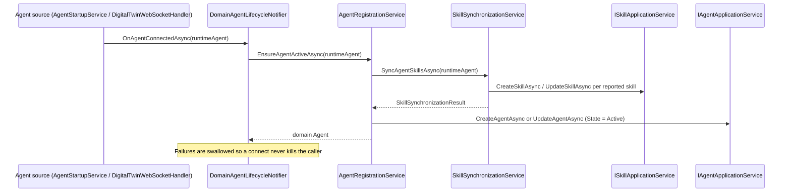
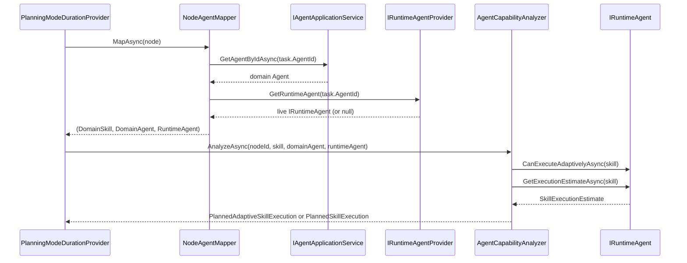
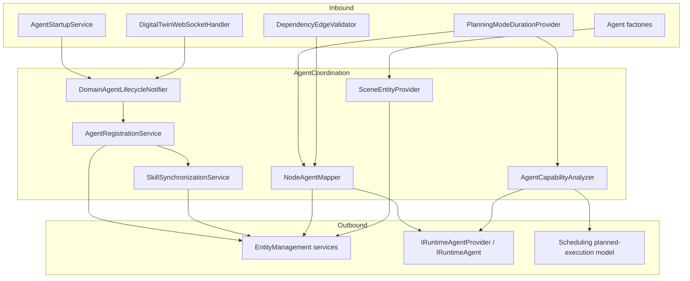

# Agent Coordination Services

> Bridges the runtime Agents module to the persistent domain model: activates agents, synchronizes their skills to
> PostgreSQL, and maps procedure nodes to the capable runtime agents that drive duration planning.

## Overview

The Agent Coordination group is the seam between two worlds. On one side sits the `Agents` module, which holds live
`IRuntimeAgent` instances (Dummy, KUKA, Digital Twin) that actually execute skills. On the other side sits the domain
model in PostgreSQL, where `Agent` and `Skill` records back GraphQL queries, workflow references, and the scheduling
pipeline. This group reconciles the two: when an agent connects, its domain record is created or reactivated and every
skill it reports is written through to the database; when a procedure is scheduled, each skill-execution node is
resolved to the runtime agent assigned to it so the agent's own duration estimates can drive timing.

It implements abstractions defined inside the Agents module (`IAgentLifecycleNotifier`, `ISceneEntityProvider`)
following the Dependency Inversion Principle, so the Agents module never depends on the Application layer directly.

## Key Concepts

- **Two-layer agent model** — every agent has a runtime presence (in-memory, managed by the Agents module) and a domain
  presence (PostgreSQL `agents` row). This group keeps the domain layer consistent with the runtime layer. The lifecycle
  state machine itself is documented in detail in [agent-lifecycle.md](../agent-lifecycle.md).
- **Idempotent activation** — `EnsureAgentActiveAsync` handles both first registration and reconnection without distinct
  code paths, so startup and WebSocket reconnect share one entry point.
- **Skill synchronization** — runtime agents are the source of truth for their skills; the group upserts a domain
  `Skill` definition for each, comparing names, descriptions, directions, types, and typed values to decide create vs.
  update vs. no-op.
- **Node-to-agent mapping** — a `SkillExecutionNode` carries a `SkillExecutionTask` with a `Skill` and an `AgentId`; the
  group resolves that pair to the live `IRuntimeAgent` currently registered.
- **Capability analysis** — given a resolved (skill, agent) pair, the group asks the runtime agent whether it can
  execute adaptively and what its duration estimates are, then constructs the appropriate `IPlannedSkillExecution` (
  fixed or adaptive) for the scheduler.
- **DIP-driven bridging** — the lifecycle callback and scene-entity provider contracts live in the Agents module; the
  implementations live here.

## How It Works

The group has three responsibilities that activate at different moments: lifecycle activation (startup and
connect/disconnect), skill synchronization (a sub-step of activation), and node mapping plus capability analysis (during
scheduling). The activation flow:

The mapping-and-analysis flow runs inside the scheduling pipeline. `PlanningModeDurationProvider` (a scheduling-layer
`ISkillDurationProvider`) calls into this group for each skill-execution node:

`NodeAgentMapper` deliberately resolves agents through `IRuntimeAgentProvider` on every call rather than caching a
startup-time snapshot, so a Digital Twin that connects via WebSocket after startup is immediately visible to the
scheduler. The domain agent for the tuple is fetched from `IAgentApplicationService.GetAgentByIdAsync`, while only the
live runtime agent comes from `IRuntimeAgentProvider`. `AgentCapabilityAnalyzer` chooses the planned-execution shape:
when the agent reports adaptive capability **and** a `MinAdaptiveDuration` it builds a `PlannedAdaptiveSkillExecution`;
when the agent reports it is **not** adaptive it builds a fixed `PlannedSkillExecution` from the nominal estimate; and
when the agent reports adaptive capability but no `MinAdaptiveDuration` (or returns no constraints at all) it yields
`null` and the node is treated as unmappable.

## Components

| Class / Interface                                              | Responsibility                                                                                                                                                                                                                     |
|----------------------------------------------------------------|------------------------------------------------------------------------------------------------------------------------------------------------------------------------------------------------------------------------------------|
| `IAgentRegistrationService` / `AgentRegistrationService`       | Idempotent domain activation of a runtime agent and state transitions; creates or reactivates the `Agent` record, generates a representative color, and stores runtime metadata.                                                   |
| `DomainAgentLifecycleNotifier`                                 | Implements `IAgentLifecycleNotifier` (defined in Agents); routes connect events to `EnsureAgentActiveAsync` and disconnect events to `UpdateAgentStateAsync(Inactive)`, swallowing activation failures so the connection survives. |
| `ISkillSynchronizationService` / `SkillSynchronizationService` | Synchronizes a runtime agent's reported skills into the domain, upserting each via `EnsureSkillExistsAsync` and returning a `SkillSynchronizationResult` with create/update/unchanged counts and errors.                           |
| `SkillSynchronizationResult`                                   | Result record carrying timing, processed/created/updated/unchanged counts, agent-relationship updates, and an error list.                                                                                                          |
| `INodeAgentMapper` / `NodeAgentMapper`                         | Maps a procedure `Node` to a `(Skill, Agent, IRuntimeAgent)` tuple by reading the `SkillExecutionTask` and resolving the live agent via `IRuntimeAgentProvider`.                                                                   |
| `IAgentCapabilityAnalyzer` / `AgentCapabilityAnalyzer`         | Queries the runtime agent's adaptive capability and duration estimates and builds the matching `IPlannedSkillExecution` (adaptive or fixed) or `null`.                                                                             |
| `ISceneEntityProvider` / `SceneEntityProvider`                 | Implements the Agents-module `ISceneEntityProvider`; supplies position-tag and scene-object dictionaries from the database for agent creation.                                                                                     |
| `AgentCoordinationLogger` / `AgentCapabilityLogger`            | Source-generated structured loggers for registration, skill-sync, mapping, and capability-analysis events.                                                                                                                         |

## Connections and Pipeline Role

This group is the integration hub between the Agents module, the EntityManagement CRUD services, and the Scheduling
pipeline. It runs at two distinct moments: at **startup / on connect** (activation and skill sync) and at **design time,
inside the scheduling pipeline** (node mapping and capability analysis). It is not part of the runtime execution loop
itself.

**What depends on this group (inbound):**

- `AgentStartupService` (GraphQLServer initialization) calls `IAgentLifecycleNotifier.OnAgentConnectedAsync` for each
  Dummy/KUKA agent loaded from configuration at startup.
- `DigitalTwinWebSocketHandler` (Agents module) calls `OnAgentConnectedAsync` on WebSocket connect and
  `OnAgentDisconnectedAsync` on disconnect.
- `PlanningModeDurationProvider` (Scheduling/Duration) injects `INodeAgentMapper` and `IAgentCapabilityAnalyzer` to turn
  each `SkillExecutionNode` into a planned execution with a duration. This is how agent capability reaches the OR-Tools
  timing computation.
- `DependencyEdgeValidator` (GraphQLServer validation) consumes the mapping/analysis types to validate that
  skill-execution edges resolve to capable agents.
- The Agents module's agent factories (`DummyAgentFactory`, `KukaAgentFactory`) consume `ISceneEntityProvider` to
  hydrate agent skills with real scene entities.

**What this group depends on (outbound):**

- **EntityManagement** — `IAgentApplicationService` (create/update/get agents), `ISkillApplicationService` (
  create/update skills), `IPositionTagApplicationService`, and `ISceneObjectApplicationService`, plus the generic
  `IRepository(Agent)` and `IRepository(Skill)` for existence checks.
- **Agents module** — `IRuntimeAgent` (the runtime contract: `GetAvailableSkillsAsync`, `CanExecuteAdaptivelyAsync`,
  `GetExecutionEstimateAsync`) and `IRuntimeAgentProvider` (live agent lookup, backed by the unified agent manager).
- **Scheduling** — the planned-execution model types `IPlannedSkillExecution`, `PlannedSkillExecution`, and
  `PlannedAdaptiveSkillExecution`.
- **Domain** — `Agent`, `Skill`, `AgentState`, `TypedValue`, `Position`, `PositionTag`, `SceneObject`, and the procedure
  `Node` / `SkillExecutionNode` types.

**Pipeline role:** mixed, but firmly outside the runtime execution loop. Registration and skill synchronization are *
*startup and connect-time** concerns that keep the design-time data model in step with the live fleet. Node mapping and
capability analysis are **design-time scheduling** concerns: they feed the planning-mode duration provider so the
scheduler can compute timings before any execution begins. During actual procedure execution, the orchestration and
triggering services take over and this group is no longer on the critical path.

## Configuration

This group reads no `appsettings.json` sections of its own. All services are registered in
`AddAgentSynchronizationServices` and `AddApplicationServices` in
`Backend/GraphQLServer/Extensions/ApplicationServiceExtensions.cs` as singletons. Log verbosity is controlled through
the standard logging configuration in `appsettings.json`.

## Related Documentation

- [Application Layer README](../README.md) — Service categories and pipeline flow.
- [Application Services index](./README.md) — All service-group docs.
- [Agent Lifecycle](../agent-lifecycle.md) — The two-layer model and the agent-state machine in depth.
- [Scheduling services](./scheduling.md) — Where the planned-execution model and duration providers live.
- [Entity Management services](./entity-management.md) — The agent and skill CRUD services this group writes through.
- [Execution services](./execution.md) — The runtime pipeline that takes over once scheduling completes.
- [Agent Serialization](../../../docs/agent-serialization/README.md) — How agent assignments are validated before
  execution.
- [Execution Pipeline walkthrough](../../../docs/execution-pipeline.md) — End-to-end runtime flow.
- [Glossary](../../../docs/glossary.md) — Term definitions.
