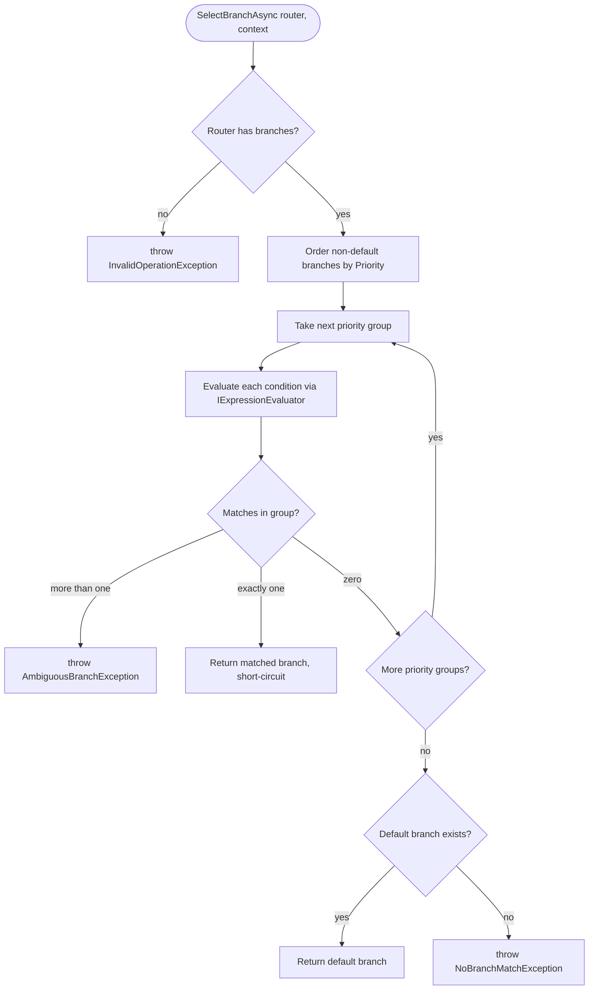
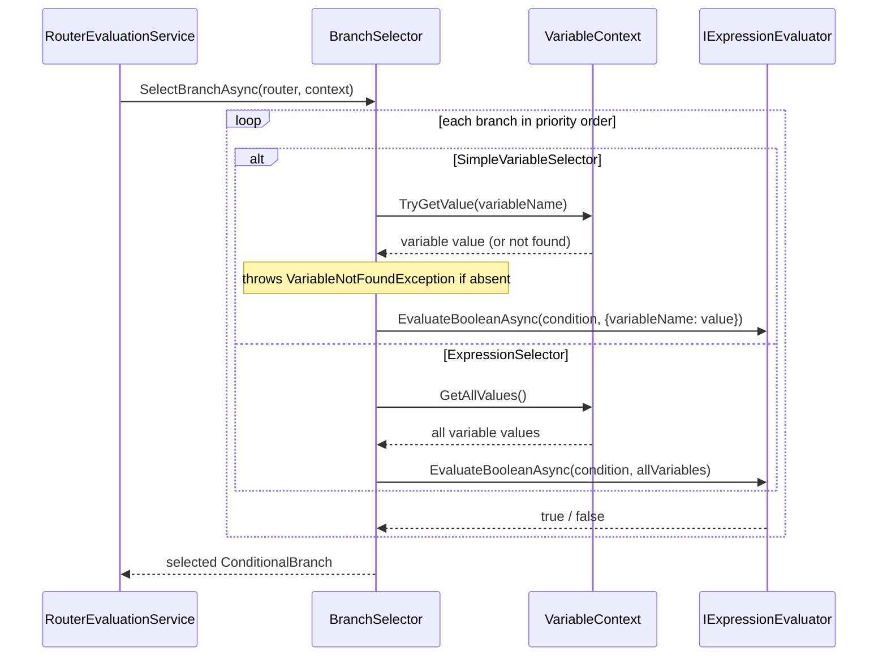
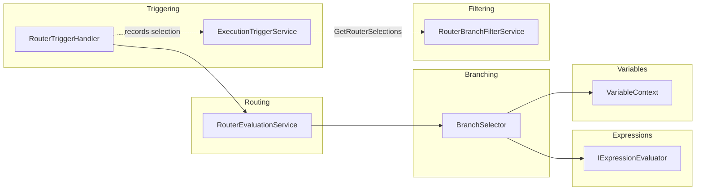

# Branching Services

> Selects exactly one conditional branch of a router at runtime by evaluating branch conditions in priority order, first
> match wins, with fail-fast on ambiguity or no match.

## Overview

The Branching group contains a single service, `BranchSelector`, that answers one question at execution time: given a
`RouterNode` and the current variable values, which one branch does control flow take? It evaluates each branch's
condition expression in priority order and returns the first branch that matches, short-circuiting so that
lower-priority branches are never evaluated. If no conditional branch matches it falls back to the router's default
branch, and if there is no default it throws.

The group is deliberately thin. It does not decide *when* a router runs, does not publish events, and does not touch the
schedule. It is a pure decision function over a router and a `VariableContext`, invoked once per router activation by
the runtime routing layer.

## Key Concepts

- **Router branch selection** — choosing exactly one outgoing `ConditionalBranch` from a `RouterNode.RouterTask`,
  analogous to picking one `case` in a switch statement.
- **Priority order** — branches carry an integer `Priority` (lower number evaluated first); selection walks branches
  grouped by ascending priority.
- **First match wins / short-circuit** — within priority order, the first matching branch is returned immediately;
  remaining branches are not evaluated.
- **Default branch** — a branch whose `Condition` is null or empty (`ConditionalBranch.IsDefaultBranch()`); used as the
  fallback when no conditional branch matches.
- **Selector types** — `SimpleVariableSelector` evaluates against a single named variable; `ExpressionSelector` exposes
  all variables for complex boolean expressions. Both derive from `SelectorExpression`.
- **Fail fast** — `SelectBranchAsync` throws `AmbiguousBranchException` when two branches at the same priority both
  match, and `NoBranchMatchException` when nothing matches and no default exists. It throws `InvalidOperationException`
  when the router has no branches and `VariableNotFoundException` when a required variable is absent.
- **Totality contract** — because the runtime caller swallows exceptions, a router whose branch set is not total (
  ambiguous or non-exhaustive) becomes a latent deadlock. Routers must be validated at creation, not relied upon to fail
  gracefully at execution.

## How It Works

`SelectBranchAsync` orders branches by `Priority`, partitions out the default branch, and walks the non-default branches
one priority group at a time. Each branch condition is evaluated via `IExpressionEvaluator.EvaluateBooleanAsync` against
an evaluation context built from the `VariableContext`. For a `SimpleVariableSelector` only the named variable is placed
in the evaluation context (with a boolean-to-string coercion when the condition compares against `"true"`/`"false"`
string literals); for an `ExpressionSelector` every variable is added.

The condition-evaluation path differs by selector type:

When a `SimpleVariableSelector` has an empty `VariableName`, the selector attempts a regex fallback that extracts the
variable name from the branch condition (for example `QualityOK == true`). All selection steps are traced through
`BranchingLogger`, a source-generated structured logger.

## Components

| Class / Interface | Responsibility                                                                                                                                                                               |
|-------------------|----------------------------------------------------------------------------------------------------------------------------------------------------------------------------------------------|
| `IBranchSelector` | Contract for selecting exactly one branch from a `RouterNode` given a `VariableContext`; declares the three branch-selection exceptions.                                                     |
| `BranchSelector`  | Implementation that orders branches by priority, evaluates conditions per selector type with short-circuit, enforces ambiguity and no-match fail-fast, and falls back to the default branch. |
| `BranchingLogger` | Source-generated structured logging for branch selection: selection start, per-branch condition evaluation, variable lookups, boolean-to-string coercion, and selection results.             |

## Connections and Pipeline Role

Branching is a pure **execution-runtime** component. It does no design-time CRUD, runs nothing at startup, and is
registered as a singleton in `ApplicationServiceExtensions.AddApplicationServices` (
`services.AddSingleton<IBranchSelector, BranchSelector>()`). It is stateless and operates entirely on the `RouterNode`
and `VariableContext` passed in.

**What it depends on:**

- **Expressions** — injects `IExpressionEvaluator` (implemented by `ExpressionEvaluator`) to evaluate every branch
  condition as a boolean.
- **Variables** — reads the runtime `VariableContext` (Domain entity) via `TryGetValue` / `GetAllValues`, and throws
  `VariableNotFoundException` from `Services.Variables.Exceptions`. The branch-selection exceptions
  `AmbiguousBranchException` and `NoBranchMatchException` also live in that namespace.
- **Domain (Procedure)** — operates on `RouterNode`, `RouterTask`, `ConditionalBranch`, `SelectorExpression`,
  `SimpleVariableSelector`, and `ExpressionSelector`.

**What depends on it:**

- **Execution / Routing** — `RouterEvaluationService` (implementing `IRouterEvaluationService`) is the sole runtime
  caller. It invokes `SelectBranchAsync`, then resolves the selected branch's `TargetNodeId` into the next node to
  execute.
- **Execution / Triggering** — `RouterTriggerHandler` drives `RouterEvaluationService` from a reactive (Rx) callback
  during execution. It records the chosen target in an in-memory `_routerSelections` map, publishes `NotSelected` events
  for the branches that lost, and exposes the map upward.

The selection result propagates from the runtime into the schedule indirectly. `RouterTriggerHandler` surfaces its
recorded selections through `ExecutionTriggerService.GetRouterSelections()`, and the **Scheduling / Filtering** group's
`RouterBranchFilterService` consumes that dictionary to keep only the selected branch (and its descendants) on the
displayed timeline. `RouterBranchFilterService` does not call `BranchSelector` directly; it acts on the already-recorded
selection.

**Totality contract and the deadlock risk.** `SelectBranchAsync` can throw. Its caller chain ends in
`RouterTriggerHandler.TriggerRouterAsync`, which is fire-and-forget from an Rx callback and swallows exceptions in a
`catch (Exception)` block (it deliberately does not re-throw). A thrown `AmbiguousBranchException` or
`NoBranchMatchException` therefore does not surface as an error: the router silently fails to select, no branch fires,
and downstream nodes waiting on the router's `Finish` event never become runnable. This is the liveness hazard formally
tracked by `NoDeadlocks.lean` (and the safety property in `RouterBranchConsistency.lean`) in the Lean verification of
`RouterTriggerHandler`. The mitigation is structural: routers must be validated so that branch selection is **total** —
conditions mutually exclusive within a priority and a default branch present — at creation time, rather than depending
on `SelectBranchAsync` to fail loudly at execution.

## Related Documentation

- [Application layer README](../README.md)
- [Expressions services](./expressions.md)
- [Variables services](./variables.md)
- [Scheduling services](./scheduling.md)
- [Execution services](./execution.md)
- [Execution trigger service deep-dive](../execution-trigger-service.md)
- [Execution pipeline walkthrough](../../../docs/execution-pipeline.md)
- [Glossary](../../../docs/glossary.md)
