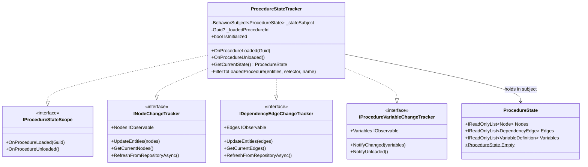
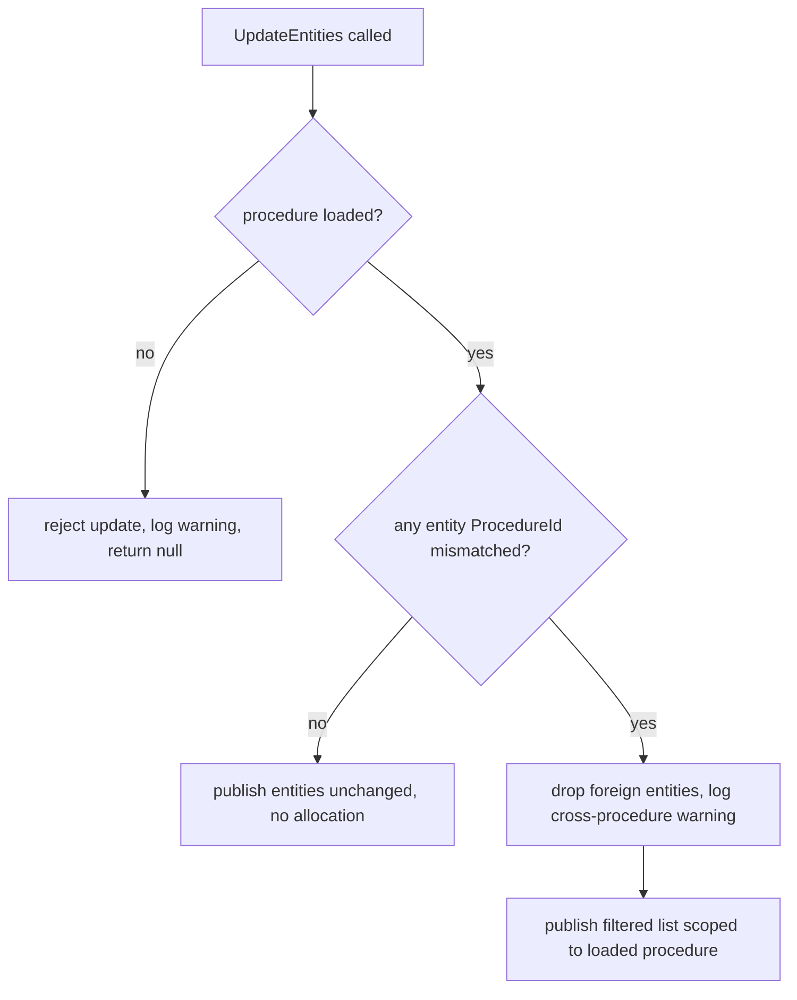
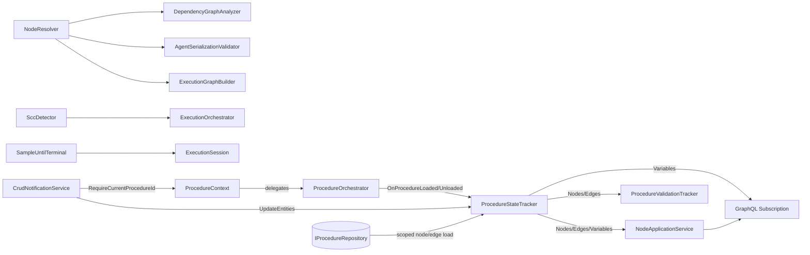

# Common Services

> Cross-cutting infrastructure: the procedure-scope trust boundary, the unified reactive state backbone behind every
> GraphQL subscription, shared graph-resolution helpers, and a platform timer-resolution fix.

## Overview

The `Services/Common/` group holds the infrastructure that every other Application service group leans on but none of
them owns. It defines the procedure-scope trust boundary (`IProcedureContext`), the single reactive store that fans
procedure-scoped node, edge, and variable changes out to GraphQL subscriptions (`ProcedureStateTracker`), the pure graph
helpers used by validation and execution (`INodeResolver`, `SccDetector`), one reactive primitive used by per-execution
pipelines (`SampleUntilTerminal`), and a Windows-only hosted service that corrects the system timer resolution so Rx.NET
timers fire accurately.

These types are deliberately small, mostly stateless or single-purpose, and free of business policy. They exist so that
procedure scoping, change tracking, and graph resolution are implemented once and reused by EntityManagement,
Scheduling, and Execution (including its Validation sub-area) rather than re-derived in each.

## Key Concepts

- **Procedure-scope trust boundary** — `IProcedureContext` answers "which procedure is loaded?" and "does this entity
  belong to it?". `ProcedureStateTracker.FilterToLoadedProcedure` enforces the same boundary at the reactive write
  surface: any update whose `ProcedureId` does not match the loaded procedure is dropped, and an update arriving while
  no procedure is loaded is rejected outright.
- **Unified reactive state** — A single `BehaviorSubject(ProcedureState)` holds nodes, edges, and variables together.
  `ProcedureStateTracker` projects slices of that subject through `INodeChangeTracker`, `IDependencyEdgeChangeTracker`,
  and `IProcedureVariableChangeTracker`, each `DistinctUntilChanged`, so a node update never wakes an edge subscriber.
- **Lifecycle-driven scoping** — `IProcedureStateScope` lets the procedure lifecycle owner load and clear scoped data
  without a DI cycle. Loading triggers a scoped repository fetch; unloading immediately resets the subject to
  `ProcedureState.Empty` so no stale cross-procedure data can linger.
- **Stale-load guard** — An asynchronous scoped load checks the active procedure id again before publishing; if the
  procedure switched mid-flight, the results are discarded.
- **Node resolution** — `INodeResolver` maps a graph node id (TaskNode, SkillExecutionNode, or RouterNode) to the node
  ids it stands for. `ResolveToExecutableIds` returns the executable leaves, expanding a task node to its executable
  descendants by recursing through nested task nodes and stopping at routers (a router resolves to itself, since it
  publishes its own Start/Finish events); a leafless container resolves to the empty set. `ResolveToFiringEndpointsIds`
  is the total firing-endpoint variant: it returns those leaves when non-empty, otherwise the node itself, so a
  dependency routed through a leafless container (an empty task or branch) gates on that container's own zero-extent
  Start/Finish rather than being dropped. `ResolveToExecutableIds` is also the single emptiness oracle shared across the
  runtime dependency analysis, the schedule's leafless-container contraction, and the timeline display, so all three
  agree on which containers are empty.
- **SCC detection** — `SccDetector` is a generic Tarjan strongly-connected-components implementation shared by the
  scheduling and execution layers for cycle detection.
- **Sample-until-terminal** — `SampleUntilTerminal` rate-limits an in-progress stream during execution but guarantees
  the final snapshot is delivered exactly once at completion.
- **Timer resolution** — `WindowsTimerResolutionService` raises the Windows system timer to 1ms so sub-16ms Rx sampling
  intervals are honoured.

## How It Works

`ProcedureStateTracker` is the heart of the group. It implements four interfaces over one
`BehaviorSubject(ProcedureState)`. Lifecycle notifications enter through `IProcedureStateScope`; entity writes enter
through the change-tracker interfaces and pass the procedure-scope filter; reads leave through the three projected
observables that GraphQL subscribes to.

A write that survives the filter rebuilds the immutable `ProcedureState` with a `with` expression and pushes it onto the
subject. The variable path keeps `IProcedureVariableChangeTracker` as the authoritative writer for variables: even a
scoped node/edge load preserves the current `Variables` slice rather than overwriting it.

The procedure-scope filter is the trust boundary in code:

`SampleUntilTerminal` composes three Rx operators — `Sample(interval)` on the intermediate stream,
`TakeUntil(terminal)`, then `Concat(terminal)` — so consumers see rate-limited progress while a run is live and then
exactly one finalised value at the end, regardless of where the last sample tick fell.

## Components

| Class / Interface                                          | Responsibility                                                                                                                                                                                                                                                                                                                                                                                                                                                                                                  |
|------------------------------------------------------------|-----------------------------------------------------------------------------------------------------------------------------------------------------------------------------------------------------------------------------------------------------------------------------------------------------------------------------------------------------------------------------------------------------------------------------------------------------------------------------------------------------------------|
| `IProcedureContext`                                        | Abstraction for the procedure-scope trust boundary: current procedure id, ownership validation, and a `ProcedureChanges` observable.                                                                                                                                                                                                                                                                                                                                                                            |
| `ProcedureContext`                                         | Implements `IProcedureContext` by delegating to `IProcedureOrchestrator`; throws on direct set/clear to force lifecycle changes through the orchestrator.                                                                                                                                                                                                                                                                                                                                                       |
| `ProcedureState`                                           | Immutable record snapshot of nodes, edges, and variables; `Empty` is the no-procedure-loaded value.                                                                                                                                                                                                                                                                                                                                                                                                             |
| `ProcedureStateTracker`                                    | Unified store implementing `INodeChangeTracker`, `IDependencyEdgeChangeTracker`, `IProcedureVariableChangeTracker`, and `IProcedureStateScope` over one `BehaviorSubject(ProcedureState)`; enforces procedure scoping on every write.                                                                                                                                                                                                                                                                           |
| `INodeChangeTracker`                                       | Observable stream and synchronous snapshot of procedure-scoped nodes, plus repository refresh.                                                                                                                                                                                                                                                                                                                                                                                                                  |
| `IDependencyEdgeChangeTracker`                             | Observable stream and synchronous snapshot of procedure-scoped dependency edges, plus repository refresh.                                                                                                                                                                                                                                                                                                                                                                                                       |
| `IProcedureVariableChangeTracker`                          | Observable stream of the loaded procedure's variable definitions; notifies on change and on unload.                                                                                                                                                                                                                                                                                                                                                                                                             |
| `IProcedureStateScope`                                     | Narrow lifecycle hook (`OnProcedureLoaded`/`OnProcedureUnloaded`) that drives scoped loads without a DI cycle.                                                                                                                                                                                                                                                                                                                                                                                                  |
| `INodeResolver`                                            | Resolves a node id to the executable leaves it represents (`ResolveToExecutableIds`) or to the firing endpoints a dependency through it gates on (`ResolveToFiringEndpointsIds`: the leaves when non-empty, otherwise the node itself).                                                                                                                                                                                                                                                                         |
| `NodeResolver`                                             | Stateless `INodeResolver` implementation: recurses a TaskNode to its executable descendants over `ParentToChildrenMapping` (skills collected to any depth, nested routers returned by identity as branch boundaries), and returns SkillExecutionNodes and RouterNodes by identity. A visited set guards against malformed parent cycles. `ResolveToFiringEndpointsIds` wraps this, returning the executable leaves when non-empty, otherwise the node itself for a leafless container present in the hierarchy. |
| `HandleDependencyTypeMapper`                               | Pure static mapper from dependency-edge handle strings to `EventTriggerType` and `DependencyType`; shared by the runtime `DependencyGraphAnalyzer` and the schedule's `EdgeTypeMapper` so both layers map handles identically.                                                                                                                                                                                                                                                                                  |
| `SccDetector`                                              | Generic Tarjan strongly-connected-components detector over an adjacency dictionary; O(V+E).                                                                                                                                                                                                                                                                                                                                                                                                                     |
| `PerExecutionRxExtensions`                                 | Hosts `SampleUntilTerminal`, the "sampled during execution, one guaranteed terminal value" Rx primitive.                                                                                                                                                                                                                                                                                                                                                                                                        |
| `WindowsTimerResolutionService`                            | Hosted service that calls `timeBeginPeriod(1)`/`timeEndPeriod(1)` on Windows so sub-16ms Rx timers fire accurately; a no-op on other platforms.                                                                                                                                                                                                                                                                                                                                                                 |
| `NotificationLogger` / `ReactiveLogger` / `PlatformLogger` | Source-generated structured logging for notification, reactive-tracking, and platform operations.                                                                                                                                                                                                                                                                                                                                                                                                               |

## Connections and Pipeline Role

This group is **cross-cutting**. It has no pipeline phase of its own; it is wired in at startup and then consumed across
design-time CRUD, the reactive subscription path, and runtime execution. The procedure-scope and reactive types (
`IProcedureContext`, `INodeResolver`, and `ProcedureStateTracker` behind its four tracker interfaces plus
`IProcedureStateScope`) are registered as singletons in `AddApplicationServices` (
`GraphQLServer/Extensions/ApplicationServiceExtensions.cs`); the four tracker interfaces and `IProcedureStateScope` all
resolve to the single `ProcedureStateTracker` instance. `WindowsTimerResolutionService` is registered as a hosted
service in `AddOrchestrationServices`; `SccDetector` and `PerExecutionRxExtensions` are static helpers and are not
DI-registered.

What this group depends on:

- **`IProcedureRepository`** (`Domain`/Infrastructure) — `ProcedureStateTracker` queries `GetNodesByProcedureIdAsync`
  and `GetEdgesByProcedureIdAsync` for scoped loads and refreshes.
- **`IProcedureOrchestrator`** (`Services/EntityManagement/Procedures`) — `ProcedureContext` delegates current-procedure
  questions and `ProcedureChanges` to it.
- **`NodeHierarchyInfo`** (`Services/Scheduling/Processing/Hierarchy`) — `NodeResolver` reads `ParentToChildrenMapping`,
  `SkillExecutionNodes`, `RouterNodes`, and `TaskNodes` from it.
- **Domain entities** — `Node`, `DependencyEdge`, `VariableDefinition`.

What depends on this group:

- **EntityManagement** — `NodeApplicationService` exposes `INodeChangeTracker.Nodes` as its `Nodes` observable;
  `DependencyEdgeApplicationService` does the same for edges; `ProcedureOrchestrator` drives
  `IProcedureStateScope.OnProcedureLoaded`/`OnProcedureUnloaded` and `IProcedureVariableChangeTracker.NotifyChanged`/
  `NotifyUnloaded` on every load/unload.
- **Scheduling** — `CrudNotificationService` writes calculated and persisted state through
  `INodeChangeTracker.UpdateEntities` / `IDependencyEdgeChangeTracker.UpdateEntities` and reads
  `IProcedureContext.RequireCurrentProcedureId`.
- **Execution / Validation** (the `Execution/Validation` sub-area) — `ProcedureValidationTracker` combines
  `INodeChangeTracker.Nodes` with `IDependencyEdgeChangeTracker.Edges` to run validators reactively;
  `AgentSerializationValidator` resolves edge endpoints through `INodeResolver.ResolveToExecutableIds` (executable
  leaves only, so leafless containers stay out of the same-agent serialization analysis).
- **Execution** — `DependencyGraphAnalyzer` resolves dependency-edge endpoints through
  `INodeResolver.ResolveToFiringEndpointsIds` (so a dependency through a leafless container is preserved as a gate on
  that container) and checks emptiness with `ResolveToExecutableIds`; `ExecutionOrchestrator` calls
  `SccDetector.FindSccs` for cycle detection; `ExecutionSession` builds its per-channel publish streams with
  `SampleUntilTerminal`.
- **Scheduling** — `ExecutionGraphBuilder` uses the same `INodeResolver.ResolveToExecutableIds` as its
  leafless-container oracle when materializing empty containers as zero-extent LP nodes (`ZeroExtentFiringPlaceholder`),
  so the schedule's notion of emptiness matches the runtime's and the display's.
- **GraphQL layer** — `Subscription` resolvers stream `INodeApplicationService.Nodes`,
  `IDependencyEdgeApplicationService.DependencyEdges`, and `IProcedureVariableChangeTracker.Variables` to clients,
  making this group the reactive backbone for live UI updates.

Pipeline placement:

- **Startup** — `WindowsTimerResolutionService` runs as an `IHostedService`: it sets the timer resolution on start and
  restores it on stop.
- **Design-time CRUD** — `IProcedureContext` scoping, the change trackers, and the procedure-scope filter all
  participate when entities are created, edited, scheduled, and pushed to subscribers.
- **Runtime execution** — `INodeResolver`, `SccDetector`, and `SampleUntilTerminal` are consumed by the execution
  pipeline; the change trackers also carry live execution updates out to subscriptions.

## Related Documentation

- [Application Layer README](../README.md)
- [Service Groups index](./README.md)
- [Entity Management Services](./entity-management.md)
- [Execution Services](./execution.md)
- [Scheduling Services](./scheduling.md)
- [Execution Orchestrator deep-dive](../execution-orchestrator.md)
- [CRUD Scheduling deep-dive](../crud-scheduling.md)
- [Agent Serialization](../../../docs/agent-serialization/README.md)
- [Execution Pipeline walkthrough](../../../docs/execution-pipeline.md)
- [Glossary](../../../docs/glossary.md)
- [Architecture overview](../../../docs/architecture.md)
- [Documentation hub](../../../docs/README.md)
