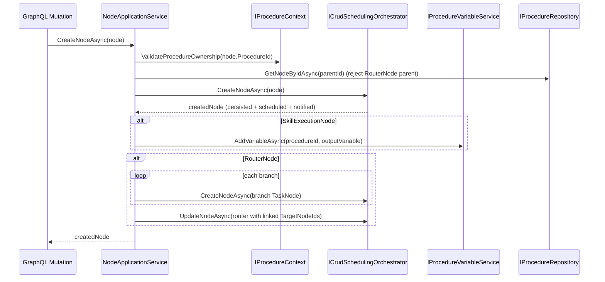
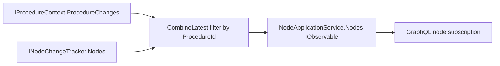
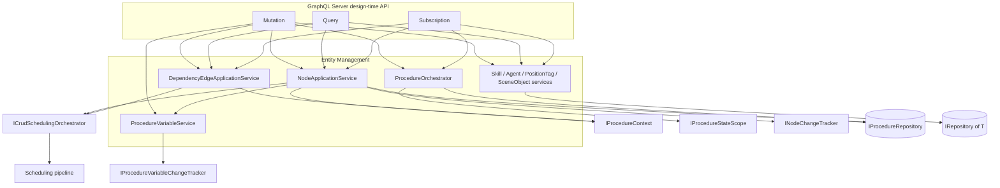

# Entity Management Services

> Procedure-scoped CRUD for the design-time domain model: nodes, edges, procedures, variables, skills, agents, position
> tags, and scene objects — each operation persists through Infrastructure repositories, pushes reactive notifications,
> and (for graph entities) triggers scheduling.

## Overview

The Entity Management group is the write-and-read surface for everything a user authors at design time. Each entity type
gets a focused application service that validates input, persists through an Infrastructure repository, and emits a
reactive stream so GraphQL subscriptions stay live. Graph entities (nodes and edges) are routed through the
`ICrudSchedulingOrchestrator` so that every structural mutation re-runs scheduling before the call returns. Procedures
sit one level up: the `IProcedureOrchestrator` decides which procedure is "loaded", and the node/edge services enforce
that all mutations stay inside that loaded procedure.

Two pieces of automation distinguish node creation from a plain CRUD write: creating a `SkillExecutionNode` auto-creates
procedure variables for the skill's output properties, and creating a `RouterNode` auto-creates a child `TaskNode` per
branch and links each branch to its target.

## Key Concepts

- **Procedure-scoped isolation**: the node and edge services validate `ProcedureId` against the currently loaded
  procedure (`IProcedureContext.ValidateProcedureOwnership`) before mutating, and filter queries to that procedure,
  preventing cross-procedure data access. The variable service is not procedure-context-scoped — it operates on an
  explicitly supplied `procedureId` and validates only procedure existence and variable-name uniqueness.
- **Per-entity application service**: one service per entity (`NodeApplicationService`,
  `DependencyEdgeApplicationService`, `SkillApplicationService`, `AgentApplicationService`,
  `PositionTagApplicationService`, `SceneObjectApplicationService`) following the same CRUD-plus-reactive-stream shape.
- **Reactive notifications**: every service exposes an `IObservable` of the full entity list. Graph entities derive
  theirs from Common change trackers (`INodeChangeTracker`, `IDependencyEdgeChangeTracker`); flat entities own a local
  `Subject` and re-emit the whole collection after each mutation.
- **Scheduling integration**: structural mutations on nodes and edges are delegated to `ICrudSchedulingOrchestrator`,
  which persists, re-schedules, and notifies as one coordinated step.
- **Auto-created variables**: creating a `SkillExecutionNode` creates a `VariableDefinition` (source `SkillOutput`,
  scope `Procedure`) for each `Output`/`InputOutput` property of the skill; deleting the node tree removes them again.
- **Auto-created branch nodes**: creating a `RouterNode` creates one child `TaskNode` per `ConditionalBranch` and sets
  each branch's `TargetNodeId`. Manually adding children under a `RouterNode` is rejected.
- **Procedure lifecycle**: `IProcedureOrchestrator` owns load/unload/create/delete of `Procedure` aggregates and
  publishes `ProcedureChanges`, the signal that drives procedure-scoped filtering across the application layer.

## How It Works

A node create is the richest path: it validates ownership, rejects router children, delegates to the CRUD scheduling
orchestrator, then runs the two auto-creation side effects.

Reactive reads work differently from writes. Node and edge query/observable paths read from the Common change trackers
rather than hitting the repository, and combine the tracker stream with `IProcedureContext.ProcedureChanges` so the
emitted list always reflects the currently loaded procedure:

Flat entities (skills, agents, position tags, scene objects) skip both the orchestrator and the procedure context. They
write straight to their `IRepository(T)`, then call a private `Notify...ChangedAsync` that re-reads the full list from
the repository and pushes it onto a local `Subject`. They are not procedure-scoped because they are shared library data,
not per-procedure graph elements.

Procedure lifecycle is serialized by `ProcedureOrchestrator` under a `SemaphoreSlim`: loading a procedure unloads the
previous one, marks the new one `IsLoaded`, publishes the new id on `ProcedureChanges`, then signals
`IProcedureStateScope.OnProcedureLoaded` so the unified state tracker fetches scoped nodes and edges, and notifies
`IProcedureVariableChangeTracker` with the loaded procedure's variables.

## Components

| Class / Interface                                                        | Responsibility                                                                                                                                                                                                                   |
|--------------------------------------------------------------------------|----------------------------------------------------------------------------------------------------------------------------------------------------------------------------------------------------------------------------------|
| `INodeApplicationService` / `NodeApplicationService`                     | Procedure-scoped node CRUD; delegates to `ICrudSchedulingOrchestrator`; auto-creates output variables and branch `TaskNode`s; preserves branch `TargetNodeId` on router updates; cascade-deletes node trees and their variables. |
| `IDependencyEdgeApplicationService` / `DependencyEdgeApplicationService` | Procedure-scoped dependency-edge CRUD; delegates structural mutations to `ICrudSchedulingOrchestrator`; filters queries and the observable to the loaded procedure.                                                              |
| `IProcedureOrchestrator` / `ProcedureOrchestrator`                       | Owns procedure load/unload/create/delete; serializes state under a lock; publishes `ProcedureChanges`; drives `IProcedureStateScope` and `IProcedureVariableChangeTracker`.                                                      |
| `IProcedureVariableService` / `ProcedureVariableService`                 | Add/update/remove `VariableDefinition` entries on a `Procedure`; validates name uniqueness; notifies `IProcedureVariableChangeTracker`.                                                                                          |
| `IRclProcedureQueryService` / `RclProcedureQueryService`                 | Unscoped read-only lookups of nodes and edges directly from `IProcedureRepository` (used where procedure scoping is not applied).                                                                                                |
| `ProcedureNotFoundException`                                             | Thrown by `IProcedureOrchestrator` when a requested procedure id does not exist.                                                                                                                                                 |
| `ISkillApplicationService` / `SkillApplicationService`                   | Skill CRUD against `IRepository(Skill)` with a local reactive `Subject`; disposable.                                                                                                                                             |
| `IAgentApplicationService` / `AgentApplicationService`                   | Agent CRUD against `IRepository(Agent)` with a local reactive `Subject`; disposable.                                                                                                                                             |
| `IPositionTagApplicationService` / `PositionTagApplicationService`       | Position-tag CRUD against `IRepository(PositionTag)` with a local reactive `Subject`; disposable.                                                                                                                                |
| `ISceneObjectApplicationService` / `SceneObjectApplicationService`       | Scene-object CRUD against `IRepository(SceneObject)` with a local reactive `Subject`; disposable.                                                                                                                                |
| `EntityManagementLogger`                                                 | Source-generated structured logging shared by all services in the group (create/update/delete, notification, procedure, variable, and branch/output-variable messages).                                                          |

## Connections and Pipeline Role

This group runs at **design time**. It is the CRUD authoring surface that the runtime execution pipeline later consumes;
it does not itself execute procedures. It is invoked at startup too, when seed data and the loaded procedure are
populated.

**Inbound (who depends on this group)**

- `FHOOE.Freydis.GraphQLServer.Operations.Mutation` injects every entity service via `[Service]` for
  create/update/delete, plus `IProcedureOrchestrator` for procedure load/unload/create/delete and
  `IProcedureVariableService` for variable mutations.
- `FHOOE.Freydis.GraphQLServer.Operations.Query` injects the entity services for reads and `IProcedureOrchestrator` for
  the loaded procedure.
- `FHOOE.Freydis.GraphQLServer.Operations.Subscription` subscribes to each service's observable (`Nodes`,
  `DependencyEdges`, `OnAgentsChanged()`, `OnSkillsChanged()`, `OnPositionTagsChanged()`, `OnSceneObjectsChanged()`) and
  to `IProcedureOrchestrator.ProcedureChanges`.
- All services are registered as singletons in `ApplicationServiceExtensions.AddApplicationServices`.

**Outbound (what this group depends on)**

- **Scheduling group**: `ICrudSchedulingOrchestrator` (in `Services/Scheduling/Pipeline`) — node and edge structural
  mutations go through it for persist-schedule-notify in one step. This is the bridge from design-time CRUD into the
  scheduling pipeline. See `../crud-scheduling.md`.
- **Common group**: `IProcedureContext` for ownership validation and procedure-change signals, and the change trackers
  `INodeChangeTracker` / `IDependencyEdgeChangeTracker` / `IProcedureVariableChangeTracker` / `IProcedureStateScope` (
  all backed by the singleton `ProcedureStateTracker`) for the reactive read streams. See `./common.md`.
- **Infrastructure repositories**: `IProcedureRepository` (procedure aggregate plus its nodes and edges) and
  `IRepository(T)` for `Skill`, `Agent`, `PositionTag`, and `SceneObject`.
- **Domain entities**: `Node` and its subtypes (`TaskNode`, `SkillExecutionNode`, `RouterNode`), `DependencyEdge`,
  `Procedure`, `ConditionalBranch`, `VariableDefinition`, plus `Skill`, `Agent`, `PositionTag`, `SceneObject`.
- **Configuration**: `IOptions(SchedulingConfiguration)` for `DefaultTaskDuration` (used when auto-creating branch
  `TaskNode`s).

Downstream consumers that read the authored model at runtime — `ISceneEntityResolver`, the AgentCoordination services (
`NodeAgentMapper`, `SkillSynchronizationService`, `AgentRegistrationService`, `SceneEntityProvider`), and the GraphQL
data loaders — depend on the same entity interfaces, illustrating how design-time authoring feeds the execution and
coordination layers.

## Configuration

`NodeApplicationService` reads `Scheduling:Defaults:DefaultTaskDuration` via `IOptions(SchedulingConfiguration)` (
default `200.0`) and applies it as the `Duration` of auto-created branch `TaskNode`s. No other service in the group
reads configuration directly. Log verbosity for the group's `EntityManagementLogger` messages is controlled through
`appsettings.json` logging configuration.

## Related Documentation

- [Application layer README](../README.md)
- [CRUD scheduling deep-dive](../crud-scheduling.md)
- [Common services](./common.md)
- [Scheduling services](./scheduling.md)
- [Variables services](./variables.md)
- [Branching services](./branching.md)
- [Execution pipeline walkthrough](../../../docs/execution-pipeline.md)
- [Glossary](../../../docs/glossary.md)
- [Architecture overview](../../../docs/architecture.md)
- [Documentation hub](../../../docs/README.md)
