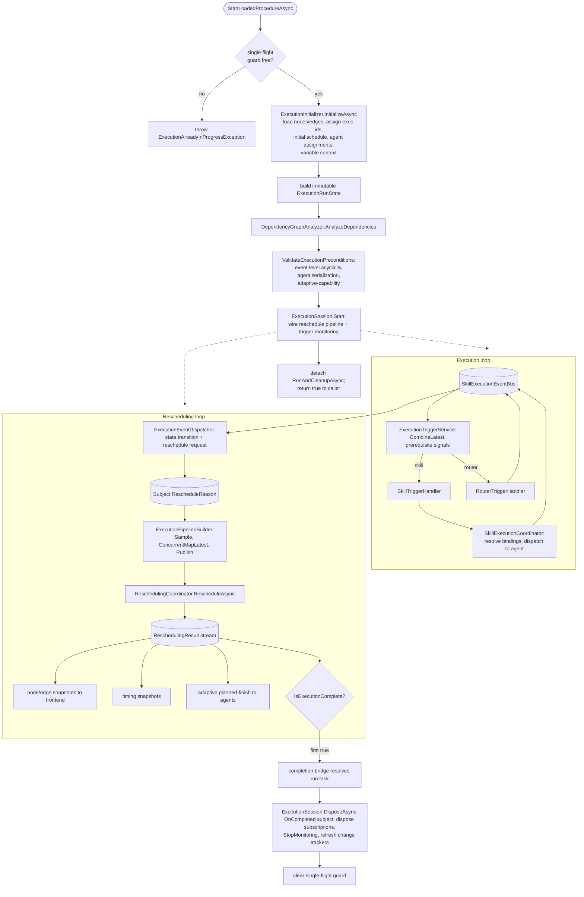
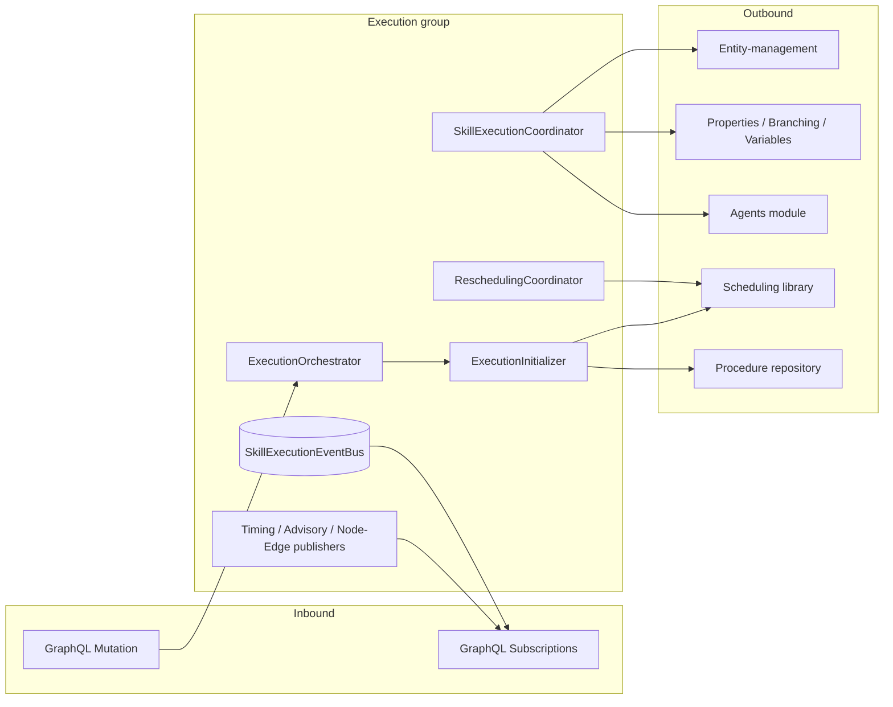

# Execution Services

> The runtime execution pipeline: it loads the scheduled procedure, fires skills and routers as their event
> prerequisites are met, reschedules reactively on every state change, and streams progress, timing, and advisories to the
> frontend until every node reaches a terminal state.

## Overview

The Execution group is the runtime engine of VRoboCoop. Once a procedure has been authored (design-time CRUD) and an
initial schedule has been computed, this group takes over: it loads the procedure's nodes and edges, validates them,
dispatches each skill to its assigned robot agent at exactly the moment its dependencies are satisfied, and continuously
recomputes the schedule as the real run diverges from the plan. It is purely event-driven — a single reactive event bus
carries skill lifecycle events, and every other service either reacts to that bus or feeds it.

The group is large and split into focused subfolders (Pipeline, Triggering, Coordination, Rescheduling, StateManagement,
Monitoring, Validation, Dependencies, Events, Routing, Initialization, Utilities, Support). All of it converges on one
entry point, `ExecutionOrchestrator.StartLoadedProcedureAsync`, and one teardown sink, `ExecutionSession.DisposeAsync`.
This document is the map of that group and links out to the existing deep-dives for the orchestrator, the trigger
service, the end-to-end pipeline walkthrough, and the agent-serialization proof.

## Key Concepts

- **Event bus as single source of truth.** `SkillExecutionEventBus` is a hot Rx `Subject(ExecutionEvent)`. Every Start,
  Finish, Failed, NotSelected, and Progress event flows through it; the trigger service, the event dispatcher, and the
  router handler all subscribe to the same stream.
- **Prerequisite graph, not a schedule, drives firing.** `DependencyGraphAnalyzer` turns domain `DependencyEdge`s into
  an event-based `DependencyGraph` (per-node Start and Finish `EventPrerequisite` lists). A node fires when its
  `CombineLatest` of prerequisite signals emits — never on a clock. A leafless container (an empty task or branch with
  no executable descendant) is a zero-extent firing endpoint: it is gated like a skill and, when triggered, publishes
  its own Start immediately followed by its Finish, so a dependency routed through an empty container is preserved
  rather than dropped. Emptiness is decided by `INodeResolver.ResolveToExecutableIds` — the one resolver-based oracle
  shared with the scheduling LP contraction and the timeline display — and endpoints are resolved through
  `ResolveToFiringEndpointsIds`. It is not tracked for completion (completion counts skills only).
- **Two control loops.** The execution loop (event bus to trigger to agent to event bus) and the rescheduling loop (
  event to reschedule request to schedule recomputation to node snapshot). Their joint termination is formally verified
  in Sunstone (`DualLoopConvergence.lean`).
- **Adaptive skills.** A skill with finish prerequisites runs adaptively: its planned-finish time is pushed to the agent
  through a `BehaviorSubject(double)`, and it completes only when its finish signal fires, not when a fixed duration
  elapses.
- **Routers and branch filtering.** `RouterTriggerHandler` evaluates a `RouterNode`, publishes `NotSelected` for
  non-selected branch descendants, and gates non-selected nodes so only the selected branch executes (verified by
  `RouterBranchConsistency.lean` and `NoDeadlocks.lean`).
- **Single-phase, declarative completion.** The first `ReschedulingResult` stamped `IsExecutionComplete` is the
  authoritative final snapshot; a completion bridge resolves the run task from it. No subscriber writes back into the
  source.
- **Per-run state isolation.** `ExecutionOrchestrator` is a singleton (required for GraphQL subscriptions), but each
  run's reactive state lives on an `ExecutionSession` over an immutable `ExecutionRunState` snapshot, so runs never
  share mutable data.
- **Terminal-status alignment.** `ExecutionStatus.IsTerminal()` (Completed/Failed/NotSelected) and
  `ExecutionEventType.IsTerminal()` (Finish/Failed/NotSelected) align one-to-one — `Finish` maps to `Completed` — and
  the predicate is mirrored on the Lean side. The state manager rejects mutations after a terminal status (monotone
  transitions).
- **Observability is one-way.** Timing, advisory, and overrun monitoring read the control plane but can never write to
  it: information flows control to observability only.

## How It Works

A start request loads and validates the procedure, then arms two reactive loops that run until every node is terminal.



The orchestration spine — how the singleton, the per-run session, and the reactive pipeline interact during a single
run — is shown below.

```mermaid
sequenceDiagram
    participant Caller as GraphQL Mutation
    participant Orch as ExecutionOrchestrator
    participant Init as ExecutionInitializer
    participant Sess as ExecutionSession
    participant PB as ExecutionPipelineBuilder
    participant Trig as ExecutionTriggerService
    participant Bus as SkillExecutionEventBus
    participant Disp as ExecutionEventDispatcher
    participant RC as ReschedulingCoordinator

    Caller->>Orch: StartLoadedProcedureAsync()
    Orch->>Orch: CompareExchange single-flight guard
    Orch->>Init: InitializeAsync(startTime)
    Init-->>Orch: nodes, edges, schedule, agents, variableContext
    Orch->>Orch: build ExecutionRunState + DependencyGraph
    Orch->>Orch: ValidateExecutionPreconditions
    Orch->>Sess: new ExecutionSession(...)
    Orch->>Sess: Start(runState, graph, variableContext)
    Sess->>PB: Build(rescheduleSubject, trigger, coordinator)
    PB-->>Sess: connectable ReschedulingResult stream
    Sess->>Sess: subscribe per-channel observers + completion bridge
    Sess->>Bus: subscribe AllEvents to dispatcher
    Sess->>Trig: Start(graph, nodes, variableContext)
    Sess-->>Orch: completionTask
    Orch->>Orch: detach RunAndCleanupAsync; return true

    loop until all nodes terminal
        Bus->>Trig: ExecutionEvent (prerequisite signal)
        Trig->>Bus: Start/Finish events from agent dispatch
        Bus->>Disp: ExecutionEvent
        Disp->>RC: reschedule request (via Subject)
        RC-->>Sess: ReschedulingResult (sampled)
    end

    RC-->>Sess: first IsExecutionComplete result
    Sess->>Orch: completionTask resolves (on pool thread)
    Orch->>Sess: DisposeAsync()
    Orch->>Orch: clear single-flight guard
```

### The two loops in detail

**Execution loop.** `ExecutionTriggerService.Start` builds, for every node, a `CombineLatest` of its start-prerequisite
signals over the hot bus. When the combined signal emits, `OnStartPrerequisitesMet` applies guards (already-started,
router branch filtering via `RouterTriggerHandler.IsSelectedBranch`) and dispatches to `SkillTriggerHandler` or
`RouterTriggerHandler`. `SkillTriggerHandler` calls `SkillExecutionCoordinator`, which resolves input property bindings,
refreshes scene-entity properties through `SceneEntityResolver`, invokes the agent (regular or adaptive), and
republishes Start/Progress/Finish/Failed events back onto the bus. Immediate-start nodes (empty prerequisites) are
subscribed in a second pass so all dependents are already listening.

**Rescheduling loop.** `ExecutionEventDispatcher` consumes every bus event: for skill nodes it drives a state transition
through `ExecutionStateTransitionService` and pushes a `RescheduleReason` onto the per-run `Subject`; for router nodes
it only requests a reschedule. `ExecutionPipelineBuilder` collapses bursts (`Sample`), runs reschedule computations
concurrently while dropping superseded results (`ConcurrentMapLatest`), and multicasts (`Publish`).
`ReschedulingCoordinator.RescheduleAsync` builds progress data, calls the scheduling layer's
`ITimingCalculationOrchestrator`, applies live router selections, and stamps `IsExecutionComplete` from
`ExecutionProgressMonitor`. Each per-channel observable samples intermediate results and emits exactly one terminal
value through `SampleUntilTerminal`, then feeds a publisher's `IObserver` surface.

## Components

| Class / Interface                                                                     | Responsibility                                                                                                                                                       |
|---------------------------------------------------------------------------------------|----------------------------------------------------------------------------------------------------------------------------------------------------------------------|
| `ExecutionOrchestrator` / `IExecutionOrchestrator`                                    | Singleton entry point. Loads, validates, and starts the run; owns the single-flight guard; detaches the run and is the cleanup trigger.                              |
| `ExecutionSession`                                                                    | Per-run owner of the reschedule `Subject`, subscription `CompositeDisposable`, and completion task. Single teardown sink (`DisposeAsync`).                           |
| `ExecutionRunState`                                                                   | Immutable per-run snapshot of nodes, edges, schedule, start time, and procedure id.                                                                                  |
| `ExecutionPipelineBuilder` / `IExecutionPipelineBuilder`                              | Builds the multicast `ReschedulingResult` stream (`Sample`, `ConcurrentMapLatest`, `Publish`).                                                                       |
| `ExecutionEventDispatcher` / `IExecutionEventDispatcher`                              | Routes bus events to state transitions and reschedule requests.                                                                                                      |
| `ExecutionTriggerService` / `IExecutionTriggerService`                                | Monitors the bus and fires skills, routers, and leafless containers (zero-extent Start+Finish) when prerequisites are met; forwards adaptive planned-finish updates. |
| `SkillTriggerHandler` / `ISkillTriggerHandler`                                        | Dispatches regular and adaptive skill executions; manages per-skill planned-finish `BehaviorSubject`s and re-entry prevention.                                       |
| `RouterTriggerHandler` / `IRouterTriggerHandler`                                      | Evaluates routers, publishes `NotSelected` for non-selected branches, monitors branch completion, and provides branch filtering.                                     |
| `RouterBranchNavigator` / `IRouterBranchNavigator`                                    | Hierarchy traversal: ancestor-router finding, branch-membership, and executable-node discovery within a branch.                                                      |
| `SkillExecutionCoordinator` / `ISkillExecutionCoordinator`                            | Executes a skill on its agent; resolves input/output property bindings; publishes lifecycle events.                                                                  |
| `SceneEntityResolver` / `ISceneEntityResolver`                                        | Refreshes stale PositionTag/SceneObject property values from live caches before each dispatch.                                                                       |
| `ReschedulingCoordinator` / `IReschedulingCoordinator`                                | Recomputes the schedule per reschedule tick; stamps `ReschedulingResult.IsExecutionComplete`; applies router selections to nodes.                                    |
| `ExecutionProgressDataBuilder` / `IExecutionProgressDataBuilder`                      | Converts execution state into `SkillExecutionProgress` data for the scheduling layer.                                                                                |
| `SkillExecutionStateManager` / `ISkillExecutionStateManager`                          | Holds per-skill `SkillExecutionState`; enforces monotone (terminal-respecting) transitions.                                                                          |
| `ExecutionStateTransitionService` / `IExecutionStateTransitionService`                | Centralizes Running/Completed/Failed/NotSelected/Progress transitions.                                                                                               |
| `ExecutionStatus` + `ExecutionStatusExtensions`                                       | The skill status enum and its `IsTerminal()` predicate.                                                                                                              |
| `ExecutionProgressMonitor` / `IExecutionProgressMonitor`                              | Computes completion, success, progress percentage, and execution statistics from state.                                                                              |
| `AdaptiveSkillDurationOverrunMonitor`                                                 | Hosted service; raises advisories when an executing skill overruns its scheduled finish. Observability only.                                                         |
| `ExecutionAdvisoryPublisher` / `IExecutionAdvisoryPublisher`                          | Subject-backed stream of `ExecutionAdvisory` for GraphQL subscriptions.                                                                                              |
| `ExecutionTimingPublisher` / `IExecutionTimingPublisher`                              | `BehaviorSubject`-backed stream of `ExecutionTimingInfo`; exposes a hot observer surface.                                                                            |
| `AgentSerializationValidator` / `IAgentSerializationValidator`                        | Verifies same-agent skill pairs are separated by an FS-first dependency chain (no concurrent dispatch to one robot).                                                 |
| `ProcedureValidationTracker` / `IProcedureValidationTracker`                          | Throttled reactive validation surface for the editor; UX-only, not the hard gate.                                                                                    |
| `AgentNameResolver` / `IAgentNameResolver`                                            | Resolves an agent display name, with a safe fallback.                                                                                                                |
| `DependencyGraphAnalyzer` / `IDependencyGraphAnalyzer`                                | Builds the event-based `DependencyGraph` (including routers) from nodes and edges.                                                                                   |
| `DependencyGraph`, `SkillEventPrerequisites`, `EventPrerequisite`, `EventTriggerType` | The prerequisite graph and its building blocks (Start/Finish prerequisite lists, adaptive detection).                                                                |
| `SkillExecutionEventBus` / `ISkillExecutionEventBus`                                  | Central hot Rx event bus for all skill lifecycle events.                                                                                                             |
| `ExecutionEvent`, `ExecutionEventType` + `ExecutionEventTypeExtensions`               | The event record, its type enum, and the `IsTerminal()` predicate.                                                                                                   |
| `ExecutionEventPublisher` / `IExecutionEventPublisher`                                | Pushes node/edge snapshots into the change trackers; refreshes them on teardown.                                                                                     |
| `RouterEvaluationService` / `IRouterEvaluationService`                                | Evaluates a router's branches against the variable context (delegates to `IBranchSelector`).                                                                         |
| `ExecutionInitializer` / `IExecutionInitializer`                                      | Loads the procedure, assigns execution ids, computes the initial schedule, builds agent assignments, initializes the variable context.                               |
| `ExecutionIdAssigner`, `ExecutionTimeCalculator`                                      | Stateless utilities: per-node execution id assignment and elapsed-seconds calculation.                                                                               |

## Connections and Pipeline Role

This group sits squarely in the **runtime execution pipeline**. It is invoked only when an operator starts a loaded
procedure; it does not participate in design-time CRUD. Within the runtime pipeline it is the layer between
authoring/scheduling (upstream) and the robot agents and frontend (downstream).

**What invokes this group (inbound):**

- The **GraphQL Mutation** `StartLoadedProcedureAsync` (`Backend/GraphQLServer/Operations/Mutation.cs`) calls
  `IExecutionOrchestrator.StartLoadedProcedureAsync`. This is the only production entry point.
- **GraphQL Subscriptions** (`Backend/GraphQLServer/Operations/Subscription.cs`) bind to this group's read-only streams
  for live UI updates: `INodeChangeTracker.Nodes` / `IDependencyEdgeChangeTracker.Edges` (via
  `IExecutionEventPublisher`), `IExecutionTimingPublisher.TimingUpdates`, `IExecutionAdvisoryPublisher.Advisories`,
  `ISkillExecutionEventBus` event streams, and `IProcedureValidationTracker.ValidationResults`.
- The hosted service `AdaptiveSkillDurationOverrunMonitor` is started by the host at **startup** and runs across all
  subsequent executions, reading the node change tracker and timing publisher.

**What this group depends on (outbound):**

- **Agents module** (`FHOOE.Freydis.Agents`): `SkillExecutionCoordinator` invokes `IRuntimeAgent.ExecuteSkillAsync` /
  `ExecuteSkillAdaptivelyAsync` via `IRuntimeAgentProvider`; `ExecutionInitializer` and `AgentNameResolver` resolve
  agents via `IAgentManager`. Precondition validation probes `IRuntimeAgent.CanExecuteAdaptivelyAsync`.
- **Scheduling library** (`Services.Scheduling`): `ExecutionInitializer` and `ReschedulingCoordinator` both call
  `ITimingCalculationOrchestrator.CalculateAsync` with a `SchedulingRequest`, producing the initial schedule and every
  reschedule. `DependencyGraphAnalyzer` and `AgentSerializationValidator` use `INodeHierarchyProcessor` and
  `INodeResolver` from the scheduling processing layer, and share the `DependencyType` enum from `Scheduling.Core`.
- **Other Application service groups:** Properties (`IPropertyBindingService` for input/output binding resolution),
  Branching (`IBranchSelector` for router evaluation), Variables (`IVariableResolver`, `VariableContext`),
  Entity-management (`IPositionTagApplicationService`, `ISceneObjectApplicationService` feed `SceneEntityResolver`), and
  Common (`IProcedureContext`, the `INodeChangeTracker` / `IDependencyEdgeChangeTracker`, and the
  `PerExecutionRxExtensions.SampleUntilTerminal` / `ConcurrentMapLatest` / `SccDetector` reactive utilities).
- **Infrastructure / Domain:** `ExecutionInitializer` reads `IProcedureRepository`; the group operates throughout on
  Domain `Node`, `SkillExecutionNode`, `RouterNode`, `DependencyEdge`, `Skill`, and `RouterTask` entities.

The inbound/outbound shape:



**Where it sits and when it runs.** Design-time CRUD (authoring nodes/edges, computing a stored schedule) happens
elsewhere; the only design-time-adjacent piece here is `ProcedureValidationTracker`, which surfaces a throttled,
best-effort serialization check to the editor (the hard gate is enforced inline by
`AgentSerializationValidator.Validate` inside the orchestrator at start). Everything else runs **during execution**,
with one **startup** component (`AdaptiveSkillDurationOverrunMonitor`) and one **cross-cutting** concern (observability
publishers consumed by subscriptions). Because the singleton survives across runs while per-run state lives on
`ExecutionSession`, completion is single-phase and termination flows entirely through `OnCompleted` and `DisposeAsync`.

## Configuration

The group reads two options sections from `appsettings.json` via `IOptions`:

- `ExecutionPipeline` (`ExecutionPipelineConfiguration`) — the reschedule sample interval and the frontend, agent, and
  timing publish intervals used by `ExecutionPipelineBuilder` and `ExecutionSession`.
- `AdaptiveSkillMonitoring` (`AdaptiveSkillMonitoringConfiguration`) — enablement plus the overrun and escalation
  margins used by `AdaptiveSkillDurationOverrunMonitor`.

Log verbosity for this group is controlled entirely through the logging section of `appsettings.json`; progress and
event logs are emitted at Trace/Debug because they fire frequently.

## Related Documentation

- [Application layer README](../README.md)
- [Execution orchestrator deep-dive](../execution-orchestrator.md)
- [Execution trigger service deep-dive](../execution-trigger-service.md)
- [CRUD and scheduling](../crud-scheduling.md)
- [Agent lifecycle](../agent-lifecycle.md)
- [Scheduling services](./scheduling.md)
- [Agent coordination services](./agent-coordination.md)
- [Branching services](./branching.md)
- [Properties services](./properties.md)
- [Variables services](./variables.md)
- [Entity management services](./entity-management.md)
- [Execution pipeline walkthrough](../../../docs/execution-pipeline.md)
- [Agent serialization](../../../docs/agent-serialization/README.md)
- [Architecture overview](../../../docs/architecture.md)
- [Glossary](../../../docs/glossary.md)
- [Documentation hub](../../../docs/README.md)
