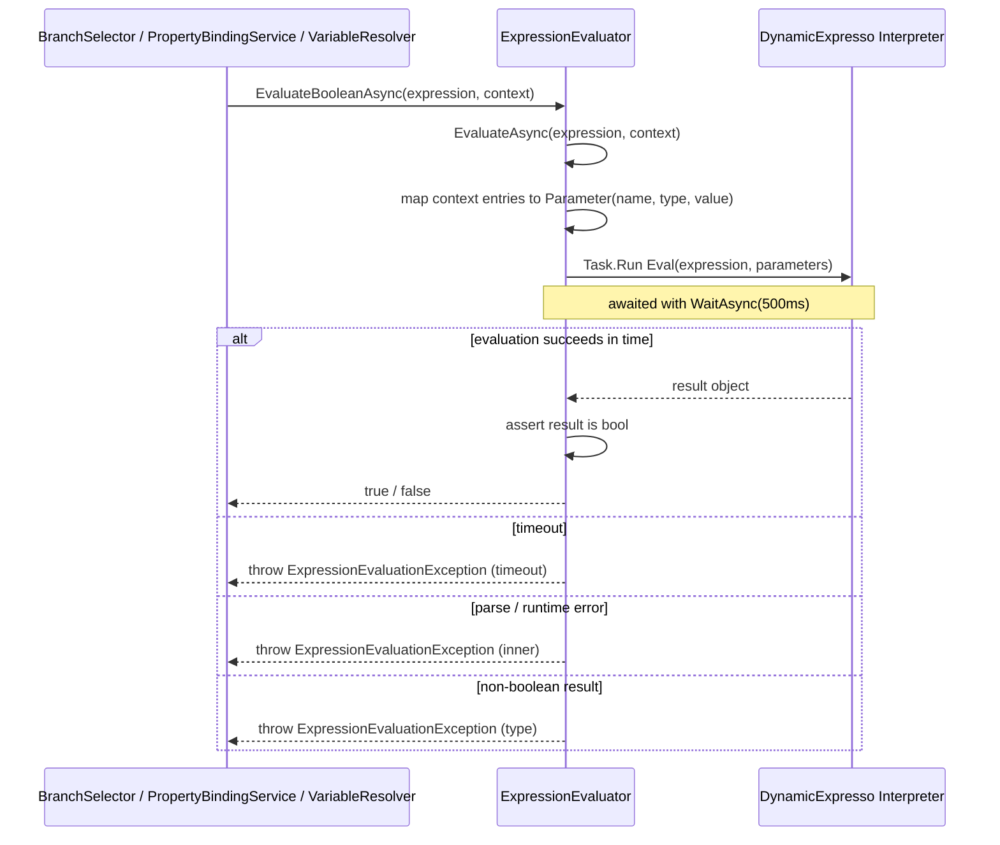
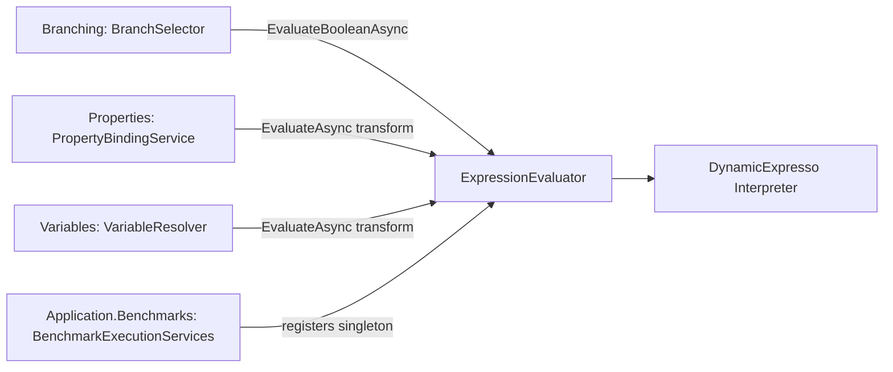

# Expressions Services

> Safe, sandboxed evaluation of user-authored selector, condition, and transform expressions against a variable context,
> backed by DynamicExpresso.

## Overview

The Expressions group is a single small service that turns a string expression and a bag of named values into a result.
It exists so that router branch conditions, expression-based selectors, and property/variable transform expressions can
be authored as free-form text yet executed safely at runtime, without compiling C# or exposing the full reflection
surface to procedure authors. The interpreter is deliberately constrained: it whitelists a handful of math and string
helpers, references only `System.Math`, and enforces an execution timeout so a pathological expression cannot stall a
run. The group is purely a computation utility; it holds no per-run state and touches no repositories.

## Key Concepts

- **Expression** — a string such as `Temperature > 50` or `upper(value)` supplied by a procedure author on a router
  branch, a selector, or a binding transform.
- **Variable context** — a `Dictionary(string, object?)` mapping identifier names to their current runtime values. Each
  entry becomes a typed `Parameter` passed to the interpreter.
- **Boolean evaluation** — branch and selector conditions must resolve to a `bool`; `EvaluateBooleanAsync` enforces this
  and rejects non-boolean results.
- **Safe interpreter** — a DynamicExpresso `Interpreter` configured at construction with a whitelist (`abs`, `max`,
  `min`, `round`, `upper`, `lower`, `trim`) and a `Math` reference, rather than an open evaluator.
- **Evaluation timeout** — a fixed 500 ms deadline applied via `Task.WaitAsync`, bounding the result rather than
  thread-pool scheduling so loaded CI does not produce false timeouts.
- **Syntax validation** — `ValidateSyntax` parses an expression to surface structural errors at design time, while
  deliberately tolerating unknown identifiers (variables that are not yet bound).

## How It Works

`ExpressionEvaluator` constructs one DynamicExpresso `Interpreter` and configures it once through
`ConfigureSafeInterpreter`. `EvaluateAsync` projects each context entry into a `Parameter` (carrying the runtime type,
falling back to `object` for nulls), runs `Interpreter.Eval` on a worker via `Task.Run`, and awaits it with the 500 ms
timeout. A timeout surfaces as an `ExpressionEvaluationException` reporting the deadline; any other failure wraps the
inner exception with the offending expression. `EvaluateBooleanAsync` delegates to `EvaluateAsync` and throws when the
result is not a `bool`. `ValidateSyntax` calls `Interpreter.Parse` and treats an `UnknownIdentifierException` as success
so authors can validate structure before all variables exist.

## Components

| Class / Interface      | Responsibility                                                                                                                                               |
|------------------------|--------------------------------------------------------------------------------------------------------------------------------------------------------------|
| `IExpressionEvaluator` | Contract exposing `EvaluateAsync`, `EvaluateBooleanAsync`, and `ValidateSyntax`.                                                                             |
| `ExpressionEvaluator`  | DynamicExpresso-backed implementation: builds a whitelisted `Interpreter`, evaluates with a 500 ms timeout, and validates syntax. Registered as a singleton. |

`ExpressionEvaluationException` (the failure type both methods throw) is defined alongside the other variable errors in
`Backend/Application/Services/Variables/Exceptions/VariableException.cs`, not in this folder; it carries the offending
`Expression` string.

## Connections and Pipeline Role

This group is a **cross-cutting runtime computation utility**. It is registered once as a singleton in
`Backend/GraphQLServer/Extensions/ApplicationServiceExtensions.cs` (
`services.AddSingleton(IExpressionEvaluator, ExpressionEvaluator)`), is stateless, and is injected wherever a string
expression must be turned into a value during execution. It performs no CRUD and reads no entities directly.

Three concrete collaborators depend on it:

- **Branching** — `BranchSelector` (`Backend/Application/Services/Branching/BranchSelector.cs`) takes
  `IExpressionEvaluator` via its constructor and calls `EvaluateBooleanAsync` to resolve both `SimpleVariableSelector`
  conditions and `ExpressionSelector` conditions on a `RouterNode`'s `ConditionalBranch` set. This is the primary
  consumer: it is how a router picks exactly one branch at runtime.
- **Properties** — `PropertyBindingService` (`Backend/Application/Services/Properties/PropertyBindingService.cs`) calls
  `EvaluateAsync` to apply a binding's `TransformExpression` (over a single `value` parameter) when writing a skill
  output back to a variable.
- **Variables** — `VariableResolver.ResolveBindingAsync` accepts an optional `IExpressionEvaluator` and calls
  `EvaluateAsync` to apply a `VariableBinding.TransformExpression`, again over a `value` parameter.

The evaluator depends only on the **DynamicExpresso** library and on the `ExpressionEvaluationException` type from the
Variables exceptions namespace. It does not depend on any other Services group, the Agents module, Infrastructure
repositories, or the Scheduling library.

Pipeline-wise, the dominant path is **runtime execution**: when the orchestrator reaches a `RouterNode`,
`BranchSelector` asks the evaluator to test each branch condition against the live `VariableContext` and selects the
matching `ConditionalBranch`. The Properties and Variables transform paths likewise run during execution, as skill
outputs flow back into variables. `ValidateSyntax` is the design-time touch point, available to validate author-supplied
expressions before a run. The same singleton is also registered for the reactive execution benchmarks in
`Backend/Application.Benchmarks/ReactiveExecution/BenchmarkExecutionServices.cs`.

## Related Documentation

- [Application layer README](../README.md)
- [Branching services](./branching.md) — the primary consumer; router branch and selector evaluation.
- [Properties services](./properties.md) — binding transform expressions.
- [Variables services](./variables.md) — variable binding transforms and the `ExpressionEvaluationException` home.
- [Execution pipeline walkthrough](../../../docs/execution-pipeline.md)
- [Glossary](../../../docs/glossary.md)
