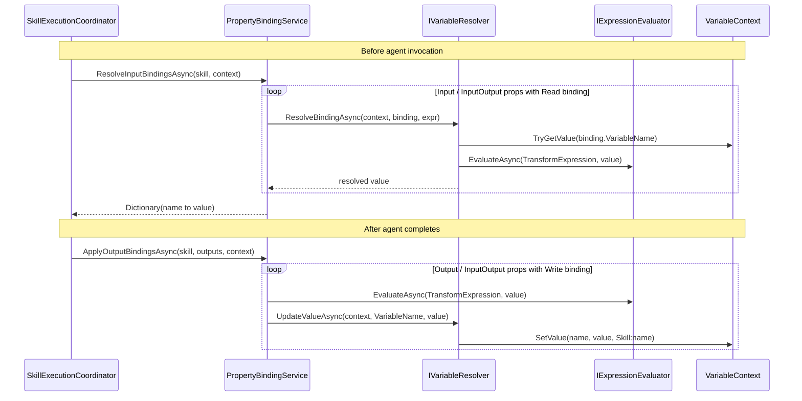
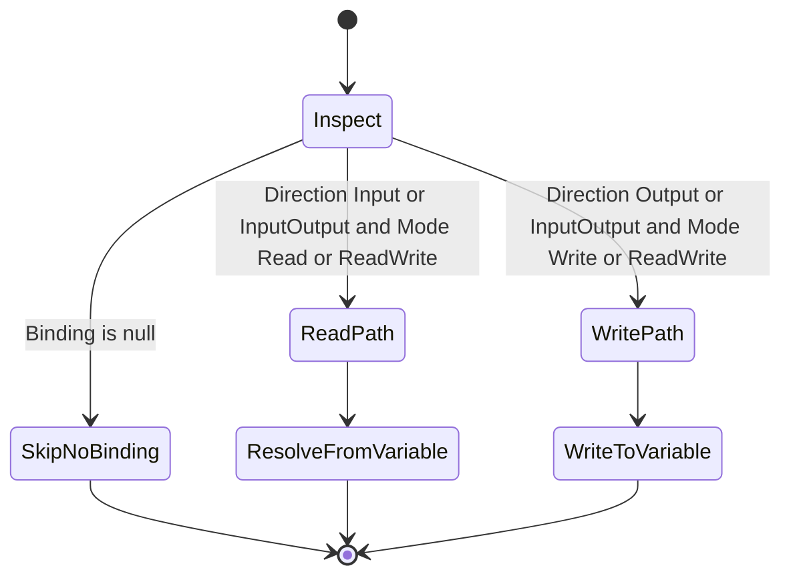
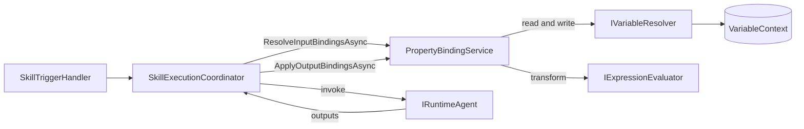

# Properties Services

> Binds a skill's input and output properties to procedure variables, so data flows between skills through the shared
> variable context during execution.

## Overview

The Properties group contains a single service, `PropertyBindingService`, that connects a skill's typed properties to
the runtime variables of a procedure. Before a skill runs, it reads variable values and pushes them into the skill's
input properties; after the skill completes, it writes the skill's output values back into variables. This is the
mechanism that lets the output of one skill become the input of a later skill (data flow), without skills knowing about
each other. The service is stateless and operates entirely on a `VariableContext` passed in by the caller.

## Key Concepts

- **Property binding** — a link from a skill's `TypedProperty` to a named procedure variable, expressed by the
  property's optional `VariableBinding`.
- **Direction** — `PropertyDirection.Input`, `Output`, or `InputOutput`; determines whether a property is read into,
  written from, or both.
- **Binding mode** — `BindingMode.Read`, `Write`, or `ReadWrite`; the binding's own intent, which must agree with the
  property direction for the binding to fire.
- **Input resolution** — reading variable values from the context and projecting them onto a skill's input properties
  before invocation.
- **Output application** — taking the values a skill emits and writing them back into variables after invocation.
- **Transform expression** — an optional expression on a binding (`TransformExpression`) that reshapes a value as it
  crosses the boundary, evaluated by the Expressions group.

## How It Works

`ResolveInputBindingsAsync` walks `skill.Properties` and selects properties that are `Input` or `InputOutput` and carry
a binding whose `Mode` is `Read` or `ReadWrite`. For each, it asks `IVariableResolver.ResolveBindingAsync` to read the
bound variable from the `VariableContext` (applying the binding's transform via `IExpressionEvaluator` if present), and
collects the non-null results into a dictionary keyed by property name.

`ApplyOutputBindingsAsync` walks the same properties but selects `Output` or `InputOutput` properties whose binding
`Mode` is `Write` or `ReadWrite`. For each property present in the skill's output dictionary, it optionally applies the
binding's `TransformExpression` (binding the raw output to a `value` symbol) and then calls
`IVariableResolver.UpdateValueAsync` to write the result into the variable, attributing the change to
`Skill:{skill.Name}`.

The selection logic is a direction-and-mode gate: a binding fires only when both the property `Direction` and the
binding `Mode` agree on the read or write side.

## Components

| Class / Interface         | Responsibility                                                                                                                  |
|---------------------------|---------------------------------------------------------------------------------------------------------------------------------|
| `IPropertyBindingService` | Contract for resolving input bindings before a skill runs and applying output bindings after it finishes.                       |
| `PropertyBindingService`  | Implementation; reads variables into input properties and writes skill outputs back to variables, applying optional transforms. |
| `PropertyLogger`          | Source-generated structured logging (`LogInputBindingResolved`, `LogOutputBindingApplied`) for binding operations.              |

## Connections and Pipeline Role

This group runs **during execution**, on the skill-invocation hot path. It is not used at design time and registers no
startup hosted service. `PropertyBindingService` is registered as a singleton in `ApplicationServiceExtensions` and is
stateless, operating only on the `VariableContext` handed to each call.

**What it depends on (outbound):**

- **Variables group** — `IVariableResolver`. Input resolution calls `ResolveBindingAsync` to read a variable from the
  `VariableContext`; output application calls `UpdateValueAsync` to write a variable. The Variables group owns the
  in-memory `VariableContext` and its values; Properties never touches variable storage directly.
- **Expressions group** — `IExpressionEvaluator`. Passed into `ResolveBindingAsync` for input transforms and called
  directly in `ApplyOutputBindingsAsync` to evaluate a binding's `TransformExpression` against a `value` symbol.
- **Domain entities** — `Skill` and its `TypedProperty` list, `PropertyDirection`, `VariableBinding`, `BindingMode`, and
  `VariableContext` from `Domain.Entities.Common` and `Domain.Entities.Variables`.

**What depends on it (inbound):**

- **Execution group** — `SkillExecutionCoordinator` is the sole consumer. It injects `IPropertyBindingService` and,
  inside its execution pipeline, calls `ResolveInputBindingsAsync` before invoking the agent (then projects the resolved
  values onto a copy of the skill via `ApplyInputBindingsToSkill`) and `ApplyOutputBindingsAsync` after the agent
  reports successful completion. Input-resolution failures surface as `VariableNotFoundException` /
  `VariableTypeMismatchException` from the Variables group and are signalled to the coordinator's observer;
  output-binding failures are caught and logged without aborting the run.

The coordinator itself is driven by the **Execution Triggering** path: `SkillTriggerHandler` calls
`ISkillExecutionCoordinator.ExecuteSkillAsync` / `ExecuteAdaptiveSkillAsync`, which is where binding resolution is
interleaved with agent invocation.

In pipeline terms, Properties is the data-flow seam between the variable store (Variables) and the agents (Execution):
it turns shared procedure variables into concrete skill inputs and folds skill outputs back into those variables, so a
downstream skill bound to the same variable observes the upstream skill's result.

## Related Documentation

- [Application layer README](../README.md)
- [Variables services](./variables.md)
- [Expressions services](./expressions.md)
- [Execution services](./execution.md)
- [Execution orchestrator deep-dive](../execution-orchestrator.md)
- [Execution trigger service deep-dive](../execution-trigger-service.md)
- [Execution pipeline walkthrough](../../../docs/execution-pipeline.md)
- [Glossary](../../../docs/glossary.md)
