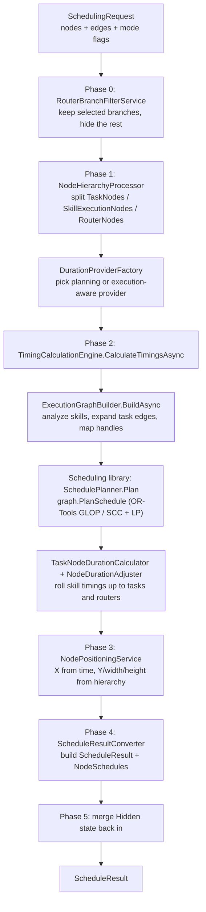
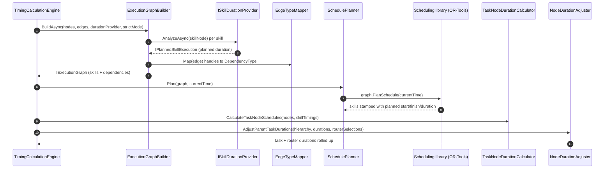
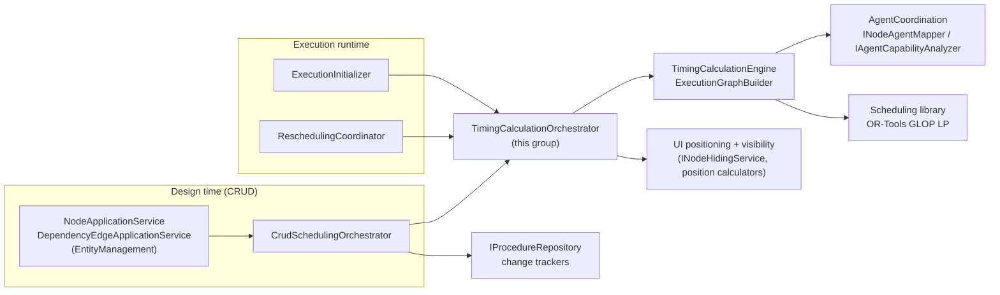

# Scheduling Services

> The timing engine of the procedure editor: it turns a node graph plus its dependency edges into start times,
> finish times, durations, and on-canvas positions, in both design-time planning mode and live execution mode.

## Overview

The Scheduling service group computes *when* every node in a procedure runs. Given the nodes (tasks, skill
executions, routers) and the dependency edges between them, it builds an execution graph, hands the skill
executions and their constraints to the standalone Scheduling library (an OR-Tools GLOP linear-programming solver),
and then propagates the solved skill timings back up through the task/router hierarchy. The output is a
`ScheduleResult` containing per-node durations, absolute/relative start and finish times, and updated domain nodes
with X/Y positions and sizes ready for the timeline UI.

The same pipeline serves two callers. At design time the `CrudSchedulingOrchestrator` recalculates the schedule on
every node/edge mutation. During execution the `ReschedulingCoordinator` and `ExecutionInitializer` re-run it with
real progress data so the timeline reflects what agents are actually doing. The mode switch is a single flag on the
`SchedulingRequest`; everything downstream is shared.

## Key Concepts

- **Two-phase calculation** — The Application layer builds and interprets the graph and the hierarchy; the
  Scheduling library solves the constraint problem. The library only ever sees flat skill executions and
  dependencies, never tasks or routers.
- **Planning mode vs execution mode** — Planning mode estimates durations from agent capabilities. Execution mode
  overrides those estimates with actual elapsed/estimated times from running agents. `IsExecutionMode` on the
  request is true when both a procedure start time and progress data are supplied.
- **Duration provider strategy** — `ISkillDurationProvider` is the seam between the two modes.
  `PlanningModeDurationProvider` derives durations from capability analysis; `ExecutionAwareDurationProvider` wraps
  it and substitutes live `SkillExecutionProgress` data per node, falling back to planning for nodes not yet running.
- **Execution graph expansion** — Task-level dependency edges are propagated down to every descendant skill
  execution (cartesian product of source and target descendants), so a single edge between two task containers
  becomes constraints between their leaf skills. A dependency chain routed through a leafless container (an empty
  task or branch with no executable descendant) is preserved by **materializing** the container as a zero-extent LP
  node — a `ZeroExtentFiringPlaceholder` (duration 0, so the LP pins Finish = Start) carried alongside the real
  skills — so `A → empty → B` becomes `A → empty• → B` and the successor is still ordered after the predecessor.
  Each chain edge keeps its own handles, so non-FS chains (e.g. `A --FF--> empty --SS--> B`) compose correctly
  through the zero-extent point. Emptiness is decided structurally by `INodeResolver.ResolveToExecutableIds` — the
  same resolver the runtime dependency analysis and the timeline display use — so a container counts as leafless
  only when it represents no executable work at all (a router is probed through its branch children). A task whose
  only child skill failed duration analysis still resolves to that child's id, so it is not leafless: it keeps its
  extent rather than being materialized as a zero-extent placeholder.
- **Hierarchical roll-up** — Skill executions get their timing from the LP solver; task and router nodes derive
  their span (earliest child start to latest child finish) from their children, processed deepest-first.
- **Router branch filtering** — Before solving, non-selected router branches are excluded from the calculation and
  marked `Hidden`, so the timeline shows only the active path. Selection is dual-mode (execution selections,
  persisted execution state, or a manually selected branch).
- **Scheduled extent vs editor width** — A node's scheduled extent (its duration on the timeline) is distinct from
  its editor box width. `NodeWidthCalculator` derives width from duration and expands containers to their widest
  descendant, so an empty container honestly reports width 0; each client floors that to a per-platform minimum so
  the container stays visible and clickable, rather than the backend baking a presentation minimum into the model.
- **Edge handle to dependency type** — The visual edge handle pair (`right`/`left`) maps to a scheduling
  `DependencyType` (FinishToStart, StartToStart, StartToFinish, FinishToFinish). The schedule's `EdgeTypeMapper`
  and the runtime `DependencyGraphAnalyzer` both delegate to the one shared `HandleDependencyTypeMapper`, so both
  layers derive the same `EventTriggerType`/`DependencyType` from the same handle strings.
- **Graceful degradation** — Infeasible-schedule, model, and invalid-operation exceptions are caught and converted to
  an unsuccessful result with no updated nodes; the empty-graph and plan-failed (non-exception) cases instead return a
  fallback result preserving the original durations. Nothing throws into the caller.

## How It Works

`TimingCalculationOrchestrator.CalculateAsync` runs a fixed phase pipeline. Phase 2 (timing) is where the
`TimingCalculationEngine` builds the execution graph, calls the Scheduling library to solve it, and rolls timings
back up the hierarchy.

### Phase 2 internals: building and solving the graph

`ExecutionGraphBuilder` analyses each `SkillExecutionNode` through the duration provider into an
`IPlannedSkillExecution`, then expands every dependency edge: an edge whose endpoint is a container task is
propagated to all executable descendants of that task, and `EdgeTypeMapper.Map` (via the shared
`HandleDependencyTypeMapper`) turns the source/target handles into a `DependencyType`. Leafless containers — empty
tasks or branches with no executable descendant — are **materialized** in a pre-pass (`MaterializeLeaflessEndpoints`):
each leafless edge-endpoint becomes a `ZeroExtentFiringPlaceholder` (duration 0, so the LP pins Finish = Start)
appended to the skill executions, and a chain through it is carried as `A → empty• → B` rather than contracted —
each edge keeping its own handles. The placeholder implements only `Scheduling.Core.IPlannedSkillExecution` (not
the application `IPlannedSkillExecution`/`ISkillExecution`), which is what keeps it a pure ordering carrier:
excluded from the LP duration arm (hence zero-extent), the timeline display, completion tracking, and
agent-serialization. Leaflessness is decided structurally by `INodeResolver.ResolveToExecutableIds` against the
processed hierarchy, the same emptiness oracle the runtime dependency analysis and the timeline display use, so all
three agree on which containers are empty. A container is leafless only when it resolves to no executable id; a task
whose only skill failed duration analysis still resolves to that skill's id, so it is not materialized and keeps its
extent. The resulting `IExecutionGraph` (skill executions + dependencies) is handed to
`SchedulePlanner.Plan`, which calls the library's `IExecutionGraph.PlanSchedule`. The library decomposes the graph
into strongly connected components, solves coupled/adaptive components with the GLOP LP solver, and writes
`PlannedStartTime` / `PlannedFinishTime` / `PlannedDuration` back onto each skill execution.

### Router duration logic

`RouterNodeDurationCalculator` (invoked by `NodeDurationAdjuster`) determines a router's span from its selected
branch target. Selection priority is: execution-time `RouterSelections`, then persisted
`SelectedBranchTargetNodeId`, then a `ManuallySelectedBranch` name. With a selection the router inherits the target
branch's timing; with no selection it spans the widest range across all branch targets so the router visually covers
every possible path.

Every empty container — a `TaskNode` (a router branch or any other task) with no executable descendants — carries
no work, so it is emitted zero-extent at its predecessor's finish (`F_pred`): it collapses to a point at the start
its incoming dependencies imply (or its own resolved start when it has no predecessor) instead of claiming its
nominal duration at time 0. With an empty selected branch the router takes its start the same way and reports zero
duration; empty branches contribute nothing to the no-selection range. Emptiness is decided by `NodeResolver`
(`ResolveToExecutableIds` returning no ids) — the same resolver-based oracle the dependency graph and the LP
materialization use, so the schedule, the runtime, and the display agree on which containers are empty. This
placement is display-only and authoritative: it positions the zero-extent point on the timeline at `F_pred`. The LP
ordering is carried separately by the materialized `ZeroExtentFiringPlaceholder` (whose own solved coordinate is
suppressed for display), so the two never conflict.

### Failure handling

`TimingCalculationEngine.CalculateTimingsAsync` catches `ScheduleInfeasibleException`, `ScheduleModelException`, and
`InvalidOperationException` from the library and returns an unsuccessful `TimingResult` (or a fallback with original
durations) rather than propagating. The orchestrator turns that into a `ScheduleResult` with `Success = false` and
an error message, so design-time CRUD and execution callers degrade gracefully.

## Components

| Class / Interface                                                                             | Responsibility                                                                                                                     |
|-----------------------------------------------------------------------------------------------|------------------------------------------------------------------------------------------------------------------------------------|
| `ITimingCalculationOrchestrator` / `TimingCalculationOrchestrator`                            | Runs the full phase pipeline (filter, hierarchy, timing, positioning, convert, hidden-state merge) and returns a `ScheduleResult`. |
| `SchedulingRequest`                                                                           | Input record carrying nodes, edges, current time, mode flags, progress data, and router selections.                                |
| `ITimingCalculationEngine` / `TimingCalculationEngine`                                        | Builds the graph, calls the planner, rolls timings up the hierarchy, and produces a `TimingResult`.                                |
| `IExecutionGraphBuilder` / `ExecutionGraphBuilder`                                            | Analyses skill nodes and expands task-level edges into per-skill dependencies.                                                     |
| `IEdgeTypeMapper` / `EdgeTypeMapper`                                                          | Maps source/target edge handles to a `DependencyType`.                                                                             |
| `ISchedulePlanner` / `SchedulePlanner`                                                        | Thin wrapper over the Scheduling library's `PlanSchedule`; logs input/output skill timing.                                         |
| `ITaskNodeDurationCalculator` / `TaskNodeDurationCalculator`                                  | Computes container task durations and schedules from child timings (deepest-first).                                                |
| `IRouterNodeDurationCalculator` / `RouterNodeDurationCalculator`                              | Computes router durations from the selected (or max) branch target timing.                                                         |
| `INodeDurationAdjuster` / `NodeDurationAdjuster`                                              | Adjusts parent task and router durations after skill timings are known.                                                            |
| `ISkillDurationProvider`                                                                      | Strategy for per-skill duration/timing analysis.                                                                                   |
| `PlanningModeDurationProvider`                                                                | Design-time durations via `INodeAgentMapper` + `IAgentCapabilityAnalyzer`.                                                         |
| `ExecutionAwareDurationProvider`                                                              | Substitutes live `SkillExecutionProgress` data; falls back to the planning provider.                                               |
| `IDurationProviderFactory` / `DurationProviderFactory`                                        | Selects planning vs execution-aware provider from the request mode.                                                                |
| `IRouterBranchFilterService` / `RouterBranchFilterService`                                    | Includes selected branches and their descendants, excludes the rest (BFS), records selections.                                     |
| `BranchFilterResult` / `BranchSelection`                                                      | Result of branch filtering: included/excluded nodes and per-router selection details.                                              |
| `INodeHierarchyProcessor` / `NodeHierarchyProcessor`                                          | Separates nodes by type and builds parent/child and task/skill mappings into `NodeHierarchyInfo`.                                  |
| `INodePositioningService` / `NodePositioningService`                                          | Applies X (time-based), Y, width, and height to nodes for the canvas.                                                              |
| `IScheduleResultConverter` / `ScheduleResultConverter`                                        | Converts a `TimingResult` into the public `ScheduleResult` / `NodeSchedule` shape.                                                 |
| `ScheduleResult` / `NodeSchedule`                                                             | Public output of a schedule calculation, consumed by callers and the UI.                                                           |
| `ICrudSchedulingOrchestrator` / `CrudSchedulingOrchestrator`                                  | Design-time entry point: runs persistence and scheduling in parallel on each CRUD mutation.                                        |
| `ICrudDataPreparationService` / `CrudDataPreparationService`                                  | Loads entities and applies the pending mutation in memory for scheduling input.                                                    |
| `ICascadeDeletionService` / `CascadeDeletionService`                                          | Deletes nodes (and node trees) with edge cleanup before scheduling.                                                                |
| `ICrudNotificationService` / `CrudNotificationService`                                        | Two-phase notification to node/edge change trackers.                                                                               |
| `IPlannedSkillExecution` / `PlannedSkillExecution`                                            | Application-level planned skill (adds name, domain skill/agent, runtime agent over the library interface).                         |
| `AdaptiveSkillExecution` / `PlannedAdaptiveSkillExecution`                                    | Variants carrying a minimum achievable duration for adaptive skills.                                                               |
| `ITimingAnalyzer` / `TimingAnalyzer`, `ITimingStatisticsCollector`, `ISchedulingResultLogger` | Support: statistics, critical-path analysis, and diagnostic logging.                                                               |

## Connections and Pipeline Role

This group is the hub between the design-time editor, the execution runtime, and the OR-Tools solver. It runs
**both at design time and during execution** — the wiring differs, the timing pipeline is identical.

What depends on this group (inbound):

- **EntityManagement** — `NodeApplicationService` and `DependencyEdgeApplicationService` inject
  `ICrudSchedulingOrchestrator` and route every create/update/delete through it so the schedule is recalculated and
  the frontend notified. See [crud-scheduling.md](../crud-scheduling.md) for that orchestration in depth.
- **Execution** — `ExecutionInitializer` calls `ITimingCalculationOrchestrator.CalculateAsync` once at startup to
  produce the initial schedule and agent assignments. `ReschedulingCoordinator` calls it repeatedly during
  execution with `ProcedureStartTimeUtc`, `ExecutionProgressData`, and `RouterSelections` set, driving the
  execution-mode path through `ExecutionAwareDurationProvider`.

What this group depends on (outbound):

- **Scheduling library** (`FHOOE.Freydis.Scheduling`) — `SchedulePlanner` calls `IExecutionGraph.PlanSchedule`,
  which runs Tarjan SCC decomposition plus the OR-Tools GLOP LP solver. This group never touches OR-Tools directly;
  the library is the only place the solver lives.
- **AgentCoordination** — `PlanningModeDurationProvider` uses `INodeAgentMapper` and `IAgentCapabilityAnalyzer`
  (from `Services/AgentCoordination/SkillMapping`) to estimate per-skill durations.
- **UI** — `NodePositioningService` uses the UI positioning calculators (`Services/UI/Positioning`); the
  orchestrator uses `INodeHidingService` (`Services/UI/Visibility`) to apply the `Hidden` flag to filtered branches.
- **Common** — `CrudSchedulingOrchestrator` resolves the active procedure via `IProcedureContext`.
- **EntityManagement / Infrastructure** — the CRUD orchestrator reads and writes through `IProcedureRepository` and
  publishes via the node/edge change trackers.
- **Agents** — `ExecutionAwareDurationProvider` consumes `SkillExecutionProgress` produced by running agents.
- **Domain** — the whole group operates over `Node`, `TaskNode`, `SkillExecutionNode`, `RouterNode`, and
  `DependencyEdge`.

Pipeline position: the CRUD path is **design-time** (recalculate-on-edit), while `ExecutionInitializer` runs at
**execution startup** and `ReschedulingCoordinator` runs **during execution**. The core timing pipeline itself is
**cross-cutting** — one code path shared by all three entry points, distinguished only by the request mode.

## Configuration

`SchedulingConfiguration` is bound from the `Scheduling` section of `appsettings.json` (via `IOptions`). It supplies
default task duration (`Defaults.DefaultTaskDuration`) and positioning constants consumed by the UI positioning
calculators (`Positioning.TimeToPixelScale`, `BaseYOffset`, `SiblingSpacing`, container padding, `BaseHeight`,
`RouterDropdownHeight`). Log verbosity for the scheduling phases and skill-timing diagnostics is controlled through
the logging section of `appsettings.json`, not in code.

## Related Documentation

- [Application Layer README](../README.md) — service categories and architectural patterns.
- [CRUD Scheduling Orchestrator](../crud-scheduling.md) — the design-time CRUD + parallel scheduling + notification
  deep-dive.
- [Execution Orchestrator](../execution-orchestrator.md) — the runtime counterpart that drives rescheduling.
- [Execution Trigger Service](../execution-trigger-service.md) — prerequisite monitoring and router selection during
  execution.
- [Entity Management Services](./entity-management.md) — the CRUD callers that funnel through this group.
- [Execution Services](./execution.md) — execution initialization and rescheduling.
- [Agent Coordination Services](./agent-coordination.md) — node-to-agent mapping and capability analysis.
- [UI Services](./ui.md) — positioning and visibility used during the final phases.
- [Execution Pipeline Guide](../../../docs/execution-pipeline.md) — full end-to-end execution walkthrough.
- [Glossary](../../../docs/glossary.md) — term definitions.
- [Documentation Hub](../../../docs/README.md) — back to the index.
