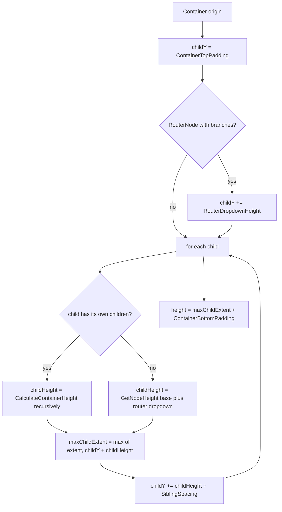
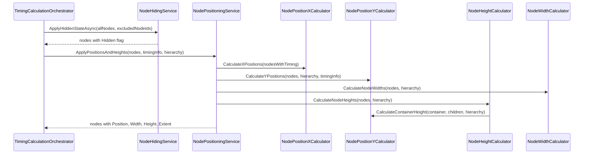

# UI Services

> Pure geometry for the procedure graph: turns scheduled timing into node X/Y positions, widths, heights, and a
> hidden/visible flag that the frontend renders directly.

## Overview

The UI service group computes the visual layout of a procedure graph so the frontend (an xyflow / React Flow canvas) can
render it without doing any geometry of its own. Given a set of nodes, their parent-to-children hierarchy, and the
timing produced by the scheduler, these services calculate each node's horizontal position (from start time), vertical
position (from hierarchy and timing order), width (from task duration), and height (from contained children). A separate
visibility service stamps a `Hidden` flag onto nodes that fall outside the active execution path, for example branches a
router did not select. The group is pure layout math with no persistence, no agent interaction, and no scheduling logic
of its own.

## Key Concepts

- **Time-to-pixel scale**: a single configurable factor (`TimeToPixelScale`) that converts abstract scheduler time units
  into horizontal pixels. The X position of a node is its `RelativeStartTime` multiplied by this scale; its width is its
  task `Duration` multiplied by the same scale.
- **Container vs leaf node**: a node with children in the hierarchy is a container whose height and width are derived
  from its descendants; a node without children is a leaf that uses the configured base height and a duration-based
  width.
- **Cascading container height**: container height is computed bottom-up, recursively summing child heights, sibling
  spacing, and top/bottom padding so a parent always fully encloses its descendants.
- **Child-overflow prevention**: container width is expanded so it is at least as wide as its widest descendant,
  preventing a nested node (such as a router inside a branch task) from spilling outside its parent.
- **Relative (React Flow) coordinates**: child positions are expressed relative to their parent's origin, not to the
  canvas, matching how xyflow nests nodes. The parent acts as origin (0,0) for its children, and child nodes carry
  `Extent = "parent"` to stay clamped inside.
- **Router dropdown allowance**: a `RouterNode` that has branches reserves extra vertical space (`RouterDropdownHeight`)
  at the top for its branch-selector UI.
- **Timing-driven ordering with deterministic fallback**: root nodes sort by `AbsoluteStartTime` and siblings by
  `RelativeStartTime`; when no timing is available, both fall back to sorting by node `Id` so layout stays stable.
- **Hidden state**: nodes excluded from the active execution path are marked `Hidden = true` and all others
  `Hidden = false`, so router branches that are not taken disappear from the canvas.

## How It Works

Layout is produced by four positioning calculators plus one visibility service. Each calculator owns exactly one
dimension (Single Responsibility). The X, height, and width calculators are pure; the Y calculator writes the computed Y
back onto each node's `Position.Y` in place as a side effect of `CalculateYPositions` / `PositionChildrenRecursively`.

- `NodePositionXCalculator` maps `RelativeStartTime * TimeToPixelScale` to an X pixel value per node.
- `NodePositionYCalculator` walks the hierarchy top-down, placing root nodes by `AbsoluteStartTime` and children
  relative to their parent, advancing `currentY` by each subtree's cascading container height plus `SiblingSpacing`. It
  also exposes `CalculateContainerHeight` (used by the height calculator) which recursively measures how tall a
  container must be to enclose all descendants.
- `NodeHeightCalculator` delegates to `NodePositionYCalculator.CalculateContainerHeight` for containers and assigns
  `BaseHeight` (plus `RouterDropdownHeight` for branchful routers) to leaves.
- `NodeWidthCalculator` runs two passes: first a duration-based width per node (`Duration * TimeToPixelScale`), then a
  bottom-up propagation that widens any container to its widest descendant.
- `NodeHidingService.ApplyHiddenStateAsync` produces a copy of the node list with the `Hidden` flag set, only allocating
  a new record `with { Hidden = ... }` when the flag actually changes.

```mermaid
classDiagram
    class INodePositionXCalculator {
        <<interface>>
        +double TimeToPixelScale
        +CalculateXPosition(node, timingInfo, parentNode) double
        +CalculateXPositions(nodesWithTiming) IReadOnlyDictionary~Guid,double~
    }
    class INodePositionYCalculator {
        <<interface>>
        +double ChildVerticalOffset
        +double ContainerTopPadding
        +double ContainerBottomPadding
        +double BaseHeight
        +double RouterDropdownHeight
        +CalculateYPositions(nodes, hierarchy, timingInfo) IReadOnlyDictionary~Guid,double~
        +CalculateContainerHeight(container, children, hierarchy) double
    }
    class INodeHeightCalculator {
        <<interface>>
        +CalculateNodeHeights(nodes, hierarchy) IReadOnlyDictionary~Guid,double~
    }
    class INodeWidthCalculator {
        <<interface>>
        +CalculateNodeWidths(nodes, hierarchy) IReadOnlyDictionary~Guid,double~
    }
    class INodeHidingService {
        <<interface>>
        +ApplyHiddenStateAsync(allNodes, nodesToHide) Task~IReadOnlyList~Node~~
    }
    NodePositionXCalculator ..|> INodePositionXCalculator
    NodePositionYCalculator ..|> INodePositionYCalculator
    NodeHeightCalculator ..|> INodeHeightCalculator
    NodeWidthCalculator ..|> INodeWidthCalculator
    NodeHidingService ..|> INodeHidingService
    NodeHeightCalculator --> INodePositionYCalculator : delegates container height
```

The recursive container measurement in both `CalculateContainerHeight` and `PositionChildrenRecursively` follows the
same accumulation rule, which keeps the height a node reports identical to the vertical span its children actually
occupy.

## Components

| Class / Interface                                      | Responsibility                                                                                                                                                                                                                                                                                                                                                                                                                                                           |
|--------------------------------------------------------|--------------------------------------------------------------------------------------------------------------------------------------------------------------------------------------------------------------------------------------------------------------------------------------------------------------------------------------------------------------------------------------------------------------------------------------------------------------------------|
| `INodePositionXCalculator` / `NodePositionXCalculator` | Computes the horizontal pixel position of each node as `RelativeStartTime * TimeToPixelScale`. Exposes the `TimeToPixelScale` factor.                                                                                                                                                                                                                                                                                                                                    |
| `INodePositionYCalculator` / `NodePositionYCalculator` | Computes vertical positions across the hierarchy (writing each node's `Position.Y` in place), sorting roots by `AbsoluteStartTime` and siblings by `RelativeStartTime`, and computes cascading container heights via `CalculateContainerHeight`. The interface exposes the layout constants `BaseHeight`, `ContainerTopPadding`, `ContainerBottomPadding`, `ChildVerticalOffset`, and `RouterDropdownHeight`; `SiblingSpacing` is a property on the implementation only. |
| `INodeHeightCalculator` / `NodeHeightCalculator`       | Produces a node-id-to-height map: container heights via the Y calculator, leaf heights from `BaseHeight` plus a router dropdown allowance when branches exist.                                                                                                                                                                                                                                                                                                           |
| `INodeWidthCalculator` / `NodeWidthCalculator`         | Produces a node-id-to-width map: duration-scaled widths, then a bottom-up pass expanding each container to its widest descendant.                                                                                                                                                                                                                                                                                                                                        |
| `INodeHidingService` / `NodeHidingService`             | Marks the supplied node ids as `Hidden = true` and all others as visible, returning a new node list with the flag applied immutably.                                                                                                                                                                                                                                                                                                                                     |
| `UiLogger` (`Support/Logging`)                         | Static source-generated structured logger for width, height, and hidden-state operations used by the calculators and the hiding service.                                                                                                                                                                                                                                                                                                                                 |

## Connections and Pipeline Role

This group is **cross-cutting layout math** that runs as a phase inside the scheduling pipeline. It is invoked both at
design time (whenever a CRUD change reschedules a procedure) and during execution (whenever the running schedule
changes), because in both cases positions and visibility must be recomputed to reflect the latest timing and the latest
active branch.

The single inbound consumer is the Scheduling/Pipeline group:

- `Scheduling.Pipeline.NodePositioningService` (`INodePositioningService`) injects all four positioning calculators (
  `INodePositionXCalculator`, `INodePositionYCalculator`, `INodeHeightCalculator`, `INodeWidthCalculator`) and calls
  them inside `ApplyPositionsAndHeights`, then writes the results back onto the node records (`Position`, `Width`,
  `Height`, and `Extent = "parent"` for nested nodes).
- `Scheduling.Pipeline.TimingCalculationOrchestrator` injects `INodeHidingService` directly. In its Phase 0 (router
  branch filtering) it calls `ApplyHiddenStateAsync` to hide excluded branch nodes, and in its Phase 3 it calls
  `NodePositioningService.ApplyPositionsAndHeights`.

What this group depends on:

- **Scheduling/Computation** for `NodeTimingInfo` (the `AbsoluteStartTime` / `RelativeStartTime` / `Duration` carrier) —
  the X and Y calculators consume it for placement and ordering.
- **Domain entities** `Node`, `TaskNode`, `SkillExecutionNode`, `RouterNode`, and their `Task` / `SkillExecutionTask` /
  `RouterTask` (for `Duration` and `Branches`), plus the `NodePosition`, `Width`, `Height`, `Extent`, and `Hidden`
  members of `Node`.
- **Application configuration** `SchedulingConfiguration.Positioning` (`PositioningConfiguration`) via `IOptions`,
  supplying every layout constant.

All five services are registered as singletons in `GraphQLServer/Extensions/ApplicationServiceExtensions.cs` (
`AddApplicationServices`). The computed node geometry ultimately reaches the frontend through the GraphQL schedule
result that the scheduling pipeline returns. This group performs no persistence and never talks to agents, the execution
event bus, or repositories.

## Configuration

All layout constants are read from `appsettings.json` under `Scheduling:Positioning`, bound to
`PositioningConfiguration` and injected as `IOptions(SchedulingConfiguration)`:

| Key                      | Bound member             | Meaning                                                               |
|--------------------------|--------------------------|-----------------------------------------------------------------------|
| `TimeToPixelScale`       | `TimeToPixelScale`       | Pixels per time unit for X position and width.                        |
| `BaseYOffset`            | `ChildVerticalOffset`    | Starting Y offset for root-level nodes.                               |
| `SiblingSpacing`         | `SiblingSpacing`         | Vertical gap between sibling nodes.                                   |
| `ContainerTopPadding`    | `ContainerTopPadding`    | Padding inside a container above its first child.                     |
| `ContainerBottomPadding` | `ContainerBottomPadding` | Padding inside a container below its last child.                      |
| `BaseHeight`             | `BaseHeight`             | Height assigned to leaf nodes.                                        |
| `RouterDropdownHeight`   | `RouterDropdownHeight`   | Extra height reserved at the top of a `RouterNode` that has branches. |

Log verbosity for these services (the `UiLogger` messages range from `Debug` to `Trace`) is controlled through the
logging section of `appsettings.json`, not in code.

## Related Documentation

- [Application layer README](../README.md)
- [Scheduling services](./scheduling.md)
- [Branching services](./branching.md)
- [CRUD scheduling deep-dive](../crud-scheduling.md)
- [Execution pipeline walkthrough](../../../docs/execution-pipeline.md)
- [Glossary](../../../docs/glossary.md)
- [Architecture overview](../../../docs/architecture.md)
