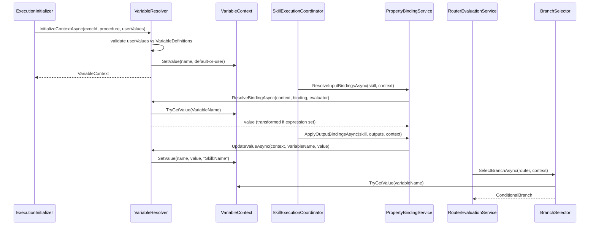
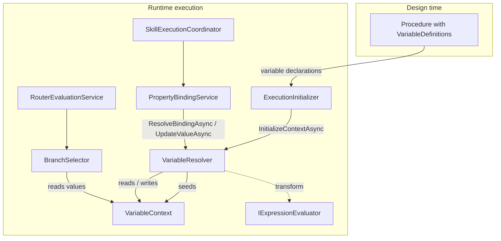

# Variables Services

> Runtime variable-context resolution: seeds the per-execution value store, reads and writes variable values, and
> resolves variable bindings (with optional transforms) for routers and skill properties.

## Overview

The Variables service group owns the runtime state that carries data through a procedure execution. It builds a
`VariableContext` from a procedure's design-time variable declarations, seeds it with default and user-provided values,
and exposes typed read/write operations on it for the rest of the execution pipeline. Routers consume these values to
make branching decisions and skill properties consume them for data flow between skills. The group is purely runtime: a
`VariableContext` is in-memory state scoped to a single procedure execution and is never persisted.

## Key Concepts

- **VariableContext** — runtime, thread-safe (`ConcurrentDictionary`) value store for one procedure execution. Holds
  `VariableValue` records keyed by name and publishes an `IObservable~VariableValue~` change stream. Lives in the Domain
  layer (`Domain.Entities.Variables`).
- **VariableValue** — record holding a variable's current `Value`, its `Name`, `LastUpdatedUtc`, and `LastUpdatedBy`
  provenance string.
- **VariableDefinition** — design-time declaration of a variable on a `Procedure` (`Name`, `Type`, `DefaultValue`,
  `Scope`, `Source`, `IsReadOnly`). Drives context initialization.
- **VariableBinding** — Domain record connecting a skill property to a variable by `VariableName`, with a
  `BindingMode` (Read / Write / ReadWrite) and an optional `TransformExpression`.
- **Binding resolution** — reading a variable value through a `VariableBinding`, then optionally running its
  `TransformExpression` through an `IExpressionEvaluator` with the raw value bound to the name `value`.
- **Variable exceptions** — a shared exception family rooted at `VariableException`, covering not-found, type-mismatch,
  expression-evaluation, and router branch-matching failures.

## How It Works

`InitializeContextAsync` validates and seeds the context: each `userProvidedValues` entry is checked against the
procedure's `VariableDefinition` set (the variable must exist, must not be `IsReadOnly`, and must be type-compatible).
Each variable is then seeded with its `DefaultValue`, overridden by any user value; a variable with neither a default
nor a user value is treated as required and rejected.

During execution, `ResolveBindingAsync` reads a variable by `VariableName` and, when a `TransformExpression` and an
`IExpressionEvaluator` are both supplied, evaluates the transform with the raw value exposed as `value`.
`UpdateValueAsync` writes a value back through `VariableContext.SetValue`, which records provenance and emits a change
notification on the context's `Changes` stream. The static `ResolveValueAsync~T~` helper performs a typed read with
`Convert.ChangeType` fallback, throwing `VariableTypeMismatchException` on failure.

## Components

| Class / Interface                | Responsibility                                                                                                                                                                                                                 |
|----------------------------------|--------------------------------------------------------------------------------------------------------------------------------------------------------------------------------------------------------------------------------|
| `IVariableResolver`              | Contract for initializing a context, updating a value, and resolving a binding during procedure execution.                                                                                                                     |
| `VariableResolver`               | Implementation. Validates and seeds the `VariableContext`, performs type-compatibility checks, resolves bindings (applying transforms via `IExpressionEvaluator`), and exposes the static typed `ResolveValueAsync~T~` helper. |
| `VariableException`              | Base class (non-abstract, protected constructors) at the root of the variable-error hierarchy.                                                                                                                                 |
| `VariableNotFoundException`      | Raised when a referenced variable is absent from the context.                                                                                                                                                                  |
| `VariableTypeMismatchException`  | Raised when a value cannot be converted to the requested CLR type.                                                                                                                                                             |
| `VariableAlreadyExistsException` | Raised when adding a variable whose name already exists in a procedure.                                                                                                                                                        |
| `ExpressionEvaluationException`  | Raised when transform/condition expression evaluation fails.                                                                                                                                                                   |
| `AmbiguousBranchException`       | Raised by branch selection when multiple branches match at the same priority.                                                                                                                                                  |
| `NoBranchMatchException`         | Raised by branch selection when no branch matches and no default branch exists.                                                                                                                                                |
| `VariableLogger`                 | Source-generated structured logging for context initialization and value updates.                                                                                                                                              |

## Connections and Pipeline Role

This group is a **runtime execution** service. It does no design-time CRUD itself; it consumes design-time variable
declarations (`Procedure.Variables` of type `VariableDefinition`) at the moment an execution starts and produces the
live `VariableContext` that the rest of the execution pipeline reads and mutates. `VariableResolver` is registered as a
singleton in `ApplicationServiceExtensions.AddApplicationServices`; it is stateless and operates entirely on the
`VariableContext` passed in as a parameter.

Inbound (who depends on this group):

- **Execution / Initialization** — `ExecutionInitializer` injects `IVariableResolver` and calls `InitializeContextAsync`
  to build the `VariableContext`, which it returns inside `ExecutionInitializationResult`. Validation exceptions (
  `InvalidOperationException`, `InvalidCastException`, `ArgumentException`) from initialization are allowed to propagate
  as invalid user input.
- **Properties** — `PropertyBindingService` injects `IVariableResolver` and uses `ResolveBindingAsync` (input bindings)
  and `UpdateValueAsync` (output bindings) to move data between skill properties and variables.
- **Execution / Coordination** — `SkillExecutionCoordinator` drives `PropertyBindingService` against the
  `VariableContext` for each skill: resolving input bindings before execution and applying output bindings (or raw
  outputs via `VariableContext.SetValue`) afterward.
- **Branching** and **Execution / Routing** — `BranchSelector` reads variable values directly from the
  `VariableContext` (`TryGetValue`, `GetAllValues`) to evaluate router conditions, and throws this group's
  `VariableNotFoundException`, `AmbiguousBranchException`, and `NoBranchMatchException`. `RouterEvaluationService`
  orchestrates that selection per `RouterNode`.

Outbound (what this group depends on):

- **Expressions** — `IExpressionEvaluator` for evaluating a binding's `TransformExpression`.
- **Domain entities** — `VariableContext`, `VariableValue`, `VariableDefinition` (via `Procedure.Variables`), and
  `VariableBinding` (via `Domain.Entities.Common`).

The `VariableException` family deliberately spans this group and the Branching group: branch-matching failures (
`AmbiguousBranchException`, `NoBranchMatchException`) are modeled as variable errors because branch conditions are
variable expressions.

## Related Documentation

- [Application layer README](../README.md)
- [Branching services](./branching.md)
- [Properties services](./properties.md)
- [Expressions services](./expressions.md)
- [Execution services](./execution.md)
- [Execution pipeline walkthrough](../../../docs/execution-pipeline.md)
- [Glossary](../../../docs/glossary.md)
- [Architecture overview](../../../docs/architecture.md)
