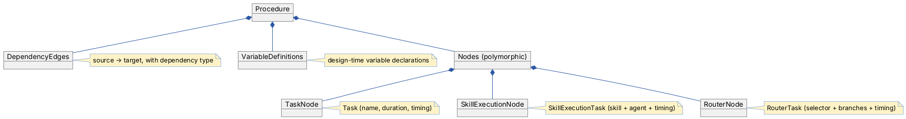

# Domain Layer

> Core entities, value objects, and interfaces that model the robotics workflow domain.

## Overview

The Domain layer defines *what things are* in the Freydis system — without any logic about how they're stored or
executed. It contains the entity classes (Procedure, Node, Skill, Agent), the interfaces that other layers implement (
repositories), and the value objects that represent data like positions, typed values, and variable bindings.

If you're new to the codebase, start here to understand the vocabulary. Every other layer speaks in terms of these
entities.

## Key Concepts

- **Procedure** — A workflow containing nodes and edges. This is the top-level "thing" a user creates and executes.
- **Node** — A step in a procedure. Three types: TaskNode (container), SkillExecutionNode (robot action), RouterNode (
  decision point).
- **Edge** — A dependency between two nodes (e.g., "B starts after A finishes").
- **Skill** — A capability like "pick up" or "move to position", with typed properties (inputs/outputs).
- **Agent** — A robot or simulation that can execute skills.
- **Variable** — A named value used in branching decisions and property bindings.
- **Branch** — One possible path from a router, selected by evaluating a condition against variables.

For complete definitions, see the [Glossary](../../docs/glossary.md).

## How It Works

### Entity Hierarchy



Every node has an `Id`, `ProcedureId`, `Position`, and optional `ParentId` (for nesting nodes inside TaskNodes or
RouterNodes). The polymorphic hierarchy is key — the Application, Infrastructure, and GraphQL layers all need to handle
these three node types.

### Variable-Driven Branching

RouterNodes use a **switch statement pattern**: evaluate a selector expression against runtime variables, match against
branch conditions, and select exactly one branch (XOR gateway). Non-selected branches are excluded from the schedule and
marked as "not selected" during execution.

```plantuml
@startuml Router Branching
skinparam backgroundColor transparent
skinparam defaultFontName Inter
skinparam componentBackgroundColor #DBEAFE
skinparam componentBorderColor #2C58A4
skinparam ArrowColor #2C58A4
skinparam noteBackgroundColor #FEF3C7
skinparam noteBorderColor #3B77DB

object RouterNode

object "Selector" as Selector {
  SimpleVariableSelector
  Expression = "color"
}

object "Branch 1" as Branch1 {
  condition = "red"
  priority = 1
  target = TaskNode_A
}

object "Branch 2" as Branch2 {
  condition = "blue"
  priority = 1
  target = TaskNode_B
}

object "Default" as Default {
  condition = null
  priority = 0
  target = TaskNode_C
}

RouterNode *-- Selector
RouterNode *-- "Branches" as BranchGroup

BranchGroup *-- Branch1
BranchGroup *-- Branch2
BranchGroup *-- Default

@enduml
```

### Property Binding and Data Flow

Skills have **properties** (Input, Output, InputOutput) that can be bound to variables:

- **Input properties** read from variables before skill execution
- **Output properties** write to variables after skill execution
- This enables data flow between skills: Skill A outputs a value, Skill B reads it

### Dependency Types

Edges express four types of timing relationships:

| Type                    | Meaning                    | Constraint           |
|-------------------------|----------------------------|----------------------|
| **FinishToStart (FS)**  | B starts after A finishes  | B.Start >= A.Finish  |
| **StartToStart (SS)**   | B starts when A starts     | B.Start >= A.Start   |
| **StartToFinish (SF)**  | B finishes when A starts   | B.Finish >= A.Start  |
| **FinishToFinish (FF)** | B finishes when A finishes | B.Finish >= A.Finish |

## Components

### Entities

| Entity               | Location              | Purpose                                |
|----------------------|-----------------------|----------------------------------------|
| `Procedure`          | `Entities/Procedure/` | Workflow container                     |
| `Node` (abstract)    | `Entities/Procedure/` | Base type for all node types           |
| `TaskNode`           | `Entities/Procedure/` | Grouping container with a Task         |
| `SkillExecutionNode` | `Entities/Procedure/` | Robot action with a SkillExecutionTask |
| `RouterNode`         | `Entities/Procedure/` | Decision point with a RouterTask       |
| `DependencyEdge`     | `Entities/Procedure/` | Directed edge between nodes            |
| `ConditionalBranch`  | `Entities/Procedure/` | One branch option in a router          |
| `SelectorExpression` | `Entities/Procedure/` | Base for selector types                |
| `Agent`              | `Entities/Common/`    | Robot/simulation definition            |
| `Skill`              | `Entities/Common/`    | Named capability with properties       |
| `TypedProperty`      | `Entities/Common/`    | Typed input/output on a skill          |
| `VariableDefinition` | `Entities/Variables/` | Design-time variable declaration       |
| `VariableContext`    | `Entities/Variables/` | Runtime variable storage               |
| `VariableValue`      | `Entities/Variables/` | Current value with source info         |
| `Position`           | `Entities/Common/`    | 3D coordinates                         |
| `PositionTag`        | `Entities/Common/`    | Named, reusable position reference     |
| `SceneObject`        | `Entities/Common/`    | Physical object in the workspace       |

### Interfaces

| Interface              | Location      | Purpose                                                             |
|------------------------|---------------|---------------------------------------------------------------------|
| `IRepository<T>`       | `Interfaces/` | Generic CRUD contract                                               |
| `IProcedureRepository` | `Interfaces/` | Procedure-specific queries (nodes by procedure, edges by procedure) |

## Detailed Design Documentation

- **[Design Specification](design-specification.md)** — Complete technical spec with PlantUML diagrams, meta model,
  selector patterns, and timeline integration.

## Related Documentation

- [Documentation Hub](../../docs/README.md) — Back to the index
- [Glossary](../../docs/glossary.md) — All domain terms defined
- [Application Layer](../../Application/docs/README.md) — Business logic that uses these entities
- [Infrastructure Layer](../../Infrastructure/docs/README.md) — How entities are stored in PostgreSQL
- [Architecture Overview](../../docs/architecture.md) — How the Domain fits in the system
