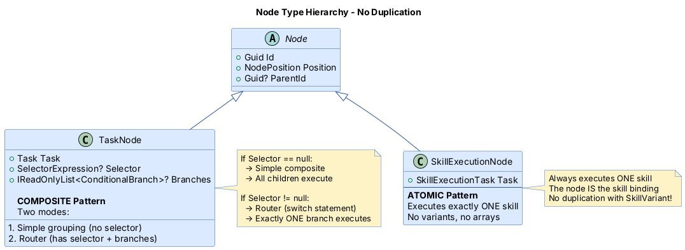
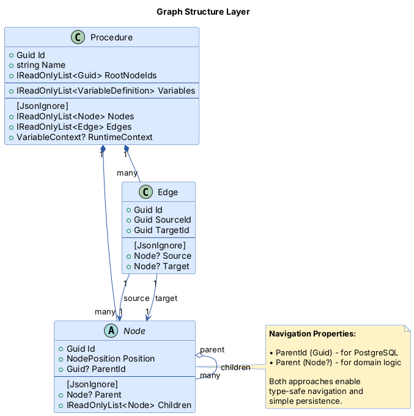
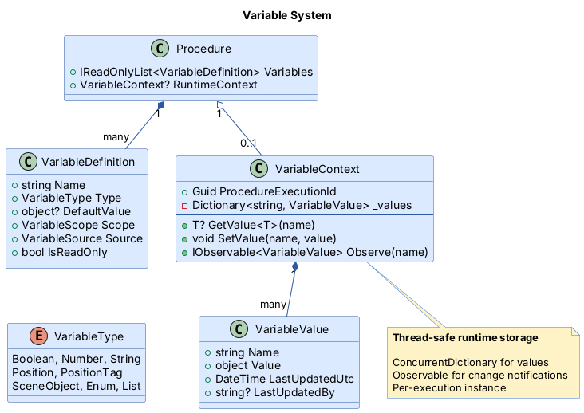
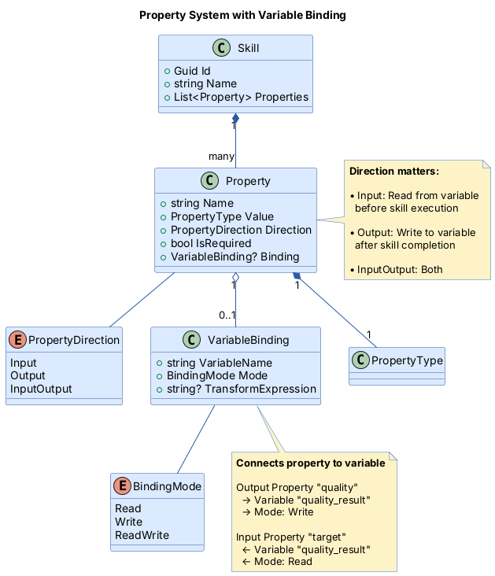
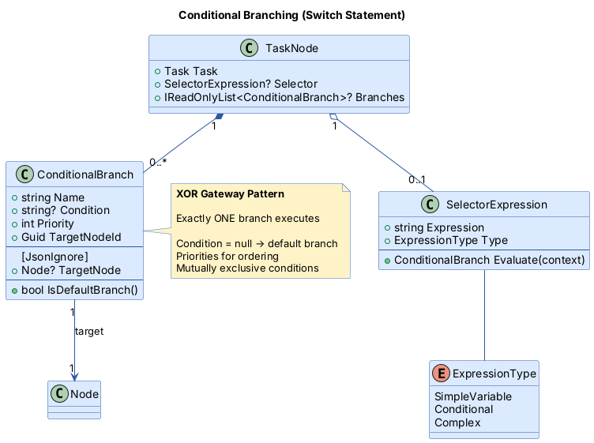
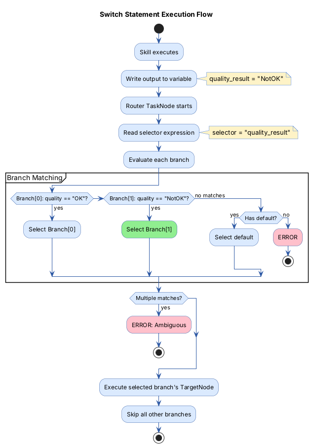

# Variable-Driven Branching System - Design Specification

## Table of Contents

1. [Overview](#overview)
2. [Core Concepts](#core-concepts)
3. [Meta Model](#meta-model)
4. [Switch Statement Pattern](#switch-statement-pattern)
5. [Timeline Integration](#timeline-integration)
6. [Domain Model Details](#domain-model-details)
7. [Best Practices](#best-practices)

---

## Overview

### Problem Statement

Current system lacks:

- Variables to pass data between skills
- Conditional routing based on skill outputs
- Timeline visualization for different execution paths

### Solution

A complete variable-driven branching system where:

1. Skills output values to procedure-level variables
2. TaskNodes route execution based on variable values (switch statement pattern)
3. Timeline shows exactly ONE path based on selected/actual variables

### Key Principles

- **DRY** — no duplication between node types.
- **SOLID** — clear separation of concerns.
- **Variables** — central data flow mechanism.
- **XOR gateway** — exactly one branch executes (switch-statement semantics).
- **Timeline clarity** — always shows one deterministic path.

---

## Core Concepts

### 1. Variables

**VariableDefinition** - Design-time declaration

- Defines what variables exist in a procedure
- Name, type, default value, scope, source

**VariableContext** - Runtime storage

- Stores actual values during execution
- Thread-safe dictionary
- Observable for subscriptions

**Variable Sources:**

- `UserDefined` - Set at execution start
- `SkillOutput` - Written by skill completion
- `AgentState` - Read from agent metadata
- `SensorData` - External system input
- `RuntimeComputed` - Calculated during execution

### 2. Node Types



### 3. Data Flow

```
Skill (Output Property)
  → VariableBinding (Write)
    → VariableContext (Store)
      → SelectorExpression (Read)
        → Choose Branch
          → Skill (Input Property)
            ← VariableBinding (Read)
              ← VariableContext (Retrieve)
```

**Key Points:**

- Variables are the ONLY data flow mechanism
- No explicit edge data mappings
- Single source of truth: VariableContext

---

## Meta Model

### Layer 1: Graph Structure



### Layer 2: Variable System



### Layer 3: Skill Properties & Binding



### Layer 4: Conditional Branching



---

## Switch Statement Pattern

### Direct Mapping

**C# Switch Statement:**

```csharp
string quality = inspectionResult.Quality;

switch (quality)
{
    case "OK":
        Package();
        Ship();
        break;

    case "NotOK":
        MarkDefective();
        Discard();
        break;

    default:
        LogUnknown();
        break;
}
```

**TaskNode Router (Exact Same Logic):**

```yaml
TaskNode_QualityRouter:
  selector:
    expression: "quality_result"
    type: SimpleVariable

  branches:
    # case "OK":
    - name: "OK Branch"
      condition: "quality_result == 'OK'"
      priority: 1
      targetNodeId: node-handle-ok

    # case "NotOK":
    - name: "NotOK Branch"
      condition: "quality_result == 'NotOK'"
      priority: 2
      targetNodeId: node-handle-reject

    # default:
    - name: "Default Branch"
      condition: null
      priority: 999
      targetNodeId: node-handle-unknown
```

### Execution Flow



### Guarantees

- **Exactly one branch** executes (never zero, never multiple).
- **Mutually exclusive** conditions, validated at design time.
- **Default fallback** optional (condition = null).
- **No fall-through** — implicit break after each branch.
- **Priority-based** evaluation order.

---

## Timeline Integration

### The Challenge

With branching, there are **multiple possible timelines**:

```
Inspect(1min) → Router → OK: Package(2min) + Ship(5min) = 8min
                       → NotOK: Mark(1min) + Discard(3min) = 5min
                       ↓
                FinalCleanup(1min)
```

**Question:** Show 9-minute timeline or 6-minute timeline?

**Answer:** Show exactly ONE based on scenario!

### Two Modes

#### Mode 1: Design-Time (Planning)

A Timeline Scenario Selector panel lets the user pick a value for each selector variable (e.g. `quality_result = "OK"`)
and shows the resulting preview timeline — duration, ordered skill list, and the size of each alternative scenario.
Selecting an alternative value (`"NotOK"`) swaps the preview in place.

Content rendered by the panel:

| Field                 | Example                            |
|-----------------------|------------------------------------|
| Selector inputs       | `quality_result = "OK"`            |
| Timeline duration     | 9 minutes                          |
| Skill order           | Inspect → Package → Ship → Cleanup |
| Alternative scenarios | `NotOK` → 6 minutes                |

#### Mode 2: Runtime (Execution)

An Execution Monitor panel tracks the procedure live, derived from the `VariableContext` and execution state. Timelines
are recomputed automatically whenever an observed variable changes.

Content rendered by the panel:

| Field              | Example                                                          |
|--------------------|------------------------------------------------------------------|
| Observed variables | `quality_result = "NotOK"` (actual)                              |
| Timeline duration  | 6 minutes                                                        |
| Skill states       | Inspect: done, Mark: running, Discard: pending, Cleanup: pending |
| Selected branch    | `NotOK`                                                          |

### Critical: EXCLUDE Non-Selected Branches

**Don't grey them out - remove them completely!**

**Why?** Nodes that depend on the Router actually depend on whichever branch completes:

```
Wrong (greying out):
Timeline shows BOTH branches
FinalCleanup position ambiguous

Correct (exclusion):
Timeline shows ONLY selected branch
FinalCleanup starts after selected branch's leaf node
```

### Dependency Resolution

```csharp
// Edge in database:
Edge { SourceId: routerId, TargetId: cleanupId }

// Resolved at runtime (OK scenario):
Edge { SourceId: shipId, TargetId: cleanupId }
// Ship is the leaf node of OK branch

// Resolved at runtime (NotOK scenario):
Edge { SourceId: discardId, TargetId: cleanupId }
// Discard is the leaf node of NotOK branch
```

### Scheduling Algorithm

```csharp
public async Task<ScheduleResult> CalculateScheduleAsync(
    Guid procedureId,
    VariableContext? scenarioContext = null)
{
    var procedure = await _procedureRepository.GetByIdAsync(procedureId);
    var context = scenarioContext ?? InitializeDefaults(procedure);

    // STEP 1: Evaluate all routers with context
    var branchSelections = await EvaluateRoutersAsync(procedure, context);

    // STEP 2: Build included node set (EXCLUDE non-selected branches)
    var includedNodes = BuildIncludedNodeSet(procedure, branchSelections);

    // STEP 3: Resolve dependencies (router deps → branch leaf deps)
    var resolvedEdges = ResolveDependencies(procedure, branchSelections);

    // STEP 4: Calculate timings ONLY for included nodes
    var graph = BuildGraph(includedNodes, resolvedEdges);
    var schedule = await _timingEngine.CalculateAsync(graph);

    // STEP 5: Add metadata
    schedule.SelectedBranches = branchSelections.Values.ToList();
    schedule.ExcludedNodes = GetExcludedNodes(procedure, includedNodes);

    return schedule;
}
```

### Timeline Visualization

**Main Timeline:** shows only the selected path.

**Side Panel:** shows alternative branches for comparison.

| Panel             | Contents                                                                                                                           |
|-------------------|------------------------------------------------------------------------------------------------------------------------------------|
| Main Timeline     | Selected path only — e.g. `OK` → 9 min, skill order `Inspect, Package, Ship, Cleanup`                                              |
| Alternative Paths | Every non-selected branch with the branch label, its projected duration, and a "preview" control that swaps it into the main panel |

---

## Domain Model Details

### Complete Class Structure

```csharp
// ============= Procedure Package =============

public record Procedure
{
    [BsonId]
    public Guid Id { get; set; }
    public required string Name { get; set; }
    public string? Description { get; set; }
    public DateTime CreatedAtUtc { get; set; }
    public DateTime LastUpdatedAtUtc { get; set; }
    public required IReadOnlyList<Guid> RootNodeIds { get; set; }

    // NEW: Variables
    public IReadOnlyList<VariableDefinition> Variables { get; set; } = [];

    // Navigation properties
    [JsonIgnore]
    public IReadOnlyList<Node> Nodes { get; set; } = [];

    [JsonIgnore]
    public IReadOnlyList<Edge> Edges { get; set; } = [];

    [JsonIgnore]
    public IReadOnlyList<Node> RootNodes { get; set; } = [];

    [JsonIgnore]
    public VariableContext? RuntimeContext { get; set; }
}

public abstract record Node
{
    [BsonId]
    public required Guid Id { get; set; }
    public required NodePosition Position { get; set; }
    public Guid? ParentId { get; set; }
    public double? Width { get; set; }
    public double? Height { get; set; }

    // Navigation properties
    [JsonIgnore]
    public Node? Parent { get; set; }

    [JsonIgnore]
    public IReadOnlyList<Node> Children { get; set; } = [];
}

public record TaskNode : Node
{
    public required Task Task { get; set; }

    // NEW: Conditional branching
    public SelectorExpression? Selector { get; set; }
    public IReadOnlyList<ConditionalBranch>? Branches { get; set; }

    // Validation: If Selector != null, Branches must exist
}

public record SkillExecutionNode : Node
{
    public required SkillExecutionTask SkillExecutionTask { get; set; }
}

public record Edge
{
    [BsonId]
    public required Guid Id { get; set; }
    public required Guid SourceId { get; set; }
    public required Guid TargetId { get; set; }
    public string? SourceHandle { get; set; }
    public string? TargetHandle { get; set; }

    [JsonIgnore]
    public Node? Source { get; set; }

    [JsonIgnore]
    public Node? Target { get; set; }
}

// ============= Tasks =============

public record Task
{
    public required string Name { get; set; }
    public string? Description { get; set; }
    public required double StartTime { get; set; }
    public required double Duration { get; set; }
    public double? FinishTime { get; set; }
    public bool? IsExecuting { get; set; }
    public double? Progress { get; set; }
}

public record SkillExecutionTask : Task
{
    public required Guid SkillId { get; set; }
    public required Guid AgentId { get; set; }
    public Guid? ExecutionId { get; set; }

    [JsonIgnore]
    public Skill? Skill { get; set; }

    [JsonIgnore]
    public Agent? Agent { get; set; }
}

// ============= Branching =============

public record ConditionalBranch
{
    public required string Name { get; set; }
    public string? Condition { get; set; }  // null = default branch
    public int Priority { get; set; }
    public required Guid TargetNodeId { get; set; }

    [JsonIgnore]
    public Node? TargetNode { get; set; }

    public bool IsDefaultBranch() => string.IsNullOrEmpty(Condition);
}

public record SelectorExpression
{
    public required string Expression { get; set; }
    public ExpressionType Type { get; set; } = ExpressionType.SimpleVariable;

    // Evaluates and returns exactly ONE branch
    public ConditionalBranch EvaluateExclusive(
        VariableContext context,
        IReadOnlyList<ConditionalBranch> branches);
}

public enum ExpressionType
{
    SimpleVariable,  // Direct value match
    Conditional,     // Boolean expressions
    Complex          // Multi-variable logic
}

// ============= Variables =============

public record VariableDefinition
{
    public required string Name { get; set; }
    public required VariableType Type { get; set; }
    public object? DefaultValue { get; set; }
    public VariableScope Scope { get; set; } = VariableScope.Procedure;
    public VariableSource Source { get; set; } = VariableSource.UserDefined;
    public string? Description { get; set; }
    public bool IsReadOnly { get; set; }
}

public class VariableContext
{
    private readonly ConcurrentDictionary<string, VariableValue> _values = new();

    public Guid ProcedureExecutionId { get; set; }
    public DateTime LastUpdatedUtc { get; set; }

    public T? GetValue<T>(string name)
    {
        if (_values.TryGetValue(name, out var value))
            return (T?)value.Value;
        return default;
    }

    public void SetValue(string name, object value, string? updatedBy = null)
    {
        _values[name] = new VariableValue
        {
            Name = name,
            Value = value,
            LastUpdatedUtc = DateTime.UtcNow,
            LastUpdatedBy = updatedBy
        };
        LastUpdatedUtc = DateTime.UtcNow;
    }

    public IReadOnlyDictionary<string, VariableValue> GetAllValues()
        => _values.ToDictionary(kvp => kvp.Key, kvp => kvp.Value);
}

public record VariableValue
{
    public required string Name { get; set; }
    public required object Value { get; set; }
    public DateTime LastUpdatedUtc { get; set; }
    public string? LastUpdatedBy { get; set; }
}

// ============= Skills =============

public record Skill
{
    [BsonId]
    public required Guid Id { get; set; }
    public required string Name { get; set; }
    public required string Description { get; set; }
    public required List<Guid> AgentIds { get; set; }

    // MODIFIED: Properties now have direction and binding
    public required List<Property> Properties { get; set; }

    [JsonIgnore]
    public IReadOnlyList<Agent> Agents { get; set; } = [];
}

public record Property
{
    public required string Name { get; set; }
    public required PropertyType Value { get; set; }

    // NEW: Direction and binding
    public PropertyDirection Direction { get; set; } = PropertyDirection.Input;
    public bool IsRequired { get; set; }
    public VariableBinding? Binding { get; set; }
}

public enum PropertyDirection
{
    Input,
    Output,
    InputOutput
}

public record VariableBinding
{
    public required string VariableName { get; set; }
    public BindingMode Mode { get; set; } = BindingMode.Read;
    public string? TransformExpression { get; set; }
}

public enum BindingMode
{
    Read,
    Write,
    ReadWrite
}
```

---

## Best Practices

### 1. ID and Navigation Pattern

**Recommended:** Guid for persistence + Navigation properties for logic

```csharp
public record Node
{
    // For PostgreSQL persistence
    public Guid Id { get; set; }
    public Guid? ParentId { get; set; }

    // For domain logic
    [JsonIgnore]
    public Node? Parent { get; set; }

    [JsonIgnore]
    public IReadOnlyList<Node> Children { get; set; } = [];
}
```

**Benefits:**

- Simple persistence (PostgreSQL handles `Guid`).
- Type-safe navigation in code.
- Easy to traverse relationships.
- No complex value-object mapping.

### 2. Branch Validation Rules

**Design-Time Checks:**

1. Conditions must be mutually exclusive
2. Either exhaustive OR has default branch
3. Only one default branch allowed
4. Priorities must be unique

**Runtime Checks:**

1. Exactly one branch matches
2. If no match, use default or error
3. If multiple matches, error (ambiguous)

### 3. Variable Type Safety

**Validate at design time:**

- Variable exists in procedure
- Type compatibility (Variable type matches Property type)
- Binding mode matches direction (Output → Write, Input → Read)

**Handle at runtime:**

- Type conversion with fallback
- Clear error messages with context
- Graceful degradation when possible

### 4. Expression Security

**Safe Evaluation:**

- Use sandboxed evaluator (DynamicExpresso)
- Whitelist allowed functions only
- No reflection or file system access
- Timeout expressions (max 100ms)
- Validate syntax at design time

### 5. Timeline Calculation

**Always:**

- Evaluate routers with scenario context
- Exclude non-selected branches entirely
- Resolve router dependencies to branch leaf nodes
- Calculate timings only for included nodes
- Return metadata about selections

**Never:**

- Show multiple timelines simultaneously
- Grey out branches (exclude them instead)
- Calculate timings for excluded nodes
- Leave dependency resolution ambiguous

---

## Summary

### Key Design Decisions

1. **No Duplication**
    - SkillExecutionNode = ONE skill execution
    - TaskNode = composite OR router (not a third type)
    - No SkillVariant or SkillBinding abstractions

2. **XOR Gateway (Switch Statement)**
    - Exactly one branch executes
    - Mutually exclusive conditions
    - Default fallback optional
    - No fall-through

3. **Variable-Centric Data Flow**
    - All data flows through VariableContext
    - Properties bind to variables
    - No explicit edge data mappings

4. **Timeline Clarity**
    - Design mode: User selects scenario
    - Runtime mode: Actual variable values
    - Always show ONE deterministic path
    - Exclude non-selected branches

5. **Dependency Resolution**
    - Router dependencies resolve to branch leaf nodes
    - Subsequent nodes positioned correctly
    - No timing ambiguity

### Architecture Layers

| Layer          | Responsibility                                          |
|----------------|---------------------------------------------------------|
| Domain         | Entities, value objects, invariants                     |
| Infrastructure | PostgreSQL, serialization, repositories                 |
| Application    | Variable resolution, branch selection, execution        |
| GraphQL        | API schema, mutations, subscriptions                    |
| Frontend       | Variable manager, branch editor, timeline visualization |

## Related Documentation

- [Domain Layer](README.md) — entity overview and navigation
- [Glossary](../../docs/glossary.md) — term definitions
- [Application Layer](../../Application/docs/README.md) — variable resolution and branch selection implementation
- [Architecture Overview](../../docs/architecture.md) — where Domain sits in the full system

