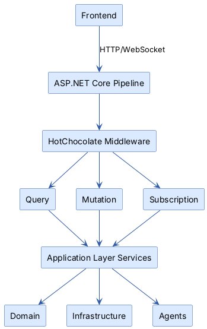
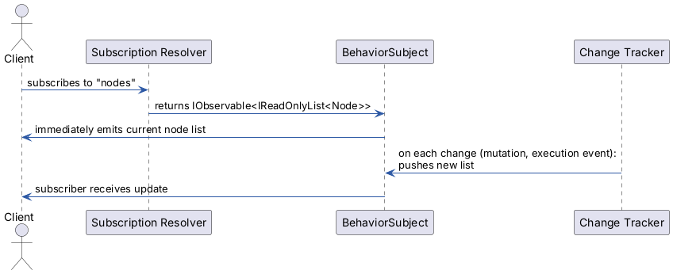
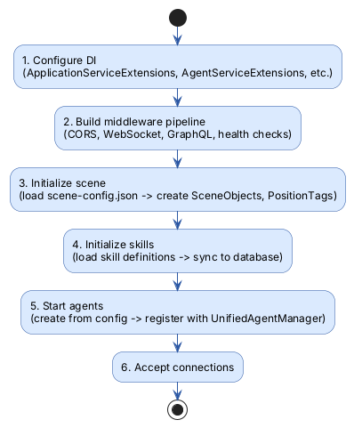

# GraphQL Server

> ASP.NET Core host that exposes the GraphQL API, configures dependency injection, and wires up all backend layers.

## Overview

The GraphQL Server is the **entry point** for all external communication. It's an ASP.NET Core application that hosts a
HotChocolate GraphQL endpoint. The frontend connects to it for everything: reading procedures, creating nodes, starting
execution, and subscribing to real-time updates.

Beyond serving the API, this layer is responsible for:

- **Dependency injection** — Registering all services from all layers with correct lifetimes
- **Startup initialization** — Loading scene configuration, registering agents, syncing skills
- **Entity mapping** — Converting domain entities to/from GraphQL DTOs
- **Input validation** — Checking edges for cycles, validating node structures

## Key Concepts

- **Query** — Read operations: get procedures, nodes, edges, agents, scene data
- **Mutation** — Write operations: create/update/delete entities, start/stop execution, manage variables
- **Subscription** — Real-time streams: node changes, edge changes, execution events, timing updates. Uses WebSocket
  transport.
- **BehaviorSubject Pattern** — Subscriptions emit the current state immediately on connect, then push updates as they
  happen. This means clients always have data, not just changes.
- **Node Type Union** — The GraphQL schema uses a union type for nodes (TaskNode | SkillExecutionNode | RouterNode).
  Clients use fragments to query type-specific fields.

## How It Works

### Request Flow

### Subscription Model

GraphQL subscriptions use WebSocket transport. The server exposes `IObservable<T>` streams backed by `BehaviorSubject`:

This means a client that connects mid-execution immediately sees the current state.

### Startup Sequence

## Components

### Operations

| File                         | Purpose                                                                        |
|------------------------------|--------------------------------------------------------------------------------|
| `Operations/Query.cs`        | Read resolvers: procedures, nodes, edges, agents, scene data, config           |
| `Operations/Mutation.cs`     | Write resolvers: CRUD for all entities, execution control, variable management |
| `Operations/Subscription.cs` | Real-time resolvers: node/edge changes, execution events, timing               |

### Services

| Service                       | Purpose                                                   |
|-------------------------------|-----------------------------------------------------------|
| `GraphQLDtoMapperService`     | Maps domain entities to GraphQL DTO types                 |
| `DependencyEdgeValidator`     | Validates edges for cycles and structural constraints     |
| `GraphQLErrorFilter`          | Translates exceptions to GraphQL-friendly error responses |
| `GraphQLMutationLogger`       | Unified logging for node mutations (OCP-compliant)        |
| `SceneInitializationService`  | Loads scene config on startup                             |
| `SkillsInitializationService` | Syncs skill definitions to database                       |
| `RuntimeAgentService`         | Manages agent startup and registration                    |
| `StartupValidationService`    | Validates configuration on startup                        |

### Types

| Category            | What's Inside                                                                                                |
|---------------------|--------------------------------------------------------------------------------------------------------------|
| `Types/DTOs/`       | Output types: `AgentDto`, `SkillDto`, `NodeDto`, `TaskNodeDto`, `SkillExecutionNodeDto`, `RouterNodeDto`     |
| `Types/InputTypes/` | Input types: `AgentInput`, `NodeInput`, `PropertyInput`, `VariableDefinitionInput`, `ConditionalBranchInput` |
| `Types/Resolvers/`  | Field resolvers: `AgentResolvers`, `SkillResolvers`, `PropertyResolvers`                                     |
| `Types/`            | Enums and payload types: `ExecutionTypes`, `PayloadTypes`, `ProcedureTypes`                                  |

### Data Loaders

| Loader                      | Purpose                        |
|-----------------------------|--------------------------------|
| `AgentDataLoader`           | Batch-loads agents by ID       |
| `SkillDataLoader`           | Batch-loads skills by ID       |
| `AgentsBySkillIdDataLoader` | Batch-loads agents by skill ID |

### DI Extensions

| Extension                        | Purpose                                |
|----------------------------------|----------------------------------------|
| `ApplicationServiceExtensions`   | Registers all application services     |
| `GraphQLServiceExtensions`       | Configures HotChocolate schema         |
| `AgentServiceExtensions`         | Registers agent factories and managers |
| `PostgresServiceExtensions`      | Configures PostgreSQL and repositories |
| `OrchestrationServiceExtensions` | Registers execution pipeline services  |

See [DI Design Guide](../Extensions/README.md) for lifetime decisions and patterns.

## Configuration

### Environments

| Environment        | Logging            | Agents       | Use Case                 |
|--------------------|--------------------|--------------|--------------------------|
| `Development`      | Balanced           | Dummy        | Day-to-day development   |
| `Hybrid`           | Balanced           | Dummy + KUKA | Mixed testing            |
| `Kuka`             | Balanced           | KUKA only    | Real robot testing       |
| `Scheduling-Debug` | Verbose scheduling | Dummy        | Debugging timing issues  |
| `Operations-Debug` | Verbose API        | Dummy        | Debugging GraphQL issues |
| `Production`       | Minimal            | Real agents  | Deployment               |

### Config Files

| File                              | Purpose                         |
|-----------------------------------|---------------------------------|
| `Config/scene-config.json`        | Scene objects and position tags |
| `Config/dummy-agents-config.json` | Dummy agent definitions         |
| `Config/kuka-agents-config.json`  | KUKA robot configurations       |

See [Agent Configuration Reference](../README-Configuration.md) for details.

## Detailed References

- [GraphQL Operations](graphql-operations.md) — Complete query, mutation, and subscription reference with examples
- [Agent Configuration](../README-Configuration.md) — Config file format and environment setup
- [DI Design Guide](../Extensions/README.md) — Dependency injection patterns and service lifetimes

## Related Documentation

- [Documentation Hub](../../docs/README.md) — Back to the index
- [Glossary](../../docs/glossary.md) — Term definitions
- [Application Layer](../../Application/docs/README.md) — Services this layer delegates to
- [Domain Layer](../../Domain/docs/README.md) — Entities mapped to GraphQL types
- [Architecture Overview](../../docs/architecture.md) — How the GraphQL Server fits in the system
