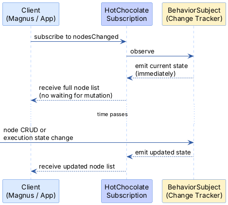

# GraphQL Operations Guide

This guide documents the GraphQL API exposed by Freydis for both Magnus (React frontend) and Skadi (the Kotlin mobile
companion app). Both clients consume the same schema. For the full type definitions, see [
`schema.graphql`](../schema.graphql).

## Subscription Model

All subscriptions use `BehaviorSubject`-backed observables. This means **new subscribers immediately receive the current
state** — not just future changes. Clients get data on connect, not just on the next mutation.

Subscriptions are powered by Rx.NET with HotChocolate's `[Subscribe(With = ...)]` pattern: a static method returns an
`IObservable<T>`, and HotChocolate bridges it to the GraphQL subscription stream.

During procedure execution, timing updates are sampled at a configurable interval (`FrontendPublishIntervalMs`, default
10ms) to prevent flooding clients with rapid-fire updates.

---

## Queries

### Procedures

| Query             | Arguments   | Returns                                              |
|-------------------|-------------|------------------------------------------------------|
| `procedures`      | —           | `[Procedure!]!` — all procedures                     |
| `procedureById`   | `id: UUID!` | `Procedure` — single procedure or null               |
| `loadedProcedure` | —           | `Procedure` — the currently active procedure or null |

### Nodes

| Query      | Arguments                | Returns                             |
|------------|--------------------------|-------------------------------------|
| `nodes`    | `where: NodeFilterInput` | `[Node!]!` — all nodes (filterable) |
| `nodeById` | `id: UUID!`              | `Node` — single node (union type)   |

The `Node` type is a **union**: `SkillExecutionNode | TaskNode | RouterNode`. Clients must use inline fragments or the
`...NodeFields` fragment pattern to access type-specific fields. See [Node Type Union](#node-type-union) below.

### Edges

| Query                | Arguments                                                               | Returns              |
|----------------------|-------------------------------------------------------------------------|----------------------|
| `dependencyEdges`    | `where: DependencyEdgeFilterInput`, `order: [DependencyEdgeSortInput!]` | `[DependencyEdge!]!` |
| `dependencyEdgeById` | `id: UUID!`                                                             | `DependencyEdge`     |

### Agents and Skills

| Query                | Arguments                                             | Returns                                             |
|----------------------|-------------------------------------------------------|-----------------------------------------------------|
| `agents`             | `where: AgentFilterInput`, `order: [AgentSortInput!]` | `[Agent!]!`                                         |
| `agentById`          | `id: UUID!`                                           | `Agent`                                             |
| `skills`             | `where: SkillFilterInput`, `order: [SkillSortInput!]` | `[Skill!]!`                                         |
| `skillById`          | `id: UUID!`                                           | `Skill`                                             |
| `runtimeAgents`      | —                                                     | `[RuntimeAgentInfo!]!` — agents with runtime status |
| `runtimeAgentById`   | `agentId: UUID!`                                      | `RuntimeAgentInfo`                                  |
| `runtimeAgentByName` | `agentName: String!`                                  | `RuntimeAgentInfo`                                  |

### Scene Data

| Query             | Arguments                                                         | Returns           |
|-------------------|-------------------------------------------------------------------|-------------------|
| `sceneObjects`    | `where: SceneObjectFilterInput`, `order: [SceneObjectSortInput!]` | `[SceneObject!]!` |
| `sceneObjectById` | `id: UUID!`                                                       | `SceneObject`     |
| `positionTags`    | `where: PositionTagFilterInput`, `order: [PositionTagSortInput!]` | `[PositionTag!]!` |
| `positionTagById` | `id: UUID!`                                                       | `PositionTag`     |

### Configuration

| Query                     | Returns                                                                                             |
|---------------------------|-----------------------------------------------------------------------------------------------------|
| `schedulingConfiguration` | `SchedulingConfiguration!` — UI layout parameters (timeToPixelScale, baseYOffset, spacing, heights) |

---

## Mutations

### Procedure Lifecycle

| Mutation               | Input                   | Returns                        | Purpose                                       |
|------------------------|-------------------------|--------------------------------|-----------------------------------------------|
| `createProcedure`      | `CreateProcedureInput!` | `CreateProcedurePayload!`      | Create a new procedure                        |
| `deleteProcedure`      | `DeleteProcedureInput!` | `DeleteProcedurePayload!`      | Delete procedure and all its contents         |
| `loadProcedure`        | `id: UUID!`             | `LoadProcedurePayload!`        | Make a procedure active for editing/execution |
| `unloadProcedure`      | —                       | `UnloadProcedurePayload!`      | Unload the current procedure                  |
| `startLoadedProcedure` | —                       | `StartLoadedProcedurePayload!` | Begin executing the loaded procedure          |

### Procedure Variables

| Mutation                  | Key Arguments                                                                       | Returns      |
|---------------------------|-------------------------------------------------------------------------------------|--------------|
| `addVariableToProcedure`  | `procedureId: UUID!`, `variable: VariableDefinitionInput!`                          | `Procedure!` |
| `updateProcedureVariable` | `procedureId: UUID!`, `variableName: String!`, `variable: VariableDefinitionInput!` | `Procedure!` |
| `removeProcedureVariable` | `procedureId: UUID!`, `variableName: String!`                                       | `Procedure!` |

### Nodes

| Mutation     | Input              | Returns                                                        |
|--------------|--------------------|----------------------------------------------------------------|
| `createNode` | `CreateNodeInput!` | `CreateNodePayload!` — includes created `node`                 |
| `updateNode` | `UpdateNodeInput!` | `UpdateNodePayload!`                                           |
| `deleteNode` | `DeleteNodeInput!` | `DeleteNodePayload!` — deletes node and entire descendant tree |

### Edges

| Mutation               | Input                        | Returns                        |
|------------------------|------------------------------|--------------------------------|
| `createDependencyEdge` | `CreateDependencyEdgeInput!` | `CreateDependencyEdgePayload!` |
| `updateDependencyEdge` | `UpdateDependencyEdgeInput!` | `UpdateDependencyEdgePayload!` |
| `deleteDependencyEdge` | `DeleteDependencyEdgeInput!` | `DeleteDependencyEdgePayload!` |

### Agents and Skills

| Mutation      | Input               | Returns               |
|---------------|---------------------|-----------------------|
| `createAgent` | `CreateAgentInput!` | `CreateAgentPayload!` |
| `updateAgent` | `UpdateAgentInput!` | `UpdateAgentPayload!` |
| `deleteAgent` | `DeleteAgentInput!` | `DeleteAgentPayload!` |
| `createSkill` | `CreateSkillInput!` | `CreateSkillPayload!` |
| `updateSkill` | `UpdateSkillInput!` | `UpdateSkillPayload!` |
| `deleteSkill` | `DeleteSkillInput!` | `DeleteSkillPayload!` |

### Scene Data

| Mutation            | Input                     | Returns                     |
|---------------------|---------------------------|-----------------------------|
| `createSceneObject` | `CreateSceneObjectInput!` | `CreateSceneObjectPayload!` |
| `updateSceneObject` | `UpdateSceneObjectInput!` | `UpdateSceneObjectPayload!` |
| `deleteSceneObject` | `DeleteSceneObjectInput!` | `DeleteSceneObjectPayload!` |
| `createPositionTag` | `CreatePositionTagInput!` | `CreatePositionTagPayload!` |
| `updatePositionTag` | `UpdatePositionTagInput!` | `UpdatePositionTagPayload!` |
| `deletePositionTag` | `DeletePositionTagInput!` | `DeletePositionTagPayload!` |

---

## Subscriptions

| Subscription             | Returns              | Backing Observable                                                           |
|--------------------------|----------------------|------------------------------------------------------------------------------|
| `nodesChanged`           | `[Node!]!`           | `INodeApplicationService.Nodes` — procedure-scoped node state                |
| `dependencyEdgesChanged` | `[DependencyEdge!]!` | `IDependencyEdgeApplicationService.DependencyEdges` — procedure-scoped edges |
| `agentsChanged`          | `[Agent!]!`          | `IAgentApplicationService.OnAgentsChanged()`                                 |
| `skillsChanged`          | `[Skill!]!`          | `ISkillApplicationService.OnSkillsChanged()`                                 |
| `executionTimingChanged` | `ExecutionTiming!`   | `IExecutionTimingPublisher.TimingUpdates` — sampled during execution         |

### ExecutionTiming Fields

| Field                           | Type        | Description                 |
|---------------------------------|-------------|-----------------------------|
| `startTimeUtc`                  | `DateTime!` | When the execution started  |
| `currentTimeSeconds`            | `Float!`    | Elapsed seconds since start |
| `estimatedTotalDurationSeconds` | `Float!`    | Estimated total duration    |
| `estimatedEndTimeUtc`           | `DateTime!` | Projected completion time   |
| `progressPercentage`            | `Float!`    | Overall progress (0-100)    |
| `isRunning`                     | `Boolean!`  | Whether execution is active |

### BehaviorSubject Pattern

All change-tracking subscriptions (`nodesChanged`, `dependencyEdgesChanged`) use `BehaviorSubject` under the hood:



This pattern eliminates the need for an initial query + subscription setup. Subscribing is sufficient to get both
current state and future updates.

---

## Node Type Union

The `Node` type is a GraphQL union:

```graphql
union Node = SkillExecutionNode | TaskNode | RouterNode
```

All three types share common fields for positioning and UI state:

| Field                                                       | Type            | Description                        |
|-------------------------------------------------------------|-----------------|------------------------------------|
| `id`                                                        | `UUID!`         | Unique identifier                  |
| `procedureId`                                               | `UUID!`         | Owning procedure                   |
| `position`                                                  | `NodePosition!` | `{ x: Float!, y: Float! }`         |
| `parentId`                                                  | `UUID`          | Parent node (null for root nodes)  |
| `width`, `height`                                           | `Float`         | Calculated dimensions              |
| `extent`                                                    | `String`        | Constraint area (e.g., `"parent"`) |
| `selectable`, `selected`, `draggable`, `dragging`, `hidden` | `Boolean`       | UI state flags                     |

### Type-Specific Fields

**TaskNode** — Contains `task: Task!`:

- `name`, `description`, `startTime`, `duration`, `finishTime`
- `isExecuting`, `progress`

**SkillExecutionNode** — Contains `skillExecutionTask: SkillExecutionTask!`:

- `skill: Skill!`, `agent: Agent!` — assigned skill and agent
- `name`, `description`, `startTime`, `duration`, `finishTime`
- `isExecuting`, `progress`

**RouterNode** — Contains `routerTask: RouterTask!`:

- `selector`: union of `SimpleVariableSelector | ExpressionSelector`
- `branches: [Branch!]!` — each with name, priority, condition, targetNodeId, isDefault
- `selectedBranchTargetNodeId`, `selectedBranchName`, `selectedAtUtc` — execution results
- `manuallySelectedBranch` — for testing/override

### Fragment Pattern

Both clients use a fragment-based approach to handle the union. Skadi's pattern:

```graphql
fragment NodeFields on Node {
  ... on TaskNode {
    id
    procedureId
    position { x y }
    parentId
    task { name description startTime duration finishTime isExecuting progress }
    # ... UI fields
  }
  ... on SkillExecutionNode {
    id
    procedureId
    position { x y }
    parentId
    skillExecutionTask {
      name description startTime duration finishTime isExecuting progress
      skill { ...SkillFields }
      agent { ...AgentFields }
    }
    # ... UI fields
  }
  ... on RouterNode {
    id
    procedureId
    position { x y }
    parentId
    routerTask {
      selector { ... on SimpleVariableSelector { variableName } ... on ExpressionSelector { expression } }
      branches { name priority condition targetNodeId isDefault }
      selectedBranchTargetNodeId
      selectedBranchName
    }
    # ... UI fields
  }
}
```

---

## Common Workflows

### Create and Execute a Procedure

```graphql
# 1. Create the procedure
mutation { createProcedure(input: { name: "Pick and Place" }) { procedure { id } } }

# 2. Load it
mutation { loadProcedure(id: "<procedure-id>") { procedure { id name } } }

# 3. Create nodes
mutation { createNode(input: { procedureId: "<id>", type: SKILL_EXECUTION, ... }) { node { ... } } }

# 4. Create dependency edges between nodes
mutation { createDependencyEdge(input: { source: "<node-a>", target: "<node-b>", ... }) { ... } }

# 5. Subscribe to live updates before starting
subscription { nodesChanged { ...NodeFields } }
subscription { executionTimingChanged { progressPercentage isRunning currentTimeSeconds } }

# 6. Start execution
mutation { startLoadedProcedure { ... } }
```

### Monitor Execution Progress

Subscribe to all three change streams for complete visibility:

```graphql
# Node state changes (skill starts, completes, progress updates)
subscription { nodesChanged { ...NodeFields } }

# Edge state changes
subscription { dependencyEdgesChanged { ...DependencyEdgeFields } }

# Overall timing and progress
subscription { executionTimingChanged {
  startTimeUtc currentTimeSeconds estimatedTotalDurationSeconds
  progressPercentage isRunning
} }
```

### Query Agents with Their Skills

```graphql
query {
  agents {
    id name state
    skills { id name description properties { name direction type } }
  }
}
```

---

## Key Enums

| Enum                | Values                                                                           | Used In                  |
|---------------------|----------------------------------------------------------------------------------|--------------------------|
| `AgentState`        | `REGISTERED`, `ACTIVE`, `INACTIVE`, `LOST`, `DECOMMISSIONED`                     | Agent lifecycle          |
| `VariableScope`     | `PROCEDURE`, `TASK`, `GLOBAL`                                                    | Variable definitions     |
| `VariableSource`    | `USER_DEFINED`, `SKILL_OUTPUT`, `AGENT_STATE`, `SENSOR_DATA`, `RUNTIME_COMPUTED` | Variable origin          |
| `PropertyDirection` | `INPUT`, `OUTPUT`, `INPUT_OUTPUT`                                                | Skill property direction |
| `BindingMode`       | `READ`, `WRITE`, `READ_WRITE`                                                    | Property binding mode    |

---

## Related Documentation

- [GraphQL Server README](README.md) — Server configuration, environment setup, key files
- [Application Layer](../../Application/docs/README.md) — Business logic behind the API operations
- [System Architecture](../../../docs/architecture.md) — How Magnus and Skadi connect to this API
- [Frontend State Architecture](../../../Frontend/src/docs/STATE_architecture.md) — How Magnus consumes this API
- [`schema.graphql`](../schema.graphql) — Full auto-generated schema reference
