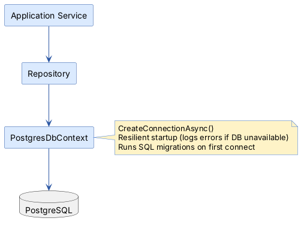
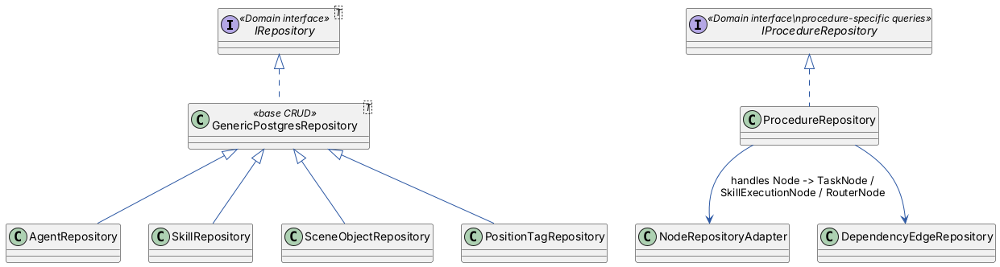
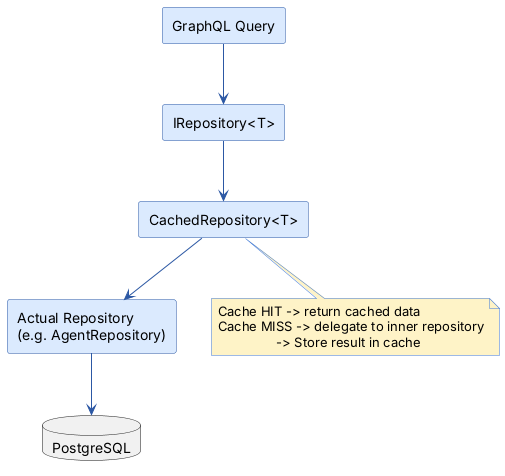

# Infrastructure Layer

> PostgreSQL persistence, repository implementations, caching, and JSON serialization for polymorphic domain entities.

## Overview

The Infrastructure layer is the bridge between the application's in-memory domain model and the PostgreSQL database. It
implements the repository interfaces defined in the Domain layer using **Dapper** (a micro-ORM) and **Npgsql** (the .NET
PostgreSQL driver). It also provides an in-memory cache layer and a custom JSON serializer for the polymorphic type
hierarchies (Node, Task, SelectorExpression).

In simple terms: the Application layer says "save this node" or "get all edges for this procedure," and the
Infrastructure layer handles the SQL, JSON serialization, and caching behind the scenes.

## Key Concepts

- **Repository Pattern** — Each entity type has a repository that handles CRUD operations. A generic base class provides
  common logic; specialized adapters handle polymorphic types.
- **Dapper** — A lightweight ORM that maps SQL results directly to C# objects. Used instead of EF Core because the
  domain model's deep polymorphic hierarchies are difficult to map with Entity Framework.
- **JSONB Storage** — Complex nested data (node tasks, skill properties, branches) is stored as JSONB in PostgreSQL,
  with a `$type` discriminator for polymorphic deserialization.
- **In-Memory Cache** — Frequently accessed entities are cached to avoid repeated database queries. Cache is invalidated
  on writes.

## How It Works

### Database Access

`PostgresDbContext` is the central database access point:



Connection string is configured in `appsettings.json`:

```json
{
  "ConnectionStrings": {
    "PostgreSQL": "Host=localhost;Port=5432;Database=FreydisDB;Username=postgres;Password=postgres"
  }
}
```

### Repository Pattern



The `GenericPostgresRepository<T>` provides:

- `GetAllAsync()` — SELECT all entities
- `GetByIdAsync(Guid id)` — SELECT by primary key
- `AddAsync(T entity)` — INSERT with ON CONFLICT for upserts
- `UpdateAsync(T entity)` — UPDATE by ID
- `DeleteAsync(Guid id)` — DELETE by ID

Specialized repositories extend this with domain-specific queries like `GetByProcedureIdAsync()` and
`DeleteByProcedureIdAsync()`.

### Polymorphic JSON Serialization

The `TypeHierarchyJsonConverter` handles storing polymorphic types in JSONB:

```json
{
  "$type": "SkillExecutionNode",
  "id": "abc-123",
  "skillExecutionTask": {
    "$type": "SkillExecutionTask",
    "name": "Pick Up Part",
    "skill": { ... },
    "agentId": "def-456"
  }
}
```

The `$type` discriminator field is added during serialization and used during deserialization to reconstruct the correct
C# subtype. This covers four type hierarchies:

- **Node** → TaskNode, SkillExecutionNode, RouterNode
- **Task** → Task, SkillExecutionTask, RouterTask
- **SelectorExpression** → SimpleVariableSelector, ExpressionSelector
- **ValueType** → various typed value subtypes

### Caching

The cache layer uses the **Decorator pattern**: `CachedRepository<T>` wraps every `IRepository<T>` registration, adding
transparent in-memory caching via `IMemoryCache`.



**How it works:**

1. `AddPostgresPersistence()` registers raw repositories as `IRepository<T>`
2. `AddRepositoryCaching()` scans all `IRepository<T>` registrations and wraps each with `CachedRepository<T>`
3. When any service injects `IRepository<T>`, it gets the cached version automatically
4. `CachedRepository<T>` updates its cache incrementally on Create/Update/Delete — no full invalidation needed

**Cache configuration:**

- 15-minute sliding expiration per entry
- High priority (resists eviction)
- Size-limited memory cache (default 10,000 entries)

#### Cache Bypass Pitfall — IProcedureRepository

`ProcedureRepository` is registered under **two** interfaces:

```csharp
// In PostgresServiceExtensions.cs:
services.AddSingleton<ProcedureRepository>();
services.AddSingleton<IProcedureRepository>(sp => sp.GetRequiredService<ProcedureRepository>());  // RAW
services.AddSingleton<IRepository<Procedure>>(sp => sp.GetRequiredService<ProcedureRepository>()); // Gets cached
```

`AddRepositoryCaching()` only wraps `IRepository<T>` registrations. `IProcedureRepository` resolves to the **raw,
uncached** `ProcedureRepository`.

**Rule: If your service only needs base CRUD
methods (`GetByIdAsync`, `GetAllAsync`, `CreateAsync`, `UpdateAsync`, `DeleteAsync`), inject `IRepository<Procedure>` —
NOT `IProcedureRepository`.** Only inject `IProcedureRepository` when you need node/edge-specific methods like
`GetNodesByProcedureIdAsync()` or `CreateNodeAsync()`.

Services that legitimately need `IProcedureRepository` (for node/edge operations) use the **tracker pattern** to keep
subscriptions consistent: they write via the raw repository, then push fresh data to change trackers, which notify
GraphQL subscribers.

| Injection                | Resolves To                   | Use When                      |
|--------------------------|-------------------------------|-------------------------------|
| `IRepository<Procedure>` | `CachedRepository<Procedure>` | Base CRUD on procedures       |
| `IProcedureRepository`   | Raw `ProcedureRepository`     | Node/edge-specific operations |

## Components

| Component                         | Purpose                                                                     |
|-----------------------------------|-----------------------------------------------------------------------------|
| `PostgresDbContext`               | Connection management, migration runner, health check                       |
| `GenericPostgresRepository<T>`    | Base CRUD with Dapper and JSONB storage                                     |
| `ProcedureRepository`             | Procedure aggregate root — procedures, nodes, and edges                     |
| `NodeRepositoryAdapter`           | Adapts `IProcedureRepository` node methods to `IRepository<Node>`           |
| `DependencyEdgeRepositoryAdapter` | Adapts `IProcedureRepository` edge methods to `IRepository<DependencyEdge>` |
| `TypeHierarchyJsonConverter`      | `$type` discriminator serializer for polymorphic types                      |
| `TypedValueJsonConverter`         | Deserializes `TypedValue.Value` to correct CLR type from JSONB              |
| `CachedRepository<T>`             | Decorator that adds in-memory caching to any `IRepository<T>`               |
| `CacheKeyGenerator`               | Generates consistent cache keys (`freydis:repository:{type}:{op}`)          |
| `MemoryCacheInvalidationService`  | Tracks and invalidates cache keys by prefix                                 |

## Database Schema

The schema is defined in `Persistence/PostgreSQL/Migrations/001_initial_schema.sql`:

| Table               | Purpose                                                     |
|---------------------|-------------------------------------------------------------|
| `agents`            | Robot/simulation definitions                                |
| `skills`            | Skill capabilities with properties                          |
| `scene_objects`     | Physical workspace objects                                  |
| `position_tags`     | Named positions in the workspace                            |
| `procedures`        | Workflow containers                                         |
| `nodes`             | All node types (stored as JSONB with `$type` discriminator) |
| `dependency_edges`  | Dependencies between nodes                                  |
| `variable_contexts` | Runtime variable storage                                    |

## Related Documentation

- [Documentation Hub](../../docs/README.md) — Back to the index
- [Glossary](../../docs/glossary.md) — Term definitions
- [Domain Layer](../../Domain/docs/README.md) — Entities and interfaces this layer implements
- [Application Layer](../../Application/docs/README.md) — Services that use repositories
- [Architecture Overview](../../docs/architecture.md) — How Infrastructure fits in the system
