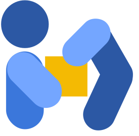
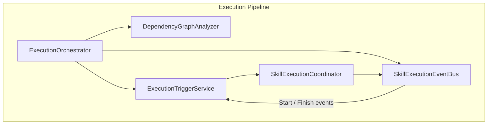

<div align="center">



# Freydis

### Modular robotics orchestration backend with real-time event-driven execution

[](https://dotnet.microsoft.com/)
[](https://learn.microsoft.com/en-us/dotnet/csharp/)
[](https://chillicream.com/docs/hotchocolate/)
[](https://www.postgresql.org/)
[](https://github.com/dotnet/reactive)

</div>

---

## Overview

Freydis is the .NET 10 backend for the VRoboCoop workspace. It exposes a HotChocolate GraphQL API for managing robotic procedures, schedules tasks with Google OR-Tools, executes them through an event-driven Rx.NET pipeline, and coordinates physical or simulated agents. Real-time subscriptions stream node, edge, and execution state to the Magnus frontend and the companion app.

## Prerequisites

- **.NET 10 SDK** — download from [dotnet.microsoft.com](https://dotnet.microsoft.com/download/dotnet/10.0).
- **PostgreSQL 16** — listening on `localhost:5432` with database `FreydisDB`. Docker or native install both work.
- **Rider** (optional) — launch configurations under [`RIDER_LAUNCH_CONFIGURATIONS.md`](RIDER_LAUNCH_CONFIGURATIONS.md) cover every environment.

<details>
<summary><b>.NET 10 SDK install (Linux Ubuntu 22.04+)</b></summary>

```bash
wget https://packages.microsoft.com/config/ubuntu/22.04/packages-microsoft-prod.deb -O packages-microsoft-prod.deb
sudo dpkg -i packages-microsoft-prod.deb
rm packages-microsoft-prod.deb
sudo apt-get update
sudo apt-get install -y dotnet-sdk-10.0
dotnet --version
```

</details>

<details>
<summary><b>PostgreSQL 16 via Docker</b></summary>

```bash
docker run -d \
  --name postgres \
  -p 5432:5432 \
  -e POSTGRES_DB=FreydisDB \
  -e POSTGRES_USER=postgres \
  -e POSTGRES_PASSWORD=postgres \
  -v postgres_data:/var/lib/postgresql/data \
  postgres:16-alpine
```

</details>

## Quick Start

```bash
cd Backend
dotnet restore
dotnet build
dotnet run --project GraphQLServer/GraphQLServer.csproj
```

Access:

- GraphQL API: `http://localhost:5095/graphql`
- GraphQL Playground: `http://localhost:5095/graphql/`

Run tests:

```bash
dotnet test
dotnet test --filter "FullyQualifiedName~ExecutionOrchestratorTests"
```

## Key Features

- **Event-driven execution** — skills fire on actual runtime Start/Finish events rather than precomputed times; supports FS, SS, FF, SF dependencies and adaptive cancellation.
- **GraphQL with real-time subscriptions** — HotChocolate 15 with Rx-backed BehaviorSubjects for immediate current-value emission to new subscribers.
- **LP-optimized scheduling** — Google OR-Tools constraint solver, SCC decomposition, constrained groups for SS/FF coupling, cycle detection, and adaptive duration estimation during execution.
- **Multi-agent coordination** — unified `IRuntimeAgent` abstraction with Dummy, KUKA iiwa, and Digital Twin agents, each enabled per-type via the active `appsettings.{Environment}.json`.
- **Clean architecture** — strict separation of Domain, Application, Agents, Scheduling, Infrastructure, and GraphQL layers with ~1,600 tests.
- **Formally verified** — scheduling and execution invariants proved in Lean 4 ([Sunstone](../Sunstone/README.md)).

## Architecture

The core pattern is a **singleton service with a per-run session** — subscription continuity requires singleton GraphQL services, while consecutive executions require isolated per-run state. Each run's reactive state lives on a fresh `ExecutionSession` (`IAsyncDisposable`), the single teardown sink; the run is detached, so the start request returns once execution begins and completion is single-phase.



Deep-dive docs for each layer live under the [Documentation Hub](docs/README.md).

## Configuration

Freydis loads one `appsettings.{Environment}.json` per `ASPNETCORE_ENVIRONMENT`. Logging levels are configured in these files — never in code.

| Environment | Purpose |
|---|---|
| `Development` | Balanced logging, Dummy agents (default) |
| `Hybrid` | Mixed Dummy and real agents |
| `Kuka` | KUKA iiwa agents via OPC UA |
| `Scheduling-Debug` | Maximum detail on scheduling and timing |
| `Operations-Debug` | Maximum detail on GraphQL operations |
| `Production` | Minimal logging for deployment |

Select an environment at launch:

```bash
ASPNETCORE_ENVIRONMENT=Scheduling-Debug dotnet run --project GraphQLServer/GraphQLServer.csproj
```

See [`GraphQLServer/README-Configuration.md`](GraphQLServer/README-Configuration.md) for the full agent configuration reference.

## Commands

| Command | Purpose |
|---|---|
| `dotnet build` | Build the solution |
| `dotnet run --project GraphQLServer/GraphQLServer.csproj` | Start the GraphQL server |
| `dotnet test` | Run every test project |
| `dotnet test --logger "console;verbosity=detailed"` | Verbose test output |
| `dotnet format Freydis.sln --verify-no-changes --verbosity diagnostic` | Verify formatting before committing |

## Project Structure

```
Backend/
├── Domain/              # Entities, value objects, variable system
├── Application/         # Execution pipeline, orchestrators, reactive infrastructure
├── Agents/              # IRuntimeAgent, factories, Dummy / KUKA / Digital Twin
├── Scheduling/          # OR-Tools scheduling, dependency graphs, SCC decomposition
├── Infrastructure/      # PostgreSQL persistence (Dapper), repositories, caching
├── GraphQLServer/       # HotChocolate operations, types, subscriptions, DI
├── docs/                # Documentation Hub (start here for deep dives)
└── *.Tests/             # Test projects (xUnit + Moq)
```

## Related Documentation

- [Root README](../README.md) — workspace overview
- [Documentation Hub](docs/README.md) — layer-by-layer deep dives, glossary, execution pipeline
- [Agent Configuration Reference](GraphQLServer/README-Configuration.md)
- [GraphQL Operations](GraphQLServer/docs/graphql-operations.md)
- [Sunstone](../Sunstone/README.md) — Lean 4 proofs of scheduling and execution correctness
- [Magnus frontend](../Frontend/README.md) — the primary GraphQL client

---

<div align="center">

**Made with ❤️ by the VRoboCoop Team**

[⬆ Back to Top](#freydis)

</div>
