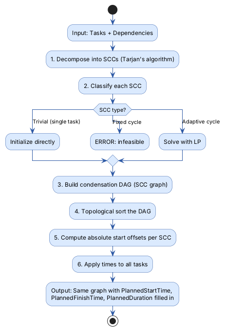

# Scheduling Library

> Pure algorithm library for computing task schedules using linear programming and dependency graph analysis.

## Overview

The Scheduling library answers the question: **"Given a set of tasks with dependencies, when should each task start and
end?"** It takes a list of tasks (some with fixed durations, some with variable/adaptive durations) and their dependency
relationships, then uses Google OR-Tools' linear programming solver to compute optimal start times that minimize total
execution time.

This is a pure algorithm library with no framework dependencies — no ASP.NET, no database, no Rx.NET. It can be used
independently of the rest of the Freydis system. The Application layer wraps it with execution-context-aware services.

## Key Concepts

- **Execution Graph** — A collection of tasks (called "skill executions") and directed dependencies between them. This
  is both the input and output of scheduling.
- **Fixed-Duration Task** — A task with a known, constant duration (e.g., "pick up part takes 3 seconds").
- **Adaptive Task** — A task with a variable duration between min and max bounds (e.g., "hold position for 2-10
  seconds"). The solver picks an optimal duration within the bounds.
- **Dependency Types** — Four types: Finish-to-Start (FS), Start-to-Start (SS), Start-to-Finish (SF), Finish-to-Finish (
  FF). See the [Glossary](../../docs/glossary.md) for definitions.
- **Strongly Connected Components (SCC)** — Groups of tasks that form cycles in the dependency graph. Fixed cycles are
  infeasible; adaptive cycles can be solved via LP.
- **Makespan** — The total time from the first task's start to the last task's finish. The solver minimizes this.

## How It Works

### The Scheduling Pipeline



### Linear Programming Model

The LP solver (Google OR-Tools GLOP) creates:

- **Variables** for each task's start time, finish time, and (for adaptive tasks) duration
- **Constraints** from dependencies: e.g., `TaskB.Start >= TaskA.Finish` for a Finish-to-Start dependency
- **Runtime state constraints**: finished tasks get fixed times, running tasks get fixed start times
- **Objective**: Minimize the latest finish time (makespan)

The solver finds the optimal schedule that satisfies all constraints with minimum total time.

## API Reference

### Core Types

#### `IExecutionGraph`

```csharp
public interface IExecutionGraph
{
    IReadOnlyList<IPlannedSkillExecution> SkillExecutions { get; }
    IReadOnlyList<Dependency> Dependencies { get; }
}
```

The central data structure. Contains tasks and their dependencies.

#### `IPlannedSkillExecution`

```csharp
public interface IPlannedSkillExecution
{
    Guid Id { get; }
    double PlannedStartTime { get; set; }
    double PlannedFinishTime { get; set; }
    double PlannedDuration { get; set; }
}
```

A task with computed timing. `FixedDurationPlannedSkill` and `AdaptivePlannedSkill` are the concrete implementations.

#### `ISkillExecution`

Extends `IPlannedSkillExecution` with runtime state: `ActualStartTime`, `ActualFinishTime`, `IsRunning`, `IsFinished`.
Used during execution for rescheduling with real timing data.

#### `IAdaptivePlannedSkillExecution`

Adds a `MinDuration` lower bound for variable-duration tasks; the duration is unbounded above.

#### `Dependency`

```csharp
public record Dependency
{
    IPlannedSkillExecution Source { get; init; }
    IPlannedSkillExecution Target { get; init; }
    DependencyType Type { get; init; }  // FinishToStart, StartToStart, StartToFinish, FinishToFinish
}
```

### Extension Methods

All methods are on `ExecutionGraphExtensions`:

#### `PlanSchedule` (main entry point)

```csharp
graph.PlanSchedule(currentTime: 0, applyGlobalShift: true);
```

High-level orchestrator that decomposes, classifies SCCs, solves, and applies times. This is what the Application layer
calls.

#### `SolveWithLinearProgramming`

```csharp
graph.SolveWithLinearProgramming(currentTime: 0);
```

Builds and solves the LP model directly. Used internally by `PlanSchedule` for adaptive cycles.

#### `GetStronglyConnectedComponents`

```csharp
var sccs = graph.GetStronglyConnectedComponents();
```

Tarjan's algorithm, O(V+E). Returns all SCCs for cycle detection.

### Exceptions

| Exception                     | When                                                                       |
|-------------------------------|----------------------------------------------------------------------------|
| `ScheduleModelException`      | Invalid graph: duplicate IDs, missing tasks in dependencies, bad durations |
| `ScheduleInfeasibleException` | No feasible schedule (e.g., contradictory constraints, fixed cycle)        |

### Example

```csharp
var skillA = new FixedDurationPlannedSkill { Id = Guid.NewGuid(), PlannedDuration = 5 };
var skillB = new AdaptivePlannedSkill { Id = Guid.NewGuid(), MinDuration = 3, PlannedDuration = 5 };

var graph = new ExecutionGraph
{
    SkillExecutions = [skillA, skillB],
    Dependencies = [new Dependency { Source = skillA, Target = skillB, Type = DependencyType.FinishToStart }]
};

graph.PlanSchedule(currentTime: 0, applyGlobalShift: true);

// skillA: start=0, finish=5
// skillB: start=5, finish=8 (solver picked optimal adaptive duration of 3)
```

## Components

| Component                    | Purpose                                                                                           |
|------------------------------|---------------------------------------------------------------------------------------------------|
| `ExecutionGraph`             | Default implementation of `IExecutionGraph`                                                       |
| `FixedDurationPlannedSkill`  | Task with immutable duration                                                                      |
| `AdaptivePlannedSkill`       | Task with min/max duration bounds                                                                 |
| `Dependency`                 | Directed edge between tasks with type                                                             |
| `StronglyConnectedComponent` | SCC subgraph for cycle analysis                                                                   |
| `ExecutionGraphExtensions`   | Extension methods: `PlanSchedule`, `SolveWithLinearProgramming`, `GetStronglyConnectedComponents` |
| `SchedulingConstraintLogger` | Diagnostic logging for LP constraint generation                                                   |

## Formal Verification

The LP scheduling formulation is formally verified in [Sunstone](../../../Sunstone/README.md)
(`LPSchedulingValidity.lean`, `AdaptiveDurationExtension.lean`). Machine-checked proofs cover FS cycle infeasibility,
SCC DAG structure, solution composability via time-shifting, and adaptive duration change safety.

## Related Documentation

- [Documentation Hub](../../docs/README.md) — Back to the index
- [Glossary](../../docs/glossary.md) — Dependency types and scheduling terms
- [Application Layer](../../Application/docs/README.md) — Services that wrap this library with execution context
- [Execution Pipeline](../../docs/execution-pipeline.md) — How scheduling fits into the execution flow
- [Architecture Overview](../../docs/architecture.md) — How Scheduling fits in the system
- [Scheduling Tests](../../Scheduling.Tests/docs/README.md) — Test coverage and benchmarks
- [Sunstone Proofs](../../../Sunstone/README.md) — Formal verification of scheduling and execution correctness
