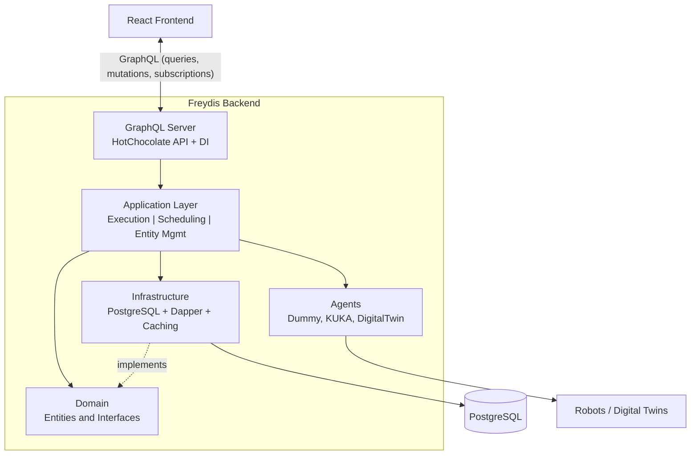

# Freydis Backend Documentation

> Central hub for all backend documentation — start here.

---

## What is Freydis?

Freydis is the backend for **VRoboCoop**, a system that lets you design robotic workflows visually and execute them on
real robots and digital twins in real time. You define *procedures* (sequences of tasks with dependencies), assign them
to *agents* (robots or simulations), and the system schedules, executes, and monitors everything — with live updates
streamed to the frontend via GraphQL subscriptions.

**In one sentence:** Freydis turns visual workflow diagrams into coordinated robot actions.

---

## Documentation Map

### Getting Started

| Document                                 | Description                                        |
|------------------------------------------|----------------------------------------------------|
| [Main README](../README.md)              | Quick start, build instructions, technology stack  |
| [Glossary](glossary.md)                  | Every domain term defined in plain English         |
| [Architecture Overview](architecture.md) | System layers, data flow, and key design decisions |

### Core Concepts

| Document                                                             | Description                                          |
|----------------------------------------------------------------------|------------------------------------------------------|
| [Execution Pipeline](execution-pipeline.md)                          | What happens when you click "Execute" — step by step |
| [Domain Layer](../Domain/docs/README.md)                             | Entities, node types, variables, and branching       |
| [Domain Design Specification](../Domain/docs/design-specification.md) | Deep technical spec with PlantUML diagrams           |

### Layer Deep-Dives

| Document                                                 | Description                                      |
|----------------------------------------------------------|--------------------------------------------------|
| [Application Layer](../Application/docs/README.md)       | Business logic, services, reactive patterns      |
| [Application Services](../Application/docs/services/README.md) | Per-group deep-dives for every `Services/` folder (what each does, how it connects, its pipeline role) |
| [Infrastructure Layer](../Infrastructure/docs/README.md) | PostgreSQL, repositories, caching                |
| [Agents Module](../Agents/docs/README.md)                | Robot agents, factories, communication protocols |
| [Scheduling Module](../Scheduling/docs/README.md)        | OR-Tools scheduling, dependency graphs, timing   |
| [Scheduling Tests](../Scheduling.Tests/docs/README.md)   | xUnit + BenchmarkDotNet coverage for the scheduling module |
| [Application Benchmarks](../Application.Benchmarks/docs/README.md) | End-to-end pipeline and reactive execution benchmarks (BenchmarkDotNet) |
| [GraphQL Server](../GraphQLServer/docs/README.md)        | API layer, queries, mutations, subscriptions     |

### Formal Verification

| Document                                             | Description                                                    |
|------------------------------------------------------|----------------------------------------------------------------|
| [Agent Serialization](agent-serialization/README.md) | FS-first reachability prevents same-agent concurrent dispatch; Lean proofs, C# validator, procedure-scope trust boundary, client UX |
| [Sunstone Proofs](../../Sunstone/README.md)          | Lean 4 formal verification of scheduling and execution         |
| [Formal Verification Guide](../../Sunstone/docs/formal-verification-guide.md) | Reader's guide to the Lean proof modules |
| [Lean ↔ C# Cross Reference](../../Sunstone/docs/cross-reference.md) | Which proof verifies which code, plus known differences |
| [Assumption Audit](../../Sunstone/docs/assumption-audit.md) | Every Lean proof assumption checked against what C# enforces |
| [Missing Failed Case](../../Sunstone/docs/missing-failed-case.md) | Known gap: failure paths not modeled in formal proofs  |
| [Concurrency Model Gap](../../Sunstone/docs/concurrency-model-gap.md) | Known gap: sequential model vs concurrent C# runtime |

### Operations & Security

| Document                                | Description                                             |
|-----------------------------------------|---------------------------------------------------------|
| [Security & Configuration](security.md) | Credentials, CORS, host restrictions, environment setup |

### Detailed References

| Document                                                                      | Description                                                           |
|-------------------------------------------------------------------------------|-----------------------------------------------------------------------|
| [Execution Orchestrator](../Application/docs/execution-orchestrator.md)       | Singleton lifecycle coordinator, Rx pipeline, single-phase completion |
| [Execution Trigger Service](../Application/docs/execution-trigger-service.md) | Reactive prerequisite monitoring, skill/router triggering             |
| [CRUD Scheduling Orchestrator](../Application/docs/crud-scheduling.md)        | Design-time CRUD with parallel scheduling and two-phase notifications |
| [Agent Lifecycle](../Application/docs/agent-lifecycle.md)                     | Agent states, startup flow, reconnection                              |
| [Dummy Agent](../Agents/Agents/Dummy/README.md)                               | In-process simulated agent: pacing/output config, simulated outputs   |
| [KUKA iiwa 14 Agent](../Agents/Agents/Kuka/README.md)                         | OPC UA hardware agent: connection, joint reads, security config       |
| [Digital Twin Protocol](../Agents/Agents/DigitalTwin/README.md)               | WebSocket protocol for Unity digital twins                            |
| [GraphQL Operations](../GraphQLServer/docs/graphql-operations.md)             | Complete query, mutation, and subscription reference                  |
| [Agent Configuration](../GraphQLServer/README-Configuration.md)               | Scene and agent config files                                          |
| [DI Design Guide](../GraphQLServer/Extensions/README.md)                      | Dependency injection patterns and service lifetimes                   |
| [Variable System Design](../Domain/docs/design-specification.md)               | Branching, selectors, and variable-driven routing                     |

---

## Architecture at a Glance

For a detailed architecture breakdown, see [Architecture Overview](architecture.md).

---

## How to Read These Docs

Every layer document follows the same structure:

1. **Overview** — Plain English explanation of what this layer does and why it exists
2. **Key Concepts** — Core ideas explained simply, like a glossary for that layer
3. **How It Works** — Technical details with diagrams and code snippets
4. **Components** — Table of classes/services with one-line descriptions
5. **Configuration** — How to configure (if applicable)
6. **Related Documentation** — Cross-links to other docs

Start with the [Glossary](glossary.md) if you're new, or jump to a specific layer if you know what you're looking for.
