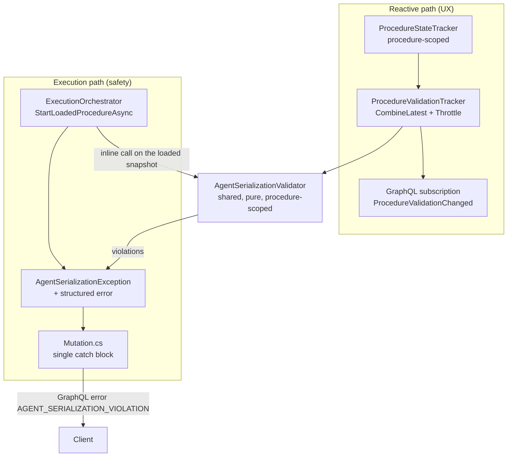

# Agent Serialization

> Same-agent skill pairs are separated by a finish-to-start dependency chain, preventing concurrent dispatch to a single physical agent.

## Overview

A procedure graph may assign several skills to the same physical agent — a robot arm, a digital twin, an emulator. If two such skills become ready at the same instant, the trigger path dispatches both concurrently, which the agent cannot honour. Agent serialization is the end-to-end guarantee that this never happens: every pair of same-agent skills is either temporally ordered by the dependency graph or is in mutually exclusive router branches.

The guarantee is delivered by three cooperating parts:

1. A **graph-level rule** — for every same-agent pair, a finish-to-start (FS) chain must exist in one direction, or the pair must be router-exclusive.
2. A **Lean 4 proof** that the rule is sound against the LP scheduler.
3. A **C# validator** that is called both reactively (soft warnings) and inline from the execution orchestrator (hard gate).

## Key Concepts

- **Same-agent pair** — two `SkillExecutionNode`s whose `SkillExecutionTask.AgentId` matches.
- **FS chain** — a path of Finish-to-Start edges, so that each successor's start is bounded below by its predecessor's finish.
- **FS-first path (`FsThenAny`)** — a path whose first edge is FS and whose remaining edges are FS or SS. Sufficient to force non-overlap; see [Proofs](proofs.md).
- **Router exclusivity** — two nodes under distinct branch targets of a common ancestor router. Such pairs never co-execute and are skipped.
- **Procedure-scope invariant** — the validator, the LP scheduler, and the hard gate all consume the same snapshot, and that snapshot belongs to exactly one loaded procedure.

For term definitions, see the [Glossary](../glossary.md).

## How It Works

### Pipeline at a glance

### Two-tier validation

Validating the graph while the user is still building it would block legitimate sequences (adding a second same-agent skill before the FS edge exists). The tiers split responsibility:

| Tier | Who | When | Role |
|------|-----|------|------|
| Soft warnings | `ProcedureValidationTracker` | Reactive, throttled (1 s) | UX only — surfaces violations as nodes and edges change |
| Hard gate | `ExecutionOrchestrator` | Inline at `StartLoadedProcedureAsync` | Safety-critical — rejects execution if violations exist |

The hard gate uses the exact snapshot fed to the LP scheduler, so Theorem 6 in [Proofs](proofs.md) applies end-to-end.

### Two levels of strictness

| Level | Path shape | Rationale |
|-------|-----------|-----------|
| L1 — pure FS | BFS on FS-only edges | Simple, easy to prove, covers the majority of procedures |
| L2 — FS-then-any | First edge FS, tail over FS ∪ SS | Admits safe combinations such as `A →FS→ B →SS→ C` where the FS step carries the bound forward |

Both levels are sound: an accepted graph cannot produce an LP solution in which two same-agent skills overlap. Neither is complete — see the conservatism note in [Proofs](proofs.md).

### The suggested fix is always an FS edge

When a same-agent pair is flagged, the client suggests three remedies: add an FS connection, reassign the agent, or move one skill into a different router branch. The FS edge suggestion is safe in every case — it tightens the LP without admitting new solutions.

## Components

| Concern | Primary type | Lives in |
|---------|-------------|----------|
| Pure validation logic | `AgentSerializationValidator` | `Backend/Application/Services/Execution/Validation/` |
| Reactive aggregation | `ProcedureValidationTracker` | same folder |
| Procedure-scoped input | `ProcedureStateTracker` | `Backend/Application/Services/Common/Reactive/` |
| Structured GraphQL error | `AgentSerializationException` | `Backend/Application/Services/Execution/Validation/` |
| Base class for typed execution errors | `ExecutionPreConditionException` | same folder |
| Client-side rendering | `useExecutionErrorHandlers.ts`, `ExecutionErrorMapper.kt` | `Frontend/src/hooks/`, `App/shared/src/commonMain/kotlin/com/example/vrobocoop/flow/graphql/` |

See [Validator](validator.md) for algorithm, DI wiring, and trust-boundary enforcement; [Client UX](client-ux.md) for React and Kotlin rendering; [Verification](verification.md) for the reproducer commands.

## Related Documentation

- [Proofs](proofs.md) — formal soundness statement and Lean mechanisation
- [Validator](validator.md) — C# implementation and procedure-scope trust boundary
- [Client UX](client-ux.md) — React and Kotlin rendering of violations
- [Verification](verification.md) — proof build, test commands, formatting
- [Documentation Hub](../README.md) — backend doc index
- [Architecture Overview](../architecture.md) — system layers and reactive pipeline
- [Execution Pipeline](../execution-pipeline.md) — where the hard gate sits in the start flow
- [Application Layer](../../Application/docs/README.md) — reactive infrastructure
- [Execution Orchestrator](../../Application/docs/execution-orchestrator.md) — hard-gate call site
- [Sunstone Proofs](../../../Sunstone/README.md) — Lean 4 formal verification index
