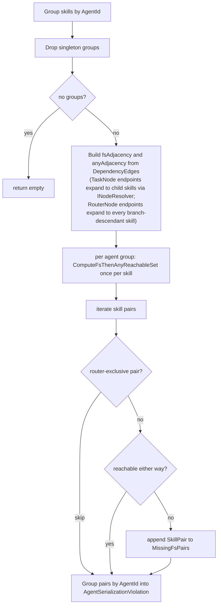

# Agent Serialization — Validator

> The C# validator that mechanises Theorem 6 at runtime, its reactive wrapper, and the procedure-scope invariant that keeps the hypotheses honest.

## Overview

`AgentSerializationValidator` is a pure function from `(nodes, edges)` to a list of violations. It is invoked from two places:

- `ProcedureValidationTracker` — a reactive wrapper that pushes soft warnings to the UI.
- `ExecutionOrchestrator.StartLoadedProcedureAsync` — an inline hard gate that throws `AgentSerializationException` if any violation would slip into execution.

Both call sites share the same validator instance. The hard-gate call is the one with the Lean proof behind it, because only the orchestrator guarantees the same-graph invariant Theorem 6 requires.

## Key Concepts

- **FS-only adjacency** — the directed graph of user-drawn FS edges, with `TaskNode` endpoints resolved to their executable children.
- **Any adjacency** — FS ∪ SS edges, used to extend the tail of an FS-first path.
- **Reachable set** — for each same-agent skill, the set of nodes reachable by an FS-first path. A pair $(a, b)$ is serialised iff $b \in \mathrm{Reach}(a)$ or $a \in \mathrm{Reach}(b)$.
- **Procedure-scope invariant** — the validator only ever sees nodes and edges belonging to the single loaded procedure. Upstream leaks are filtered and logged.

## How It Works

### Algorithm

1. Group `SkillExecutionNode`s by `SkillExecutionTask.AgentId`; discard singletons.
2. Build two adjacency maps over raw `DependencyEdge`s, resolving `TaskNode` endpoints to their executable children via `INodeResolver` and then expanding `RouterNode` endpoints to every `SkillExecutionNode` descendant of the router's branch subtrees:
   - `fsAdjacency` — FS edges only (seed for the mandatory first step).
   - `anyAdjacency` — FS ∪ SS edges (tail expansion).
3. For each agent group, compute `ComputeFsThenAnyReachableSet` once per skill:
   - Seed the BFS queue from `fsAdjacency[source]` (the first edge must be FS).
   - Expand through `anyAdjacency` until the queue drains.
4. For each pair in the group, skip router-exclusive pairs (via `CollectRouterAncestry`), otherwise flag the pair if neither reachable set contains the other endpoint.
5. Group surviving pairs by agent and emit one `AgentSerializationViolation` per affected agent.

Complexity: $O(A \cdot K \cdot (V + E))$ where $A$ is the number of agents, $K$ the maximum number of same-agent skills, $V$ and $E$ the node and edge counts.

### FS through routers

When an edge endpoint is a `RouterNode`, the validator expands it to the union of `{router.Id}` and every `SkillExecutionNode` descendant reachable through `ParentToChildrenMapping` (precomputed once per `Validate` call as `routerBranchSkills`). An edge `A →FS→ R` therefore contributes `A →FS→ B` for every skill `B` inside any branch of `R`, and symmetrically `R →FS→ C` contributes `B →FS→ C`. The expansion is sound because every branch skill satisfies $R.\text{start} \le B.\text{start} \le B.\text{finish} \le R.\text{finish}$ — a property enforced at the event level by `DependencyGraphAnalyzer`'s injected `Router.Start` SS prerequisite on every branch skill. The walk descends defensively through nested routers, keeping the validator correct even if a future structural change ever allowed router-in-router layouts.

Inter-branch pairs are still skipped by `AreInMutuallyExclusiveBranches` — skills in different branch targets of the same router share a router ancestor but enter through different branches, so the expansion never fabricates cross-branch serialization obligations. The router's own ID is preserved in the expanded set, so user-drawn edges that reference the router directly continue to participate in adjacency and BFS. The validator still operates on raw `DependencyEdge`s and does not observe the event-level `Router.Start` SS prerequisites that the analyzer injects.

### Pipeline



## Components

| Type | File | Role |
|------|------|------|
| `IAgentSerializationValidator` | `Services/Execution/Validation/IAgentSerializationValidator.cs` | Interface — single `Validate(nodes, edges)` method |
| `AgentSerializationValidator` | `AgentSerializationValidator.cs` | Implementation; FS-first BFS, router-exclusivity, violation grouping |
| `AgentSerializationViolation` | `AgentSerializationViolation.cs` | Per-agent violation record with `UnserializedSkills` and `MissingFsPairs` |
| `AgentSerializationException` | `AgentSerializationException.cs` | Thrown by the hard gate; carries structured violations |
| `ExecutionPreConditionException` | `ExecutionPreConditionException.cs` | Base class — defines `ErrorCode` and `StructuredData` for one catch block in `Mutation.cs` |
| `IProcedureValidationTracker` | `IProcedureValidationTracker.cs` | Reactive tracker interface |
| `ProcedureValidationTracker` | `ProcedureValidationTracker.cs` | `CombineLatest(nodes, edges) → validator → result` with `Throttle` + `DistinctUntilChanged` |
| `ProcedureValidationResult` | `ProcedureValidationResult.cs` | Composite result — one field per validator |
| `ValidationResultComparer` | `ValidationResultComparer.cs` | Structural equality to suppress no-op emissions |
| `AgentNameResolver` | `AgentNameResolver.cs` | Resolves `AgentId` to display name for violation messages |
| `INodeResolver` | `Services/Common/INodeResolver.cs` | Shared with `DependencyGraphAnalyzer`; expands `TaskNode` IDs to executable children |
| `INodeHierarchyProcessor` | `Services/Scheduling/Processing/Hierarchy/` | Builds the `ParentToChildrenMapping` used to expand `RouterNode` endpoints to branch-descendant skills |

## Reactive tracker

`ProcedureValidationTracker` subscribes once to `CombineLatest(INodeChangeTracker.Nodes, IDependencyEdgeChangeTracker.Edges)`, runs every validator, and emits a composite `ProcedureValidationResult`. `Throttle(1s)` coalesces drag-edit bursts; `DistinctUntilChanged(ValidationResultComparer.Instance)` suppresses emissions when position-only edits leave violations unchanged.

New validators plug in by adding a field to `ProcedureValidationResult` and a call in `ProcedureValidationTracker.RunAllValidators` — the subscription, throttle, and GraphQL channel are reused unchanged. The injected set is explicit rather than an `IEnumerable<IProcedureValidator>` because each validator's violation type is different and the type safety must flow through GraphQL to both clients.

## Hard gate — same-graph invariant

Theorem 6 quantifies over a single feasible LP solution derived from a single graph snapshot. The tracker's `CurrentResult` can be up to one second stale (the throttle window), so the orchestrator cannot rely on it. Instead, `ExecutionOrchestrator.ValidateExecutionPreconditionsAsync` (called from `StartLoadedProcedureAsync`) runs the validator inline on the immutable `runState.Nodes` / `runState.Edges` snapshot it also hands to `AnalyzeDependencies` and the LP scheduler:

```csharp
ValidateEventLevelAcyclicity(dependencyGraph);

var serializationViolations = _agentSerializationValidator.Validate(runState.Nodes, runState.Edges);
if (serializationViolations.Count > 0)
{
    foreach (var v in serializationViolations)
        _logger.LogAgentSerializationViolation(v.AgentName, v.UnserializedSkills.Count, v.MissingFsPairs.Count);
    throw new AgentSerializationException(serializationViolations);
}
```

`Mutation.cs` has a single catch block for `ExecutionPreConditionException` and maps it to a GraphQL error with the subclass's `ErrorCode` and `StructuredData`:

```csharp
catch (ExecutionPreConditionException ex)
{
    logger.LogMutationRejected("StartLoadedProcedureAsync", ex.Message);
    var builder = ErrorBuilder.New().SetMessage(ex.Message).SetCode(ex.ErrorCode);
    if (ex.StructuredData is not null)
        builder.SetExtension("data", ex.StructuredData);
    throw new GraphQLException(builder.Build());
}
```

New typed execution errors inherit `ExecutionPreConditionException`, provide an `ErrorCode` and optional `StructuredData`, and flow through the same path without touching `Mutation.cs`.

## Procedure-scope trust boundary

Theorems 5 and 6 assume that the nodes, edges, and LP solution all belong to the same `PrereqGraph`. Cross-procedure leakage — pairs drawn from two unrelated procedures that happen to share an agent — would generate spurious violations because the validator cannot distinguish them.

`ProcedureStateTracker` enforces the invariant at two layers:

1. **Scoped repository access.** On `IProcedureStateScope.OnProcedureLoaded(procedureId)`, the tracker loads data via `IProcedureRepository.GetNodesByProcedureIdAsync(procedureId)` and `GetEdgesByProcedureIdAsync(procedureId)`. A stale-load guard discards results whose target procedure has changed while the async query was in flight. `OnProcedureUnloaded()` immediately emits `ProcedureState.Empty`.
2. **Public write-boundary filtering.** Both `UpdateEntities` overloads filter payloads through `FilterToLoadedProcedure`:
   - rejecting the update entirely when no procedure is loaded, logging `ReactiveLogger.LogUpdateRejectedNoProcedure(entityType, count)`;
   - dropping any entity whose `ProcedureId` does not match `_loadedProcedureId`, logging `ReactiveLogger.LogCrossProcedureEntitiesDropped(entityType, droppedCount, loadedProcedureId)`.

The hard-gate call in `ExecutionOrchestrator.StartLoadedProcedureAsync` consumes the same scoped streams, so the "same-graph" hypothesis of Theorem 6 is delivered by construction. Any upstream leak surfaces immediately in logs with the offending caller's payload size and the active procedure ID.

## Configuration

Service registration in `Backend/GraphQLServer/Extensions/ApplicationServiceExtensions.cs`:

```csharp
services.AddSingleton<INodeHierarchyProcessor, NodeHierarchyProcessor>();
services.AddSingleton<INodeResolver, NodeResolver>();
services.AddSingleton<IAgentNameResolver, AgentNameResolver>();
services.AddSingleton<IAgentSerializationValidator, AgentSerializationValidator>();
services.AddSingleton<IProcedureValidationTracker, ProcedureValidationTracker>();
```

Log levels for validator and tracker loggers are set in `appsettings.json` under `Logging:LogLevel`, not in code.

## GraphQL subscription

One subscription covers all validation concerns; new validators add fields to `ProcedureValidationResult` rather than new subscriptions:

```graphql
subscription OnProcedureValidationChanged {
  procedureValidationChanged {
    agentSerializationViolations {
      agentId
      agentName
      unserializedSkills { nodeId skillName }
      missingFsPairs { skillA skillB }
    }
  }
}
```

The server-side `Throttle` and `DistinctUntilChanged` guarantee that clients only receive emissions when violations actually differ, so a drag gesture never spams subscribers.

## Related Documentation

- [Agent Serialization overview](README.md)
- [Proofs](proofs.md) — Theorem 6 that this validator mechanises
- [Client UX](client-ux.md) — how violations are rendered
- [Verification](verification.md) — unit tests, procedure-scope guard tests, and full-suite coverage
- [Application Layer](../../Application/docs/README.md)
- [Execution Orchestrator](../../Application/docs/execution-orchestrator.md)
