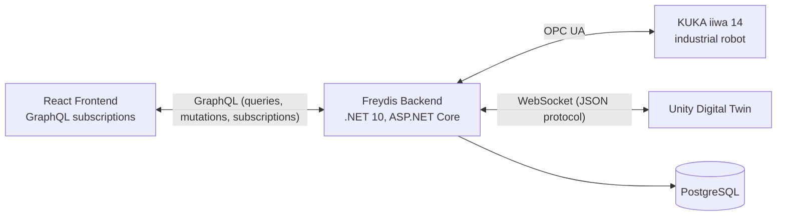
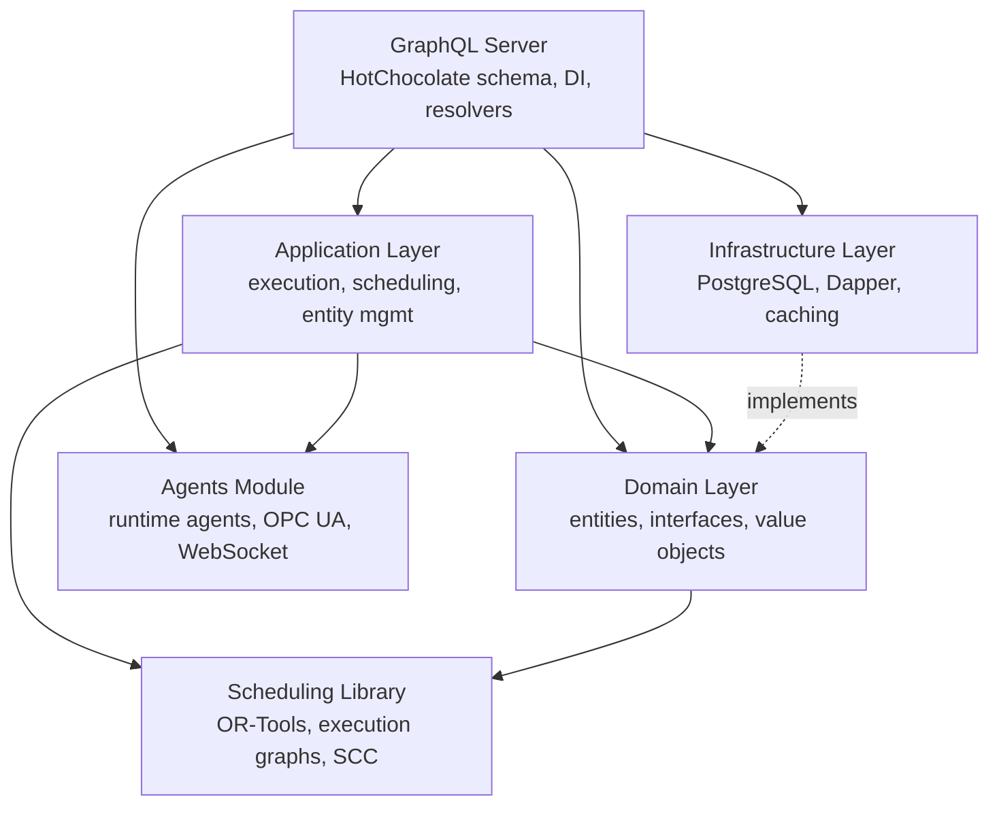
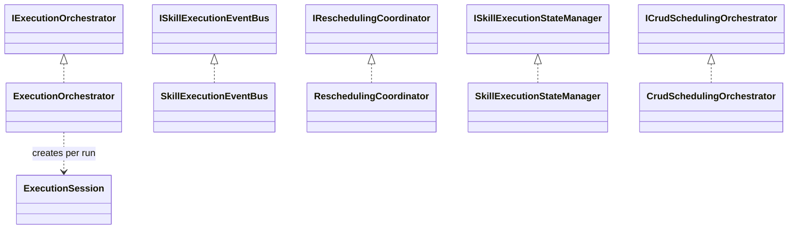
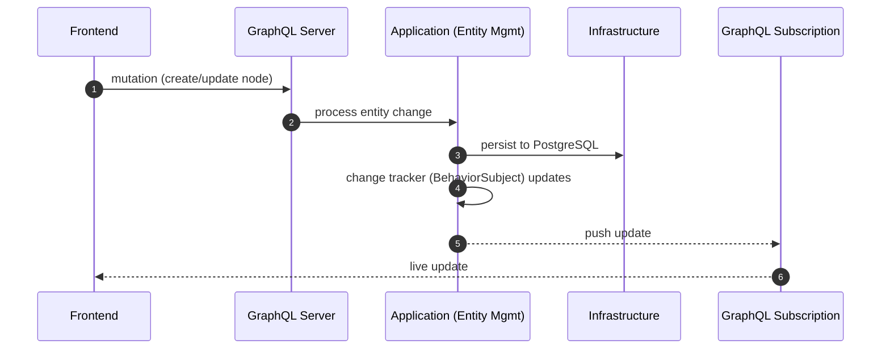
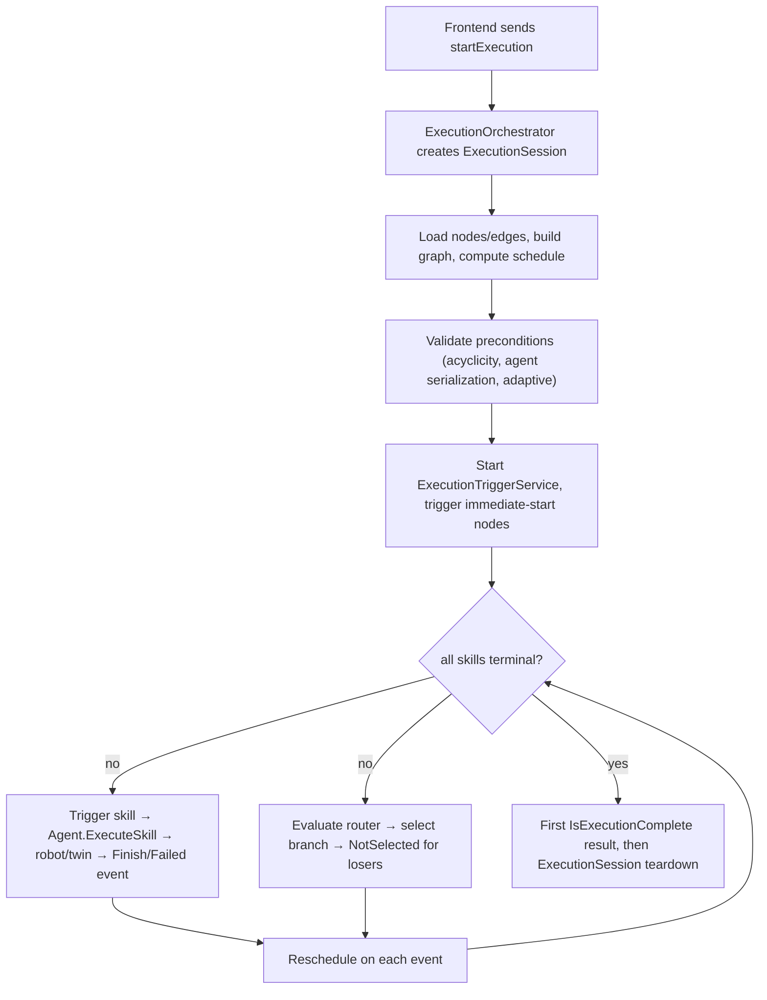
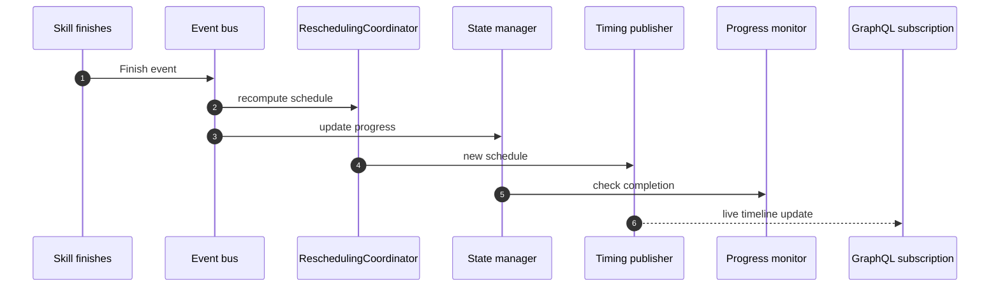

# Architecture Overview

> How the Freydis backend is structured, how data flows through it, and why key design decisions were made.

## Overview

Freydis is a **.NET 10 backend** that orchestrates robotic workflows. It exposes a **GraphQL API** for a React frontend,
persists data in **PostgreSQL**, communicates with robots via **OPC UA** and **WebSocket**, and uses **Rx.NET** for
real-time reactive streams. The codebase follows **Clean Architecture** — domain entities at the center, application
logic around them, infrastructure and API at the edges.

This document explains the layers, how they connect, and the architectural decisions that shaped the system.

---

## System Context

- **Frontend** connects via GraphQL (queries, mutations, subscriptions over WebSocket)
- **KUKA robots** connect via OPC UA (industrial automation protocol)
- **Digital Twins** (Unity) connect via WebSocket with a custom JSON message protocol
- **PostgreSQL** stores all persistent data (procedures, nodes, edges, agents, skills)

---

## Layer Architecture

**Dependency rule:** each layer only depends on layers below it. The Domain layer defines interfaces that Infrastructure
implements. Both the Application and Domain layers reference the Scheduling library.

---

## Layer Responsibilities

### GraphQL Server

The entry point for all external communication. Responsibilities:

- **Query resolvers** — Read procedures, nodes, edges, agents, scene data
- **Mutation resolvers** — Create/update/delete entities, start/stop execution
- **Subscription resolvers** — Real-time streams (node changes, execution events, timing updates, advisories)
- **DI configuration** — Registers all services with correct lifetimes (Singleton vs Scoped)
- **Startup initialization** — Loads scene config, registers agents, syncs skills

See: [GraphQL Server docs](../GraphQLServer/docs/README.md)

### Application Layer

The heart of the system. Contains all business logic, organized into service categories:

| Category               | What It Does                                                    |
|------------------------|-----------------------------------------------------------------|
| **Execution Pipeline** | Orchestrates execution: schedule → trigger → monitor → complete |
| **Triggering**         | Monitors events, triggers nodes when prerequisites are met      |
| **Rescheduling**       | Recalculates timing when skills finish early/late               |
| **State Management**   | Tracks which skills are running, finished, or not selected      |
| **Validation**         | Agent-serialization gate and reactive procedure validation      |
| **Scheduling**         | Builds execution graphs, calculates timing via OR-Tools         |
| **Entity Management**  | CRUD for nodes, edges, procedures (procedure-scoped)            |
| **Agent Coordination** | Registers agents, maps skills to agents, syncs capabilities     |
| **Branching/Routing**  | Evaluates router conditions, selects branches                   |
| **Variables**          | Manages runtime variable context for branching decisions        |
| **Properties**         | Resolves skill property bindings to variable values             |

See: [Application Layer docs](../Application/docs/README.md)

### Domain Layer

Defines the core entities and interfaces. No business logic — just data structures and contracts:

- **Procedure entities** — `Procedure`, `Node` (Task/Skill/Router), `DependencyEdge`, `ConditionalBranch`
- **Common entities** (`Entities/Common`) — `Agent`, `Skill`, `TypedProperty`, `Position`, `SceneObject`
- **Variable entities** — `VariableDefinition`, `VariableContext`, `VariableValue`
- **Repository interfaces** — `IRepository<T>`, `IProcedureRepository`

See: [Domain Layer docs](../Domain/docs/README.md)

### Agents Module

Implements the three agent types and their communication protocols:

- **DummyRuntimeAgent** — Simulates execution by waiting for the skill duration
- **KukaIiwa14RuntimeAgent** — Controls a real KUKA robot via OPC UA
- **DigitalTwinRuntimeAgent** — Sends commands to Unity via WebSocket

Plus agent management: `UnifiedAgentManager`, factories, providers (`IRuntimeAgentProvider`).

See: [Agents docs](../Agents/docs/README.md)

### Infrastructure Layer

Implements the Domain's repository interfaces with PostgreSQL + Dapper:

- **Generic PostgreSQL repository** — Base CRUD operations
- **Specialized adapters** — `NodeRepositoryAdapter`, `DependencyEdgeRepositoryAdapter` handle polymorphic types
  (Node → TaskNode/SkillExecutionNode/RouterNode)
- **TypeHierarchyJsonConverter** — `$type` discriminator for JSON storage
- **CachedRepository** — `IMemoryCache`-backed decorator over `IRepository<T>`, with `CacheKeyGenerator` and
  `MemoryCacheInvalidationService`

See: [Infrastructure docs](../Infrastructure/docs/README.md)

### Scheduling Library

A near-pure algorithm library; its only package dependency is `Microsoft.Extensions.Logging.Abstractions`:

- **ExecutionGraph** — Represents tasks + dependencies
- **LP Solver** — Uses Google OR-Tools to calculate optimal timing
- **SCC Analysis** — Tarjan's algorithm for cycle detection in dependency graphs (`StronglyConnectedComponent`,
  `ConstrainedGroup`)

See: [Scheduling docs](../Scheduling/docs/README.md)

---

## Key Data Flows

### 1. Design-Time: Creating a Procedure

When a user creates/modifies a node, the mutation flows through to the database, then the change tracker pushes the
update to all subscribers (including the frontend's subscription).

### 2. Execution: Running a Procedure

For the complete walkthrough, see [Execution Pipeline](execution-pipeline.md).

### 3. Real-Time Updates

---

## Key Architectural Decisions

### Why Singleton Services?

GraphQL subscriptions hold references to `IObservable<T>` streams. If the service that owns the stream is scoped (created
per-request), the subscription dies when the request ends. By making execution services singletons, subscription streams
survive across requests. Each execution's mutable reactive state lives on a fresh `ExecutionSession`, which the
orchestrator disposes through a single teardown sink (`ExecutionSession.DisposeAsync`) once the detached run reaches its
terminal state.

### Why Rx.NET?

The execution model is inherently reactive: events happen asynchronously (skill starts, finishes, errors), and multiple
services need to react to the same events. Rx.NET provides:

- **BehaviorSubject** — Last-value caching for subscriptions
- **CombineLatest** — Wait for multiple skills to finish before triggering the next step
- **Sample/Throttle** — Rate-limit rescheduling updates to the frontend
- **Observable composition** — Build complex event pipelines declaratively

### Why Event-Driven Execution (not time-based)?

Skills don't always take the predicted time. A robot might finish 2 seconds early, or an adaptive skill might run
indefinitely. Instead of scheduling tasks at specific clock times, the system uses **events**: when Skill A publishes a
Finish event, the trigger service checks if Skill B's prerequisites are now satisfied. This makes the system resilient
to timing variations.

### Why PostgreSQL + Dapper (not EF Core)?

The domain model uses deep polymorphic hierarchies (Node → TaskNode/SkillExecutionNode/RouterNode, each with nested task
types). Entity Framework Core struggles with this pattern. Dapper + manual JSON serialization with a `$type`
discriminator gives full control over storage and deserialization.

### Why a Separate Scheduling Library?

The scheduling algorithms (linear programming, SCC analysis) are pure functions with no framework dependencies beyond a
logging abstraction. Keeping them in a separate library makes them independently testable and reusable. The Application
layer wraps them with execution-context-aware services.

---

## Technology Stack

| Technology      | Version     | Purpose                       |
|-----------------|-------------|-------------------------------|
| .NET            | 10.0        | Runtime and framework         |
| C#              | 14          | Language                      |
| HotChocolate    | 15.1.16     | GraphQL server                |
| PostgreSQL      | 16          | Database                      |
| Npgsql          | 9.0.3       | PostgreSQL driver             |
| Dapper          | 2.1.35      | Micro-ORM                     |
| System.Reactive | 6.0.1       | Rx.NET reactive streams       |
| Google OR-Tools | 9.14.6206   | Linear programming solver     |
| DynamicExpresso.Core | 2.19.0 | Router condition expressions  |
| OPC UA          | NetStandard | KUKA robot communication      |
| Serilog         | —           | Structured logging            |
| xUnit + Moq     | —           | Testing                       |

---

## Related Documentation

- [Documentation Hub](README.md) — Back to the index
- [Glossary](glossary.md) — Term definitions
- [Execution Pipeline](execution-pipeline.md) — Detailed execution flow
- [Application Layer](../Application/docs/README.md) — Service categories and patterns
- [DI Design Guide](../GraphQLServer/Extensions/README.md) — Service registration and lifetimes
