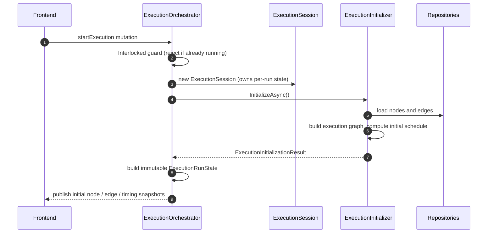
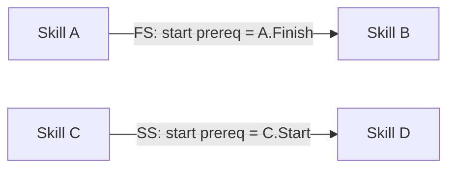
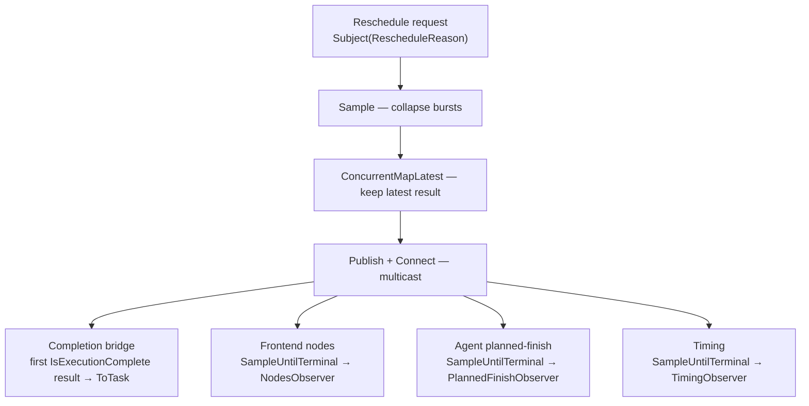
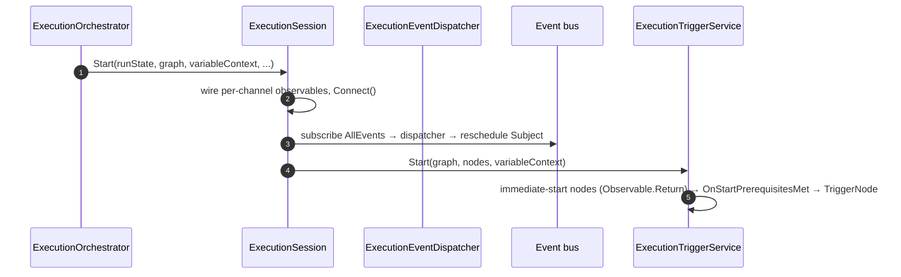
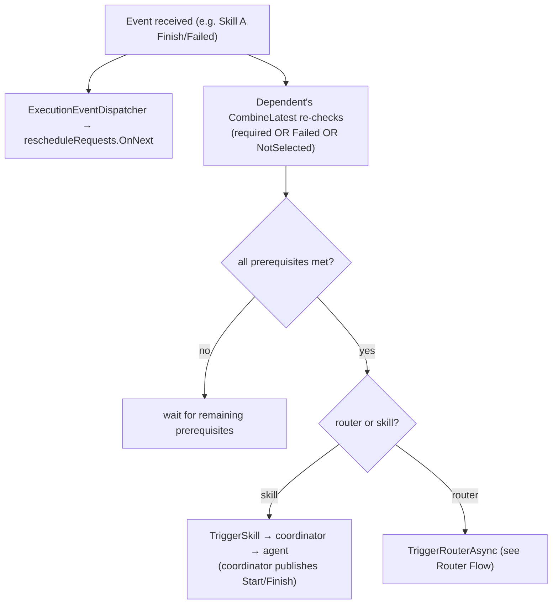
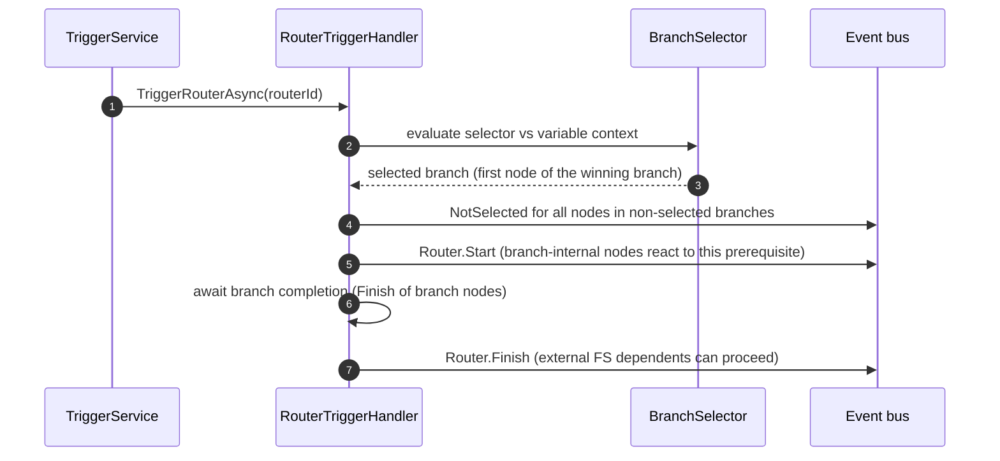
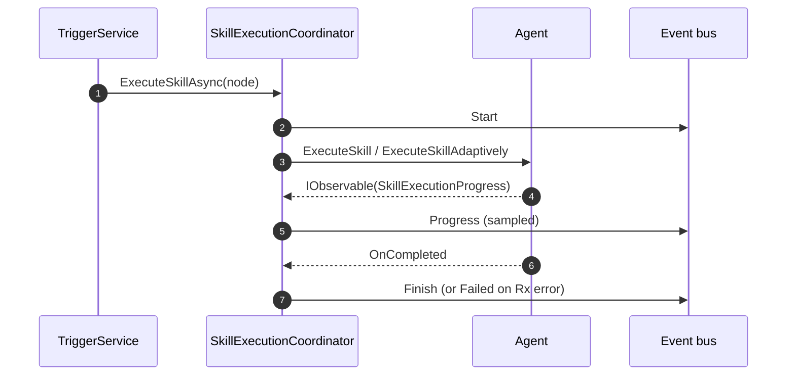
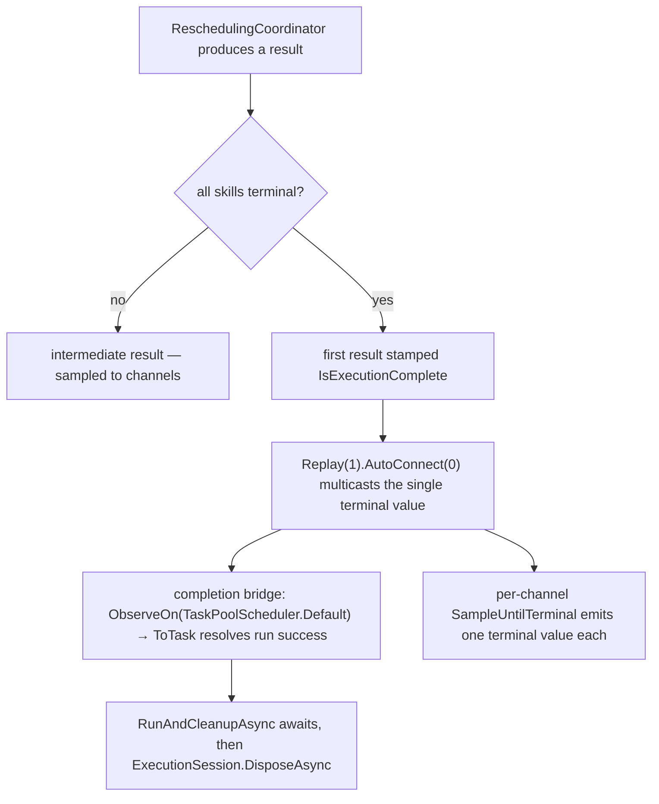
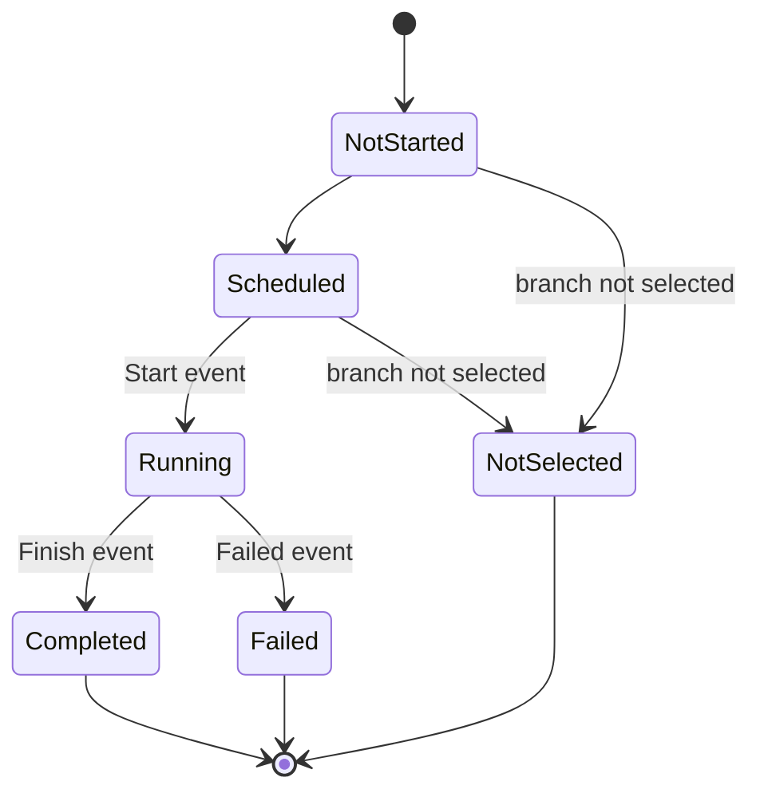

# Execution Pipeline

> What happens when you click "Execute" — from button press to robot motion and back.

## Overview

The execution pipeline is the most complex part of Freydis. It takes a visual procedure (nodes and edges) and turns it
into real-time coordinated robot actions. The pipeline is **event-driven**: instead of running tasks at fixed clock
times, it watches for events (skill started, skill finished) and triggers the next tasks when their prerequisites are
met.

This document walks through the entire execution flow, from start to completion.

---

## The Simple Version

1. You click **Execute** in the frontend
2. The backend loads the procedure (nodes + edges) from the database
3. A schedule is calculated: "Skill A takes 3 seconds, Skill B starts after A finishes, etc."
4. Root nodes (no incoming dependencies) start executing immediately
5. When a skill finishes, the system checks: "Are any downstream skills now ready?"
6. If yes, those skills start. If a router is reached, a branch is selected based on conditions.
7. As skills finish early or late, the schedule is recalculated so the timeline stays accurate
8. When every skill is terminal, the first completion-stamped result drives the final update and the run tears down

---

## Step-by-Step Walkthrough

### Phase 1: Initialization

**Component:** `ExecutionOrchestrator.StartLoadedProcedureAsync()`



1. **Guard against concurrent execution** — `Interlocked.CompareExchange` on `_isExecuting`; a second call is rejected
   with `ExecutionAlreadyInProgressException`.
2. **Create the session** — A fresh `ExecutionSession` owns this run's reschedule `Subject`, subscription bag, and
   completion task. No mutable per-run state lives on the singleton orchestrator.
3. **Initialize** — `IExecutionInitializer.InitializeAsync` loads nodes/edges, builds the execution graph via
   `IExecutionGraphBuilder`, and computes the initial schedule, returning an `ExecutionInitializationResult`.
4. **Build run state** — The result is captured in an immutable `ExecutionRunState` (nodes, edges, schedule, start time,
   procedure id) threaded through the run.
5. **Publish initial state** — Nodes (with timing), edges, and execution timing are pushed to the frontend.

### Phase 2: Dependency Analysis

**Component:** `IDependencyGraphAnalyzer`

The dependency graph analyzer transforms edges into a lookup structure:



Each node gets a list of **start prerequisites** (events that must occur before it starts) and optionally **finish
prerequisites** (for adaptive skills that wait for a signal to stop). The analyzer also injects the synthetic
`Router.Start` prerequisite that gates branch-internal nodes, and identifies:

- **Immediate-start skills** — No prerequisites, execute right away
- **Adaptive skills** — Variable duration, wait for an external finish signal

### Phase 3: Set Up the Rescheduling Pipeline

**Component:** `IExecutionPipelineBuilder`, `ExecutionSession`

Before starting execution, the session wires a reactive pipeline for rescheduling. The builder returns a connectable
`Sample → ConcurrentMapLatest → Publish` source; the session attaches the completion bridge and three sampled
per-channel observables, then connects it.



Rescheduling can happen on every skill event without overwhelming the frontend or agents — each consumer samples at its
own configured interval.

### Phase 4: Start Execution

**Component:** `ExecutionSession.Start`, `IExecutionTriggerService`



Immediate-start nodes have no prerequisites, so their `Observable.Return(Unit)` signal fires `OnStartPrerequisitesMet`
synchronously; the actual `Start`/`Finish` events are published later by the coordinator and agent. Reschedule requests
come from `ExecutionEventDispatcher.HandleExecutionEvent`, an independent subscriber to the same hot bus.

### Phase 5: Event-Driven Triggering

**Component:** `ExecutionTriggerService` (ongoing)

For each event on the bus, two independent subscribers react: the dispatcher requests a reschedule, and each dependent's
`CombineLatest` signal re-checks its prerequisites. A prerequisite is satisfied by the required event type **or** a
`Failed` **or** `NotSelected` event from the same skill.



#### Router Flow

When a router's prerequisites are met:



### Phase 6: Skill Execution

**Component:** `ISkillExecutionCoordinator`, `IRuntimeAgent`



**Adaptive execution** works differently: the skill starts with a minimum duration bound and runs until a finish signal
(another skill's terminal event) fires. The agent emits progress continuously, and the rescheduling pipeline adjusts
timing as the adaptive skill's actual duration grows.

### Phase 7: Rescheduling

**Component:** `IReschedulingCoordinator`

Every time a skill starts or finishes, a reschedule is requested:

1. Actual timestamps are injected into the execution graph
2. OR-Tools re-solves with updated constraints
3. Remaining tasks get adjusted start/end times
4. Updated nodes are published to the frontend (timeline shifts in real time)

Router branch filtering is applied: only nodes in selected branches are included in the schedule. Non-selected branches
are excluded entirely.

### Phase 8: Completion Detection

**Component:** `IReschedulingCoordinator`, `ExecutionSession`

Completion is **single-phase**. The rescheduling coordinator stamps `IsExecutionComplete` onto the first result it
produces once every skill is terminal (`Completed + Failed + NotSelected == Total`); that one value is authoritative.



`StartLoadedProcedureAsync` returned `true` back in Phase 1 once the run *started*; the detached `RunAndCleanupAsync`
task is what awaits the completion task. The `ObserveOn(TaskPoolScheduler.Default)` hop is the re-entry guard — it moves
the awaiting `DisposeAsync` off the dispatcher thread so teardown never disposes the operator graph from inside its own
terminal `OnNext`.

### Phase 9: Cleanup

**Component:** `ExecutionSession.DisposeAsync` (single teardown sink)

`DisposeAsync` runs from `RunAndCleanupAsync` on every exit path — success, cancellation, and synchronous start failure.
Each step is isolated in its own `try`/`catch` so an early throw cannot skip a later step:

1. `rescheduleRequests.OnCompleted()` — The source subject completes; completion propagates through the pipeline.
   Post-`OnCompleted` `OnNext` calls are silent no-ops, which absorbs in-flight dispatcher callbacks (no guard flag).
2. `subscriptions.Dispose()` — Tears down every subscription, including the `Connect()` handle.
3. `_executionTriggerService.StopMonitoring()` — No new skills can start.
4. `await _eventPublisher.RefreshChangeTrackersFromRepositoryAsync()` — Reset change trackers to persisted state.

The orchestrator clears `_isExecuting` with `Interlocked.Exchange` only **after** `DisposeAsync` completes, so a
dispose-without-reset can never wedge the next run. `DisposeAsync` is idempotent.

---

## Key Design Patterns

### Event-Driven vs. Time-Based

Traditional schedulers run tasks at specific clock times. Freydis uses events instead. Why?

- Robots don't always take the predicted time
- Adaptive skills have no fixed duration
- Event-driven execution naturally handles timing variations without explicit error correction

### Singleton with Per-Run Session

The `ExecutionOrchestrator` is a singleton (for GraphQL subscription continuity), but each run's reactive state lives on
a fresh `ExecutionSession` (`IAsyncDisposable`). The run is detached on a background task, and the session is the single
teardown sink. This enables consecutive executions without a service restart and with no cross-run state bleed.

### Rx.NET Multi-Tier Sampling

Different consumers need updates at different rates. The completion bridge sees the single terminal value; the frontend,
agent, and timing channels each sample intermediate results at their own configured interval via `SampleUntilTerminal`,
then emit exactly one terminal value. `Publish()` multicasts a single rescheduling stream to all of them.

### Fire-and-Forget with Safety Net

Router evaluation is kicked off from an Rx callback (`TriggerRouterAsync`). The method returns a `Task` that handles its
own exceptions internally. A `.ContinueWith(OnlyOnFaulted)` safety net catches any escaping exception.

---

## Error Handling

| Scenario                          | Handling                                                              |
|-----------------------------------|----------------------------------------------------------------------|
| Skill execution fails             | `Failed` event published; state manager marks the skill `Failed`     |
| Router evaluation fails           | Exception swallowed by the handler; `Router.Start` is never published, blocking the branch |
| Rescheduling fails                | A `Success = false` result is filtered out, so consumers keep the last good snapshot |
| Concurrent start attempt          | `ExecutionAlreadyInProgressException` thrown immediately             |
| Cancellation requested            | `CancellationToken` propagates; `DisposeAsync` still runs            |
| Stale Rx callbacks during cleanup | Post-`OnCompleted` `OnNext` calls are silent no-ops (no guard flag)  |

---

## Failure Handling Limitations

When a skill fails, the pipeline keeps moving rather than stalling — but it does not recover:

- The skill is marked `Failed` (terminal) and the `Failed` event is published on the bus.
- A `Failed` (or `NotSelected`) event **satisfies** a dependent's prerequisite, so downstream nodes are released and
  execute — even though their upstream produced no successful result.
- The overall execution terminates (the progress monitor counts `Failed` as terminal), but a failed branch yields no
  successful outcome. The one exception is router branch completion, which waits specifically for `Finish`, so a failed
  branch-internal skill can leave a router awaiting completion.
- There is no retry, no fallback path, and no recovery of a partially-failed execution.

This is a known gap. The formal verification in [Sunstone](../../Sunstone/README.md) reflects it: the per-node liveness
proof is only valid on the success path. See [Missing Failed Case](../../Sunstone/docs/missing-failed-case.md).

## Formal Verification

Key properties of the execution pipeline are formally verified in the [Sunstone](../../Sunstone/README.md) Lean 4 proof
suite. Machine-checked proofs cover no-premature-triggering, router branch consistency, deadlock freedom, dual-loop
convergence, and LP scheduling validity. The formal model does not currently cover failure paths — a known limitation
of theorem proving, which only reasons about what is explicitly modeled.

### Monotone state transitions

Each skill node moves through a monotone status machine; once a status is terminal it never changes:



The dual-loop convergence proof (`Sunstone/Sunstone/Execution/DualLoopConvergence.lean`) relies on a `h_no_regress`
hypothesis: once a node's status is terminal (`Completed`, `Failed`, or `NotSelected`), it stays terminal. The runtime
enforces this in `SkillExecutionStateManager.UpdateState`, which consults `ExecutionStatusExtensions.IsTerminal` —
whose truth table mirrors the Lean `ExecutionStatus.isTerminal` predicate — and rejects any mutation on a state that has
already reached a terminal status, under a per-state monitor lock so concurrent transitions cannot violate the
invariant by interleaving check-then-mutate. A late progress event after `Completed`, a duplicate `MarkCompleted`, or a
race between `MarkCompleted` and `MarkFailed` all degrade to a logged warning rather than an inconsistent state.

## Related Documentation

- [Architecture Overview](architecture.md) — Layer structure and data flows
- [Glossary](glossary.md) — Term definitions
- [Execution Orchestrator](../Application/docs/execution-orchestrator.md) — Detailed orchestrator design: lifecycle,
  delegation, cleanup
- [Execution Trigger Service](../Application/docs/execution-trigger-service.md) — Reactive prerequisite signals and node
  triggering
- [CRUD Scheduling Orchestrator](../Application/docs/crud-scheduling.md) — Design-time CRUD + parallel scheduling
- [Application Layer](../Application/docs/README.md) — Service categories including execution services
- [Agent Lifecycle](../Application/docs/agent-lifecycle.md) — How agents start up and connect
- [Scheduling Module](../Scheduling/docs/README.md) — OR-Tools solver and execution graph APIs
- [Sunstone Proofs](../../Sunstone/README.md) — Formal verification of scheduling and execution correctness
- [Documentation Hub](README.md) — Back to the index
```