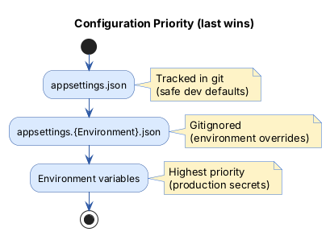

# Security & Configuration

> How credentials, CORS, and host restrictions are managed across environments.

## Overview

The Freydis backend uses ASP.NET Core's layered configuration system. Sensitive values (database passwords, production
CORS origins) are provided via **environment variables** at runtime — they are never hardcoded in tracked configuration
files. The base `appsettings.json` contains only safe localhost defaults for local development.

This document explains the configuration security model, how to set up each environment, and common pitfalls to avoid.

---

## Configuration Hierarchy

ASP.NET Core merges configuration sources in this order (last wins):



**Key rule:** Credentials only exist in environment variables or gitignored files. The tracked `appsettings.json` uses
`localhost` with default `postgres/postgres` for local development — this is intentional and safe.

---

## Database Credentials

### Local Development

The base `appsettings.json` ships with:

```json
{
  "ConnectionStrings": {
    "PostgreSQL": "Host=localhost;Port=5432;Database=FreydisDB;Username=postgres;Password=postgres"
  }
}
```

This connects to a local PostgreSQL instance with default credentials. For local development, this is fine — the
database is on `localhost` and not exposed.

### Docker Compose

Docker Compose reads credentials from a `.env` file (gitignored):

```bash
# Copy the template and set a real password
cp .env.example .env
# Edit .env and set POSTGRES_PASSWORD
```

The `docker-compose.yml` references these variables:

```yaml
environment:
  - POSTGRES_PASSWORD=${POSTGRES_PASSWORD:?Set POSTGRES_PASSWORD in .env}
  - ConnectionStrings__PostgreSQL=Host=postgres;...;Password=${POSTGRES_PASSWORD}
```

The `${POSTGRES_PASSWORD:?...}` syntax makes `docker compose up` fail with a clear error if the variable is missing,
preventing accidental deployment with no password.

### Production

Set the connection string via environment variable:

```bash
export ConnectionStrings__PostgreSQL="Host=prod-db;Port=5432;Database=FreydisDB;Username=freydis_app;Password=<strong-password>"
```

ASP.NET Core's `__` (double underscore) syntax maps to JSON hierarchy: `ConnectionStrings__PostgreSQL` overrides
`ConnectionStrings.PostgreSQL` from any `appsettings.json` file.

---

## CORS Configuration

### What's Allowed

The base `appsettings.json` allows only `localhost` origins:

```json
{
  "Cors": {
    "AllowedOrigins": [
      "http://localhost:5173",
      "http://localhost:5174"
    ]
  }
}
```

### Adding Origins for Production

Override via environment variables:

```bash
export Cors__AllowedOrigins__0=https://your-frontend-domain.com
export Cors__AllowedOrigins__1=https://staging.your-domain.com
```

### What NOT to Do

Do not add internal network IPs (e.g., `http://10.0.0.49:5173`, `http://100.96.203.111:5173`) to tracked configuration
files. If you need to allow a lab machine during development, create a local `appsettings.Development.json` (gitignored)
or use environment variables.

---

## Host Restrictions

### Development

`AllowedHosts` is set to `"*"` in the base `appsettings.json`, which is appropriate for local development.

### Production

The `appsettings.Production.json` sets `AllowedHosts` to a specific domain:

```json
{
  "AllowedHosts": "your-production-domain.com"
}
```

Override via environment variable if needed:

```bash
export AllowedHosts="app.example.com;api.example.com"
```

---

## Gitignore Rules

The `Backend/.gitignore` excludes environment-specific appsettings:

```gitignore
appsettings.*.json
!appsettings.json
```

This means:

- `appsettings.json` — **tracked** (safe dev defaults, template for all settings)
- `appsettings.Development.json` — **gitignored** (create locally if needed)
- `appsettings.Production.json` — **gitignored** (deploy-time config)
- `appsettings.Hybrid.json` — **gitignored** (lab-specific overrides)

The root `.gitignore` also excludes `.env` files.

---

## Quick Reference

| Environment | Database Credentials                    | CORS Origins                       | AllowedHosts   |
|-------------|-----------------------------------------|------------------------------------|----------------|
| Local dev   | `appsettings.json` (localhost defaults) | `localhost:5173/5174`              | `*`            |
| Docker      | `.env` file → `docker-compose.yml`      | Override via env vars              | `*` (dev)      |
| Production  | `ConnectionStrings__PostgreSQL` env var | `Cors__AllowedOrigins__N` env vars | Set explicitly |

---

## Related Documentation

- [Documentation Hub](README.md) — Back to the index
- [Architecture Overview](architecture.md) — System design and layers
- [Infrastructure Layer](../Infrastructure/docs/README.md) — Database access and caching
- [DI Design Guide](../GraphQLServer/Extensions/README.md) — Service registration patterns
