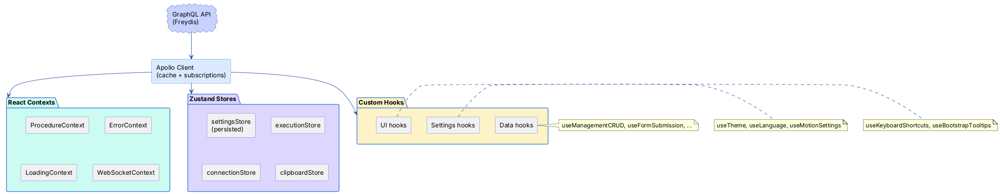

# Frontend State Architecture

The Magnus frontend manages state across four Zustand stores, four React Contexts, and fourteen custom hooks. This
document explains what each one does, how they interact, and when to use which pattern.

## Data Flow Overview



---

## Zustand Stores

Zustand stores hold UI and session state that needs to be shared across components without provider nesting. Only
`settingsStore` persists to `localStorage`.

| Store                | File                        | State                                                                                | Persistence                          |
|----------------------|-----------------------------|--------------------------------------------------------------------------------------|--------------------------------------|
| `useSettingsStore`   | `stores/settingsStore.ts`   | GraphQL endpoints, theme, animation speed, reduce motion, language, notifications    | `localStorage` (key: `app-settings`) |
| `useExecutionStore`  | `stores/executionStore.ts`  | `isProcedureRunning: boolean` — true when any node has `isExecuting === true`        | None                                 |
| `useConnectionStore` | `stores/connectionStore.ts` | `sourceNodeId`, `validTargetNodeIds` — tracks edge dragging on the React Flow canvas | None                                 |
| `useClipboardStore`  | `stores/clipboardStore.ts`  | `clipboardData: { node, isCut }` — node clipboard for copy/cut/paste operations      | None                                 |
| `useManagementModalStore` | `stores/managementModalStore.ts` | `isOpen: boolean` — source of truth for management modal visibility             | None                                 |

### settingsStore

The central user preferences store. Three settings groups:

```
graphql:
  httpEndpoint      # GraphQL HTTP URL
  wsEndpoint        # GraphQL WebSocket URL
  enableSubscriptions
  timeout

appearance:
  theme             # 'light' | 'dark' | 'auto'
  animationSpeed    # multiplier for transition durations
  reduceMotion      # accessibility: disable animations

general:
  enableNotifications
  language          # 'en' | 'de' | 'pl' | 'es'
```

Key actions: `updateSettings`, `updateGraphQLSettings`, `updateAppearanceSettings`, `updateGeneralSettings`,
`resetSettings`, `exportSettings`, `importSettings`.

### executionStore

Single boolean flag updated by the Flow component when the node list changes. Used by UI elements that need to show "
procedure is running" indicators or disable editing during execution.

### connectionStore

Ephemeral state for the React Flow edge dragging interaction. `startConnection(sourceNodeId, validTargetIds)` is called
when the user begins dragging an edge handle; `endConnection()` resets on drop or cancel. The `validTargetNodeIds` set
enables visual highlighting of valid drop targets.

### clipboardStore

Manages copy/cut/paste for nodes. `copyNode(node)` stores the node for non-destructive paste; `cutNode(node)` marks it
for deletion after paste. The `useClipboardOperations` hook handles the complex paste logic (recursive hierarchy, ID
remapping, dependency preservation).

### managementModalStore

Source of truth for management modal (create/edit) visibility. The `useManagementCRUD` hook syncs URL state into the
store for deep linking and drives the modal `show` prop from `isOpen`. Decoupling modal visibility from React Router
route transitions keeps the react-bootstrap Modal portal stable across navigation, so the component can remount without
leaking the portal.

---

## React Contexts

Contexts wrap shared business logic that requires provider lifecycle management or depends on Apollo Client. All
contexts export a hook that validates usage within the provider.

### ErrorContext

Global error aggregation with automatic classification.

| Export                         | Purpose                                                  |
|--------------------------------|----------------------------------------------------------|
| `useError()`                   | Access error state and actions                           |
| `addError(error)`              | Add error with auto-generated ID and timestamp           |
| `handleError(error, context?)` | Classify and add an `Error` object with optional context |
| `removeError(id)`              | Dismiss a specific error                                 |
| `clearErrors()`                | Dismiss all errors                                       |

Error classification detects GraphQL errors, network errors, and authentication errors, assigning severity levels:
`critical`, `error`, `warning`, `info`.

See [error-loading-patterns.md](error-loading-patterns.md) for error handling patterns across the application.

### LoadingContext

Centralized loading state management supporting multiple concurrent operations.

| Export                    | Purpose                                          |
|---------------------------|--------------------------------------------------|
| `useLoading()`            | Access global and keyed loading states           |
| `useLoadingState(key)`    | Scoped loading hook with auto-cleanup on unmount |
| `setGlobalLoading(state)` | Set the global loading overlay                   |
| `setLoading(key, state)`  | Set loading state for a specific operation       |
| `isAnyLoading()`          | Check if any operation is in progress            |

`LoadingState` shape: `{ isLoading, loadingText?, progress? }`. The `useLoadingState` hook is the preferred API — it
returns `startLoading`, `stopLoading`, and `updateProgress` helpers with automatic cleanup when the component unmounts.

### ProcedureContext

Manages the currently loaded procedure and its GraphQL operations.

| Export                     | Purpose                                              |
|----------------------------|------------------------------------------------------|
| `useProcedure()`           | Access loaded procedure data and actions             |
| `loadedProcedure`          | Current procedure (or `null`)                        |
| `isLoading`                | Procedure query loading state                        |
| `isBackendError`           | Backend connection error (distinct from query error) |
| `loadProcedure(id)`        | Load a procedure by ID (mutation)                    |
| `unloadProcedure()`        | Unload the current procedure (mutation)              |
| `refetchLoadedProcedure()` | Re-fetch from server                                 |

Auto-fetches the loaded procedure on mount using `network-only` fetch policy. Tracks backend connection errors
separately from query errors.

### WebSocketContext

Tracks the GraphQL WebSocket subscription connection lifecycle.

| Export            | Purpose                                                 |
|-------------------|---------------------------------------------------------|
| `useWebSocket()`  | Access connection status                                |
| `isConnected`     | Current WebSocket connection state                      |
| `wasDisconnected` | Prevents duplicate disconnect notifications per session |

Logs disconnection (once per session with `console.warn`) and reconnection events. Components can use `isConnected` to
show connection status indicators.

---

## Custom Hooks

### Data Hooks

| Hook                     | File                              | Purpose                                                                                                                                                                                             |
|--------------------------|-----------------------------------|-----------------------------------------------------------------------------------------------------------------------------------------------------------------------------------------------------|
| `useApolloError`         | `hooks/useApolloError.ts`         | Converts Apollo errors to app errors via `useError()`. Filters out WebSocket connection errors (handled separately). Accepts `componentName`, `operation`, and `showToast` options                  |
| `useAsyncState<T>`       | `hooks/useAsyncState.ts`          | Combines loading + error handling for async operations. Returns `{ data, isLoading, error, execute, reset }`. Uses `useError()` and `useLoadingState()` internally                                  |
| `useManagementCRUD`      | `hooks/useManagementCRUD.ts`      | Complete CRUD operations for management entities (agents, skills, scene objects, position tags). Combines GraphQL queries/mutations with URL-based modal state, form management, and error handling |
| `useFormSubmission`      | `hooks/useFormSubmission.ts`      | Standardized form submission with validation, create/update mutation dispatch, and error handling via `useError()`                                                                                  |
| `useClipboardOperations` | `hooks/useClipboardOperations.ts` | Complex copy/cut/paste logic for nodes. Recursively copies node hierarchies, preserves internal dependencies, handles ID remapping during duplication                                               |

### UI Hooks

| Hook                   | File                            | Purpose                                                                                                                                                                   |
|------------------------|---------------------------------|---------------------------------------------------------------------------------------------------------------------------------------------------------------------------|
| `useKeyboardShortcuts` | `hooks/useKeyboardShortcuts.ts` | Registers Ctrl/Cmd+C/X/V for node copy/cut/paste. Ignores shortcuts when focus is in input/textarea fields                                                                |
| `useBootstrapTooltips` | `hooks/useBootstrapTooltips.ts` | Initializes and manages Bootstrap tooltip lifecycle on a ref element. Reuses existing instances and auto-disposes on unmount                                              |
| `useGlobalTooltipHide` | `hooks/useGlobalTooltipHide.ts` | Auto-hides all Bootstrap tooltips on any page click                                                                                                                       |
| `useRouterModal`       | `hooks/useRouterModal.ts`       | URL-driven modal state management. Pre-configured for agent, skill, position tag, and scene object management modals. Enables browser back-button support for modal close |
| `useTimelineConfig`    | `hooks/useTimelineConfig.ts`    | Reads scheduling configuration from GraphQL and React Flow viewport. Computes zoom-responsive tick interval (clamped 50-400px)                                            |

### Settings Hooks

| Hook                | File                         | Purpose                                                                                                                                                                                                          |
|---------------------|------------------------------|------------------------------------------------------------------------------------------------------------------------------------------------------------------------------------------------------------------|
| `useTheme`          | `hooks/useTheme.ts`          | Applies theme from `settingsStore` with system preference detection. Sets `data-bs-theme` and `data-theme` on the document, updates browser theme color meta tag. Returns `{ theme, systemPrefersDark, isAuto }` |
| `useMotionSettings` | `hooks/useMotionSettings.ts` | Reads animation preferences from `settingsStore`. Returns helpers: `applyMotionSettings(transition)`, `createTransition(duration)`, `shouldReduceMotion()`, `getSpeedMultiplier()`                               |
| `useLanguage`       | `hooks/useLanguage.ts`       | Syncs language between `settingsStore` and i18n instance. Returns `{ currentLanguage, changeLanguage, availableLanguages }`. Supported: `en`, `de`, `pl`, `es`                                                   |

---

## Interaction Map

```plantuml
@startuml Interaction Map
skinparam backgroundColor transparent
skinparam componentStyle rectangle
skinparam defaultFontName Inter
skinparam ArrowColor #2C58A4
skinparam packageBorderColor #3B77DB
skinparam componentBorderColor #3B77DB

' --- Zustand Stores ---
package "Zustand Stores" as ZS #DDD6FE {
  component "useSettingsStore" as SS
  component "useClipboardStore" as ClS
  component "useExecutionStore" as ES
  component "useConnectionStore" as CS
}

' --- Settings hooks ---
component "useTheme" as Theme #FEF3C7
component "useMotionSettings" as Motion #FEF3C7
component "useLanguage" as Lang #FEF3C7

SS --> Theme
SS --> Motion
SS --> Lang
Theme --> [DOM attributes]
Motion --> [Framer Motion transitions]
Lang --> [i18next instance]

' --- Clipboard flow ---
component "useClipboardOperations" as ClipOps #FEF3C7
component "useKeyboardShortcuts" as KBD #FEF3C7
ClS --> ClipOps
ClS --> KBD
ClipOps --> [GraphQL mutations\n+ React Flow state]

' --- Execution flow ---
ES --> [Flow component]
ES --> [UI indicators]

' --- Connection flow ---
CS --> [React Flow edge drag UI]
CS --> [Connection validation highlights]

' --- React Contexts ---
package "React Contexts" as RC #CCFBF1 {
  component "ErrorContext" as EC
  component "LoadingContext" as LC
  component "ProcedureContext" as PC
  component "WebSocketContext" as WSC
}

component "useApolloError" as AE #FEF3C7
component "useFormSubmission" as FS #FEF3C7
component "useManagementCRUD" as CRUD #FEF3C7
component "useAsyncState" as AS #FEF3C7

EC --> AE
EC --> FS
EC --> CRUD
EC --> AS
LC --> AS : via useLoadingState
LC --> [Component loading indicators]
PC --> [Flow component (loaded procedure)]
PC --> [Procedure management UI]
WSC --> [Connection status indicators]

@enduml
```



---

## When to Use What

| Pattern                      | Use When                                                                                            | Examples                                                     |
|------------------------------|-----------------------------------------------------------------------------------------------------|--------------------------------------------------------------|
| **Zustand store**            | Global UI state that many components read; no provider nesting needed; optionally persisted         | User settings, execution status, clipboard buffer            |
| **React Context**            | Shared business logic requiring lifecycle management or Apollo Client access; provider-scoped state | Procedure data, error queue, loading coordination            |
| **Custom hook**              | Composing multiple stores/contexts; encapsulating complex interaction logic; reusable behavior      | CRUD operations, keyboard shortcuts, theme application       |
| **Local state** (`useState`) | State used by a single component or a parent with 1-2 children                                      | Form field values, dropdown open/close, temporary UI toggles |

**Rules of thumb:**

- If two unrelated components need the same state → Zustand store or Context
- If the state depends on Apollo Client or needs cleanup lifecycle → Context
- If you're combining multiple state sources or adding side effects → Custom hook
- If only one component cares → `useState`

---

## Related Documentation

- [Error and Loading Patterns](error-loading-patterns.md) — Detailed patterns for error handling, loading states, and
  skeleton loaders
- [Motion System](../components/motion/README.md) — Animation configuration, transition utilities, and accessibility
- [GraphQL Operations Guide](../../../Backend/GraphQLServer/docs/graphql-operations.md) — The API that feeds these
  stores and contexts
