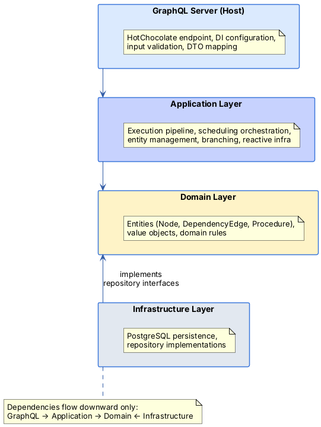

# VRoboCoop System Architecture

VRoboCoop is a multi-project workspace for coordinating complex multi-agent robotic procedures. Seven components
collaborate across web, mobile, backend, optimization, verification, visualization, and robot control layers.

---

## Communication Protocols

| Path             | Protocol                      | Purpose                                     |
| ---------------- | ----------------------------- | ------------------------------------------- |
| Magnus ↔ Freydis | GraphQL over HTTP + WebSocket | Queries, mutations, real-time subscriptions |

Magnus consumes the same GraphQL API. See
the [GraphQL Operations Guide](../Backend/GraphQLServer/docs/graphql-operations.md) for the full operations reference.

---

## Backend Layer Architecture

Freydis follows a layered architecture with strict dependency direction:



Each layer has its own documentation:

- [GraphQL Server](../Backend/GraphQLServer/docs/README.md)
- [Application Layer](../Backend/Application/docs/README.md) — the most complex layer, containing the execution pipeline
- [Domain Layer](../Backend/Domain/docs/README.md)
- [Infrastructure Layer](../Backend/Infrastructure/docs/README.md)

---

## Data Flow: Procedure Execution

A complete execution lifecycle from user action to real-time updates:

1. **Procedure Creation** — User builds a procedure in Magnus or Skadi using the visual flow editor: creates
   nodes (Task, SkillExecution, Router), connects them with dependency edges, and configures variables

2. **Procedure Loading** — Client calls `loadProcedure(id)` mutation. Freydis loads nodes, edges, and variables from
   PostgreSQL into the active procedure context

3. **Execution Start** — Client calls `startLoadedProcedure` mutation. The `ExecutionOrchestrator` begins the pipeline:
    - `ExecutionInitializer` loads entities, assigns execution IDs, initializes the variable context, and calculates the
      initial schedule
    - `DependencyGraphAnalyzer` maps dependency edges to event prerequisites

4. **Skill Triggering** — `ExecutionTriggerService` subscribes to the event bus and triggers skills when their
   prerequisites are satisfied. `SkillExecutionCoordinator` invokes the assigned agent (dummy or KUKA) with resolved
   property bindings

5. **Router Evaluation** — When a router's prerequisites are met, `RouterEvaluationService` evaluates branch conditions
   against the variable context and selects the matching branch

6. **Real-Time Updates** — Each execution event triggers a reschedule. The Rx.NET pipeline samples updates at different
   intervals:
    - Core subscriber updates node state and checks for completion
    - Frontend subscriber publishes node/edge changes via GraphQL subscriptions (sampled at 10ms)
    - Agents subscriber updates adaptive finish times (sampled at 1ms)

7. **Live Monitoring** — Magnus and Skadi receive `nodesChanged`, `dependencyEdgesChanged`, and
   `executionTimingChanged` subscription events. The timeline and flow canvas update in real time

8. **Completion** — Two-phase completion ensures the frontend receives definitive final state before the orchestrator
   cleans up per-execution resources and refreshes change trackers from the repository

---

## Development Setup

```bash
# Terminal 1: Start PostgreSQL
docker start postgres

# Terminal 2: Start Freydis backend
cd Backend && dotnet run --project GraphQLServer/GraphQLServer.csproj

# Terminal 3: Start Magnus frontend
cd Frontend && npm run dev

# Terminal 4 (optional): Start OptX OPC UA server
cd OptX/Python && python server.py
```

| Service               | URL                             |
| --------------------- | ------------------------------- |
| Magnus (Frontend)     | `http://localhost:5173`         |
| Freydis (GraphQL API) | `http://localhost:5095/graphql` |

---

## Related Documentation

- [Root README](../README.md) — Full prerequisites and installation instructions
- [Backend Documentation Hub](../Backend/docs/README.md) — Central index for all backend docs
- [Backend Architecture](../Backend/docs/architecture.md) — Detailed backend layer design and data flows
